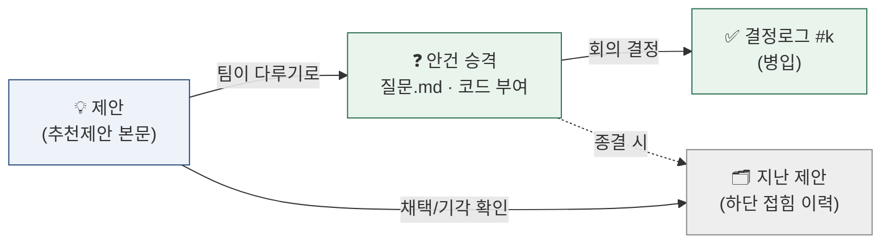

# 260709 AI 추천제안 탭 — 운영 방식 + 위키 우선순위 메모

> 작성 2026-07-09 · 운영자(성혁) 참고용. 사이트 비노출(archive).
> 중장기 로드맵은 [260709_개선사항.md](260709_개선사항.md) — 이 메모는 **추천제안 탭의 운영 규칙**과 **지금 우선순위** 스냅샷.

---

## 1. 추천제안 탭이란

위키 전체(확정·회의록·안건)를 근거로 **AI가 개선안을 제안하는 자문 페이지** (협업 탭 · `documents/추천제안.md`).

- **손글씨가 아니라 산출물** — 매 증류가 루브릭대로 재생성 (STATUS와 같은 급)
- **구속력 없음** — 결정은 팀. 팀 페이지(facts)와 달리 "AI 의견"이라는 경계가 신뢰의 조건
- 로직(루브릭)은 `tools/distill_prompt.md` 한 곳, 출력은 `추천제안.md` 한 곳 — 별도 handsoff.md 안 만듦(기존 문서와 겹쳐 썩음)

## 2. 제안의 생명주기

질문.md 안건과 같은 원리 — 상태 없이 쌓이면 무덤이 된다.

- **본문에 남는 건 "아직 안 다뤄진 제안"뿐** — 다뤄지면 하단 접힘 이력으로 (`| 제안 | ✅채택/❌기각 (날짜) | 근거 링크 |`)
- 승격(코드 부여)은 운영자 확인 후

## 3. 운영 리듬

| 언제 | 무엇 | 누가 |
|---|---|---|
| 매 증류 후 | 루브릭대로 자동 재생성 — 병목 1개 최상단·새 리스크·미이행 재부상 | 증류(자동) |
| 회의 전날 | 탭 한 번 훑고 다룰 만한 제안 있으면 "안건으로 올려줘" | 운영자 |
| 회의 후(병입) | 다뤄진 제안 → 지난 제안 이력으로 | 증류/병입(자동) |

**원칙 2개**: ① 본문 제안 **3~5개 상한** ② 상세 도메인 제안(뉴스 구성 등 mermaid 포함)은 **재생성 시 보존** — 그 주제 결정이 바뀔 때만 수정.

### 루브릭 (distill_prompt에 배선됨)

1. 지금 **릴레이를 막는 병목 1개** 최상단
2. 이번 증류에서 **새로 생긴 리스크·기회**
3. **저비용·고효과 순** 정렬
4. **전에 제안했으나 안 된 것** 재부상 (사라지지 않게)
5. 모든 제안에 **근거 링크** (회의록·안건·facts)

## 4. 배선 위치 (파일 맵)

| 무엇 | 어디 |
|---|---|
| 루브릭·생명주기 규칙 | `tools/distill_prompt.md` "추천제안 갱신 루브릭" 절 |
| 출력(제안 본문 + 지난 제안 접힘) | `documents/추천제안.md` |
| nav | mkdocs.yml 협업 구역 최상단 · 심볼릭 `wiki/추천제안.md` |
| 시스템 문서 | 시스템설명서 §8 표 · 사용가이드 §2 "증류가 갱신하는 것" |

## 5. 위키 개선 우선순위 (07-10 갱신)

| 순위 | 항목 | 상태 |
|---|---|---|
| 1 | push + 첫 CI 배포 | ✅ 완료 (07-10) — 라이브 신규 페이지 전부 200 |
| 2 | facts/화면.md 채우기 | ✅ AI 초안 작성 (07-10) — C3 회의에서 확정 대기 |
| 3 | ~~raw 삭제 방지 훅~~ | ❌ 제외 — 삭제는 운영자 의도 작업만 |
| 4 | ~~신선도 lint~~ | ❌ 제외 — 값어치 대비 애매 |
| 5 | /계약대조 (코드↔데이터계약 drift) | ⚪ Gate2(7/13) 코드 본격화 때 |

> 현 국면: 위키 급한 건 끝 — 다음 진전은 팀 회의 결정(대표기사·C3), 위키는 받아서 굳히는 역할.
