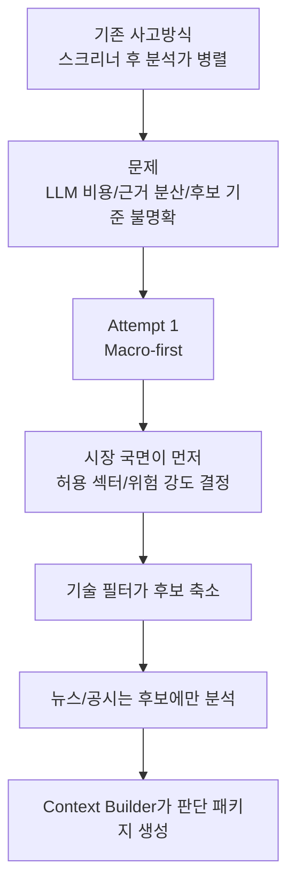
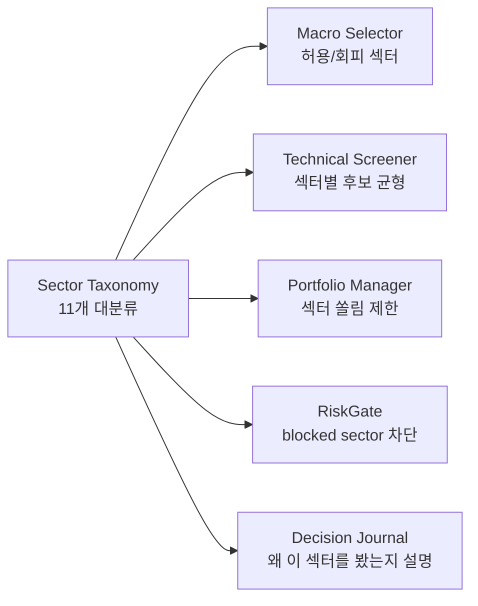

# Quantinue Attempt 1 전체 기획서

## 1. 프로젝트 개요

Quantinue는 미국 주식 대상 자율 AI 가상 자동매매 시스템이다. 사용자는 가상 시드와 투자유형을 선택하고, 시스템은 시장 상태 확인, 기업 후보 선정, 뉴스/공시 분석, 전략 판단, 반박 검증, 리스크 검문, 가상 체결, 회고 기록까지 자동 수행한다.

이 프로젝트는 실거래 시스템이 아니다. 모든 주문과 체결은 자체 `PaperBroker`에서 시뮬레이션한다. 증권사 주문 API, 실계좌 API, 실제 돈을 움직일 수 있는 키는 사용하지 않는다.

## 2. Attempt 1에서 바뀐 핵심 구조

기존 흐름은 스크리너가 후보를 만들고 공시/뉴스/매크로가 병렬로 분석하는 느낌이었다. Attempt 1에서는 **macro-first**로 바꾼다.



```text
미국 주식 유니버스
  -> Macro Selector: 오늘 시장 국면, 위험 점수, 허용/회피 섹터 결정
  -> Technical Screener: 매크로 조건 안에서 후보 5~10개 선정
  -> News / Disclosure Analyzer: 후보에 대해서만 뉴스/공시 분석
  -> Context Builder: 판단에 필요한 모든 근거를 하나의 패키지로 조립
  -> Strategist: BUY / SELL / HOLD / NO_TRADE 판단
  -> Risk Critic: 반박, 기각, 축소, 추가근거 요구
  -> Portfolio Manager: 수량과 금액 계산
  -> RiskGate: 최종 안전 규칙 검사
  -> PaperBroker: 가상 체결
  -> Reviewer: observe-only 회고 기록
```

## 3. 제품 경험

사용자는 복잡한 설정을 하지 않는다.

- 가상 시드 선택
- 투자유형 선택: 1차는 균형형만
- 일시중지/재개
- 결정 저널에서 판단 근거 확인
- 가상 체결과 손익 확인

1차 MVP의 핵심 화면은 화려한 대시보드가 아니라 **결정 저널**이다. “왜 골랐는지”, “왜 샀는지”, “왜 안 샀는지”, “어떤 근거로 기각됐는지”가 보여야 한다.

## 4. 1차 MVP 범위

### 포함

- 미국 주식만
- 균형형 투자정책 1종
- 로컬 실행
- 정규장 중심
- 후보 5~10개
- macro-first candidate selection
- 대분류 섹터 적용
- 뉴스/공시 최소 분석
- Strategist 최소 버전
- Risk Critic 최소 버전
- Portfolio Manager 최소 버전
- RiskGate 최소 버전
- PaperBroker 최소 버전
- Evidence Center 저장
- Context Builder
- 결정 저널용 데이터 산출
- Reviewer observe-only
- dry-run script

### 제외

- AWS 상시 운영
- 멀티계좌
- 안정형/공격형 실제 운용
- ML 매매 연결
- 소셜 감성
- 시간외 신규 진입
- 완전한 뉴스/공시 백테스트
- 실거래 브로커
- 텔레그램 알림
- 앱

## 5. 섹터 대분류 체계

Attempt 1에서는 복잡한 세부 산업 분류를 만들지 않는다. 아래 11개 대분류만 사용한다. 이 분류는 Macro Selector, Screener, Strategist, RiskGate, 결정 저널이 공통으로 쓰는 언어다.

| 영어 섹터명 | 국문 명칭 | 설명 및 주요 포함 산업 | 대표 기업 |
| --- | --- | --- | --- |
| Information Technology | 정보기술(IT) | 소프트웨어, 반도체, IT 장비, 하드웨어 | Microsoft, Nvidia, Apple |
| Communication Services | 통신 서비스 | 소셜미디어, 검색포털, 엔터테인먼트, 통신사 | Alphabet, Meta, Netflix |
| Consumer Discretionary | 경기 소비재 | 소득에 따라 소비가 변하는 자동차, 의류, 호텔, 유통 | Tesla, Amazon, McDonald's |
| Consumer Staples | 필수 소비재 | 경기와 무관하게 꼭 소비하는 식품, 생활용품, 담배 | PepsiCo, Costco, Procter & Gamble |
| Health Care | 헬스케어 | 제약, 바이오테크, 의료기기, 의료 서비스 | Eli Lilly, Johnson & Johnson, Moderna |
| Financials | 금융 | 은행, 투자은행, 자산운용사, 보험 | JPMorgan, Berkshire Hathaway, PayPal |
| Industrials | 산업재 | 항공우주, 방위산업, 건설 자재, 물류, 운송 | Boeing, Caterpillar, FedEx |
| Materials | 기초소재 | 화학, 광업, 철강, 제지, 용기, 포장 | Air Products, Newmont, Dow |
| Energy | 에너지 | 석유, 가스 시추/정제, 에너지 장비, 서비스 | Exxon Mobil, Chevron, First Solar |
| Utilities | 유틸리티 | 전기, 가스, 수도 등 공공 서비스 | NextEra Energy, Duke Energy |
| Real Estate | 부동산 | 부동산 개발, 관리, 리츠(REITs), 부동산 투자신탁 | American Tower, Prologis |

## 6. 섹터 분류를 쓰는 이유

섹터는 “종목을 설명하기 위한 라벨”이 아니라 리스크와 후보 선정에 직접 쓰인다.



- Macro Selector가 risk-off일 때 고변동 섹터를 회피할 수 있다.
- 금리 상승 국면에서 Real Estate, Utilities 같은 금리 민감 섹터를 더 보수적으로 볼 수 있다.
- 경기 둔화 국면에서 Consumer Staples, Health Care를 방어 섹터로 볼 수 있다.
- Strategist가 같은 테마/섹터에 종목이 몰리는지 판단할 수 있다.
- Portfolio Manager가 sector concentration을 제한할 수 있다.
- 결정 저널에서 “오늘 왜 이 섹터를 봤는지” 설명할 수 있다.

## 7. 투자정책

1차는 균형형만 구현한다.

| 항목 | 균형형 1차 정책 |
| --- | --- |
| 주식:현금 | 약 65:35 |
| 종목당 최대 | 10% |
| 보유 종목 수 | 8개 내외 목표, 강제 아님 |
| 손절 기준 | 약 -7% 또는 ATR 기반 |
| 거래당 리스크 | 계좌의 2% 이하 |
| 시간외 신규 진입 | 1차에서는 금지 |
| Reviewer 가중치 | 0, observe-only |
| ML 확률 | 저장 자리만, 판단 미연결 |

## 8. 성공 기준

1차 성공은 수익률이 아니라 자율 루프의 완주다.

- Macro Selector가 시장 국면과 허용/회피 섹터를 만든다.
- Screener가 후보 5~10개를 만든다.
- 뉴스/공시 분석이 후보에만 붙는다.
- Context Builder가 Strategist 입력 패키지를 만든다.
- Strategist가 `BUY`, `HOLD`, `NO_TRADE` 중 하나를 낸다.
- Risk Critic이 통과/기각/축소/추가근거 요구를 낸다.
- Portfolio Manager가 금액과 수량을 계산한다.
- RiskGate가 최종 허용/차단/축소를 판단한다.
- PaperBroker가 가상 주문과 체결을 기록한다.
- Reviewer가 observe-only 회고를 남긴다.
- Evidence Center에 모든 판단 근거와 source_refs가 저장된다.
- 결정 저널에서 전체 판단 흐름이 설명된다.
