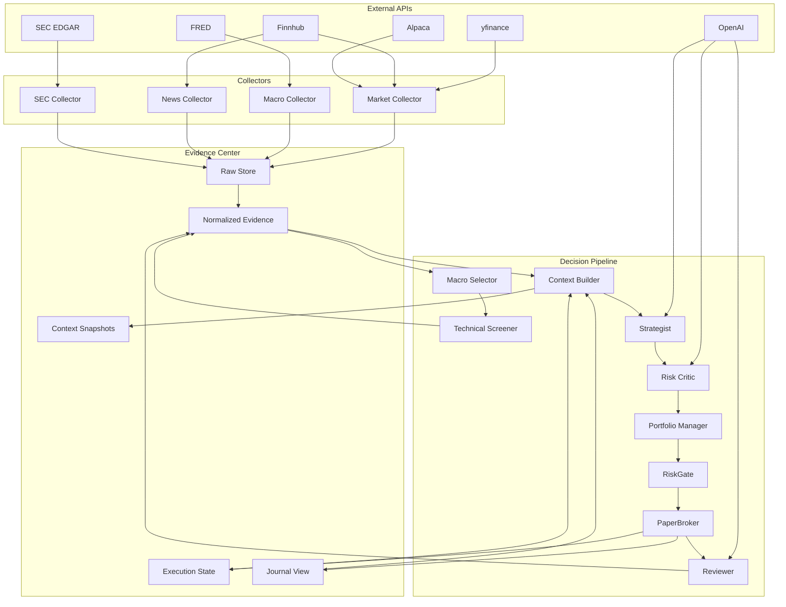
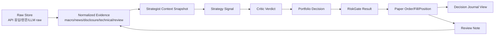
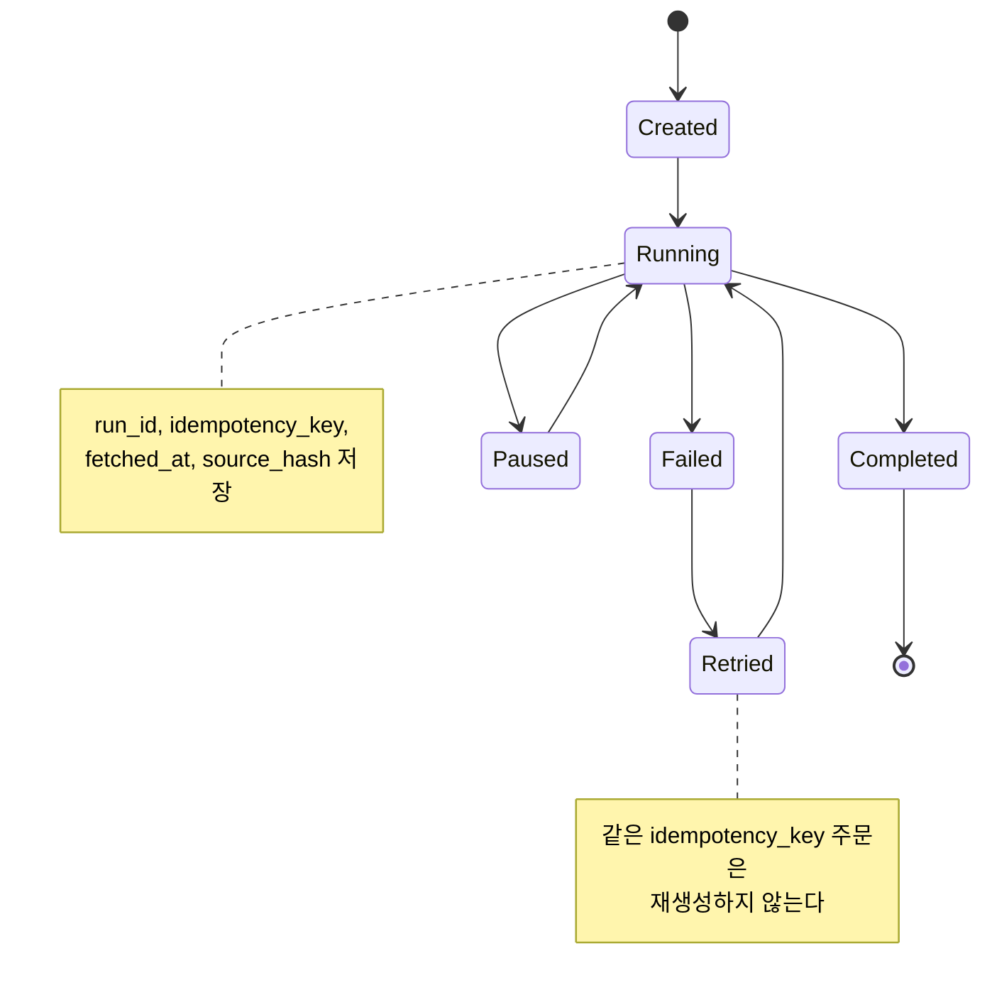

# Quantinue Attempt 1 시스템 설계서

## 1. 설계 목표

Attempt 1의 시스템 설계 목표는 “모든 기능을 깊게 만드는 것”이 아니라 “모든 판단 근거가 한 곳에 쌓이고, 그 근거를 기반으로 한 매매 루프가 끝까지 도는 것”이다.

핵심 설계 단위는 다음 세 가지다.

- **Evidence Center**: 수집 데이터, 분석 결과, 회고, 체결, 리스크 판단을 저장하는 중앙 근거 저장소
- **Context Builder**: Strategist가 판단할 수 있도록 필요한 근거만 조립하는 계층
- **Execution Spine**: PM, RiskGate, PaperBroker로 이어지는 안전한 실행 척추

## 2. 전체 구조



```text
External APIs
  yfinance / Finnhub / Alpaca / SEC EDGAR / FRED / OpenAI
        |
        v
Collectors
  market collector / macro collector / news collector / sec collector
        |
        v
Raw Store
  원본 API 응답, 뉴스 원문, 공시 원문/링크, LLM raw output
        |
        v
Evidence Center
  macro_snapshot
  sector_policy
  candidate
  technical_signal
  news_signal
  disclosure_signal
  review_note
  position/order/fill
        |
        v
Context Builder
  run_id + symbol + profile 기준으로 StrategistContext 생성
        |
        v
Strategist -> Risk Critic -> Portfolio Manager -> RiskGate -> PaperBroker
        |
        v
Decision Journal / Reviewer / Future Telegram
```

## 3. Macro-first 파이프라인

```mermaid
sequenceDiagram
  autonumber
  participant Loop as 운영 루프
  participant Macro as Macro Selector
  participant Tech as Technical Screener
  participant Evidence as Evidence Center
  participant Analyzer as News/Disclosure
  participant Builder as Context Builder
  participant Strategist
  participant Critic as Risk Critic
  participant Gate as RiskGate
  participant Broker as PaperBroker
  participant Reviewer

  Loop->>Macro: 지수/VIX/금리/DXY 기반 시장 국면 요청
  Macro->>Evidence: macro_snapshot 저장
  Loop->>Tech: 섹터 정책 반영 후보 선정
  Tech->>Evidence: candidate, technical_signal 저장
  Loop->>Analyzer: 선정 후보만 뉴스/공시 분석
  Analyzer->>Evidence: news_signal, disclosure_signal 저장
  Loop->>Builder: run_id + symbol + profile context 요청
  Builder->>Evidence: 필요한 근거 조회
  Builder->>Strategist: StrategistContext 전달
  Strategist->>Evidence: strategy_signal 저장
  Strategist->>Critic: 시그널 반박 요청
  Critic->>Evidence: critic_verdict 저장
  Critic->>Gate: 통과/기각/축소 후보 전달
  Gate->>Broker: 허용 주문만 전달
  Broker->>Evidence: order/fill/position 저장
  Broker->>Reviewer: 결과 회고 요청
  Reviewer->>Evidence: review_note observe-only 저장
```

### 3.0 `run_id` 생성 시점

`run_id`는 운영 루프가 “이번 판단 사이클”을 시작할 때 만든다. 즉, 아래 경계부터 필요하다.

```text
사전 수집 / 캐시 / 마스터 데이터
  -> run_id 없음

운영 루프 시작
  -> run_id 생성

Macro Selector 이후 판단 산출물
  -> run_id 있음
```

파이프라인 기준 적용 범위:

| 단계 | `run_id` 필요 | 이유 |
| --- | --- | --- |
| Universe Builder | 보통 N | 종목 마스터와 섹터 분류는 여러 run이 공유한다. |
| 뉴스/공시/가격 원본 수집 | N | 원본 데이터는 캐시이며 여러 run에서 재사용될 수 있다. |
| 운영 루프 시작 | Y | 이 시점에 `run` row를 만들고 `run_id`를 발급한다. |
| Macro Selector | Y | 이 run에서 본 시장 국면을 재현해야 한다. |
| Technical Screener / Candidate | Y | 이 run에서 선택/차단한 후보 목록이 필요하다. |
| News/Disclosure Analyzer 결과 | Y | 원본 수집은 run 밖이지만, 이 run의 후보에 대해 해석한 결과이므로 필요하다. |
| Context Builder | Y | Strategist가 받은 입력 스냅샷은 run 재현의 핵심이다. |
| Strategist / Critic / PM / RiskGate | Y | 특정 run의 판단 체인이다. |
| PaperBroker / Reviewer | Y | 특정 run의 실행/회고 결과다. |

예를 들어 새벽에 NVDA 뉴스 20개를 미리 수집했다면 이 데이터는 `raw_source`이고 `run_id`가 없다. 오전 10시 run에서 NVDA가 후보로 선정되어 그 뉴스 중 3개를 근거로 `positive` 판단을 만들었다면 그 결과는 `news_signal`이고 `run_id`가 붙는다.

### 3.1 Universe Builder

주 1회 또는 수동 실행으로 미국 주식 유니버스를 만든다.

역할:

- 미국 정규 거래소 종목만 포함
- 시총/거래대금 하한 적용
- OTC, penny stock, 상폐/거래정지 위험 제외
- 섹터 대분류 부여

산출물:

- `instrument`
- `universe_membership`

### 3.2 Macro Selector

매 사이클의 첫 판단 계층이다. 오늘의 시장 상태를 보고 후보 선정 범위를 좁힌다.

입력:

- SPY/QQQ/DIA 등 주요 지수
- VIX
- 미국 금리
- DXY
- 섹터 ETF 흐름
- 전일/프리마켓 변동

출력:

- `regime`: `risk_on`, `neutral`, `risk_off`, `high_volatility`
- `risk_score`: 0.0~1.0
- `risk_budget_multiplier`
- `allowed_sectors`
- `blocked_sectors`
- `sector_bias`

예시:

```json
{
  "regime": "risk_off",
  "risk_score": 0.78,
  "risk_budget_multiplier": 0.4,
  "allowed_sectors": ["Consumer Staples", "Health Care", "Utilities"],
  "blocked_sectors": ["Consumer Discretionary", "Information Technology"],
  "market_notes": "VIX 급등과 QQQ 약세로 고베타 성장주 신규 진입 축소"
}
```

### 3.3 Technical Screener

Macro Selector가 허용한 조건 안에서 오늘 볼 기업 후보를 만든다.

입력:

- 유니버스
- 섹터 정책
- 가격, 거래량, 변동성
- 현재 포지션/쿨다운

출력:

- 후보 5~10개
- selection score
- selection reason
- macro_allowed 여부

### 3.4 News / Disclosure Analyzer

뉴스와 공시는 전체 유니버스가 아니라 후보에 대해서만 분석한다.

목적:

- LLM 비용 절감
- API 호출량 절감
- 판단 근거 집중

출력:

- `news_signal`
- `disclosure_signal`
- `source_refs`

### 3.5 Context Builder

Strategist가 직접 여러 테이블을 뒤지는 대신 Context Builder가 판단 패키지를 만든다.

입력:

- `macro_snapshot`
- `sector_policy`
- `candidate`
- `technical_signal`
- `news_signal`
- `disclosure_signal`
- `current_position`
- `cooldown_state`
- `review_note`

출력:

- `strategist_context`

예시:

```json
{
  "run_id": "2026-07-03-balanced-001",
  "profile": "balanced",
  "macro": {
    "regime": "neutral",
    "risk_score": 0.44,
    "risk_budget_multiplier": 0.8,
    "allowed_sectors": ["Information Technology", "Health Care"]
  },
  "candidate": {
    "symbol": "NVDA",
    "sector": "Information Technology",
    "rank": 2,
    "selection_reasons": ["volume_spike", "trend_positive", "sector_allowed"]
  },
  "technical": {
    "trend": "bullish",
    "rsi": 66,
    "atr": 4.2,
    "technical_score": 0.72
  },
  "news": {
    "sentiment": "positive",
    "strength": 7,
    "source_trust": 0.8,
    "summary": "신뢰도 높은 매체에서 AI 수요 관련 긍정 뉴스 확인"
  },
  "disclosure": {
    "sentiment": "neutral",
    "importance": 2,
    "summary": "중요 신규 공시 없음"
  },
  "memory": {
    "mode": "observe_only",
    "weight": 0,
    "recent_notes": []
  },
  "position": {
    "has_position": false,
    "cooldown_until": null
  }
}
```

## 4. Evidence Center

Evidence Center는 단순 DB 이름이 아니라 저장 원칙이다. 모든 수집/판단/체결/회고 데이터가 추적 가능한 근거로 남아야 한다.



### 4.1 저장 계층

| 계층 | 저장 내용 | 목적 |
| --- | --- | --- |
| Raw Store | API 원본, 뉴스/공시 원문, LLM raw output | 디버깅, 재현, 출처 추적 |
| Normalized Evidence | macro, candidate, news, disclosure, technical, review | Strategist/대시보드 입력 |
| Execution State | account, position, order, fill, cash, risk events | PaperBroker와 RiskGate 상태 |
| Context Snapshot | StrategistContext, prompt input, prompt output | 판단 재현 |
| Journal View | 사람이 읽기 쉬운 결정 기록 | 발표/프론트/텔레그램 |

### 4.2 Evidence Center가 필요한 이유

- Strategist가 복합 판단을 하려면 macro/news/disclosure/technical/review가 한 묶음으로 필요하다.
- Reviewer가 나중에 판단을 복기하려면 당시의 입력과 결과가 보존되어야 한다.
- 텔레그램에서 "왜 샀어?"를 설명하려면 source_refs가 필요하다.
- 백테스트나 dry-run 실패를 디버깅하려면 raw output이 필요하다.
- 같은 뉴스/공시를 반복 분석하지 않으려면 중복 제거와 캐시가 필요하다.

### 4.3 1차 저장 방식

1차에서는 과한 인프라를 쓰지 않는다.

- Postgres: 정규화 테이블
- TimescaleDB: 가격/시계열
- JSONB: LLM raw output, context snapshot
- text/json column: 긴 요약과 source excerpt
- 파일 저장: 선택 사항. 원문이 너무 길 때만 사용
- vector DB: 1차 제외

## 5. 모듈 설계

| 모듈 | 역할 | 1차 구현 수준 |
| --- | --- | --- |
| `MarketDataProvider` | 가격/거래량/지수 데이터 조회 | yfinance fixture + 일부 실제 호출 |
| `MacroSelector` | 시장 국면, 섹터 허용/회피 결정 | 규칙 기반 + 짧은 LLM 요약 선택 |
| `TechnicalScreener` | 후보 5~10개 선정 | 거래량/추세/변동성 점수 |
| `NewsAnalyzer` | 뉴스 감성/테마/신뢰도 | 후보별 최근 뉴스 N개 |
| `DisclosureAnalyzer` | SEC 공시 감성/중요도 | 후보별 중요 공시만 |
| `EvidenceRepository` | 근거 저장/조회 | Postgres/JSONB |
| `ContextBuilder` | Strategist 입력 조립 | 필수 |
| `StrategistAgent` | 매매/비매매 판단 | PydanticAI structured output |
| `RiskCriticAgent` | 반박/거부/축소 | 체크리스트 기반 |
| `PortfolioManager` | 금액/수량 계산 | 코드 수식 |
| `RiskGate` | 최종 안전 규칙 | 코드 규칙 |
| `PaperBroker` | 가상 주문/체결 | 자체 DB 상태 기반 |
| `ReviewerAgent` | 회고 기록 | observe-only |

## 6. Strategist 판단 방식

Strategist는 아래를 직접 계산하지 않는다.

- 후보 선정
- 원천 데이터 수집
- 포지션 사이징
- 최종 리스크 차단
- 체결

Strategist는 Context Builder가 준 정보를 바탕으로 action과 이유를 낸다.

허용 action:

- `BUY`
- `SELL`
- `HOLD`
- `NO_TRADE`

1차에서는 `SELL`은 기존 보유 포지션이 있을 때만 의미 있다. 신규 후보는 대부분 `BUY` 또는 `NO_TRADE`다.

## 7. Risk Critic 설계

Risk Critic은 "다른 의견을 말하는 에이전트"가 아니라 "거부권 체크리스트"다.

검사 항목:

- macro risk-off 여부
- 섹터 회피 대상 여부
- 과열/추격 매수 여부
- 뉴스만 있고 가격/거래량 확인이 없는지
- 공시/뉴스 출처 신뢰도
- 이벤트 임박
- 쿨다운 중인지
- 유동성 부족
- 이미 보유 중인 섹터 쏠림

출력:

- `approve`
- `reject`
- `reduce_size`
- `needs_more_evidence`

1차 정책:

- `needs_more_evidence`는 `NO_TRADE`로 처리한다.
- `critical` objection은 무조건 reject한다.
- 애매하면 거래하지 않는다.

## 8. Reviewer 설계

Reviewer는 1차에서 전략에 영향을 주지 않는다.

역할:

- 진입/비진입 판단을 나중에 복기
- PaperBroker 결과와 시장 대비 성과를 요약
- 반복되는 실수 후보를 태그
- 결정 저널과 발표 자료에 쓸 설명 생성

1차 정책:

- `actionability = observe_only`
- `memory_weight = 0`
- Strategist prompt에는 참고 메모로도 최소만 제공
- 20건 이상 유사 패턴이 쌓이기 전에는 규칙 변경 후보로 승격하지 않는다.

## 9. 1차 실행 모드

| 모드 | 설명 |
| --- | --- |
| `fixture_only` | 외부 API/LLM 없이 저장된 JSON으로 전체 루프 검증 |
| `llm_dry_run` | 후보 5개 기준 실제 LLM 호출 검증 |
| `paper_dry_run` | 실제/캐시 데이터 + PaperBroker 가상 체결 |
| `paper_live` | 정규장 중 주기 실행, 실제 주문 아님 |

## 10. 장애와 재실행

모든 run은 재실행 가능해야 한다.



- 모든 run에 `run_id` 부여
- 모든 주문에 idempotency key 부여
- 실패한 run도 저장
- LLM raw output 저장
- API 호출 실패는 source status로 기록
- 같은 source snapshot이면 LLM 재호출 생략 가능

## 11. 미래 확장 지점

1차에서 구조만 남겨둘 확장 지점:

- 텔레그램 알림: Evidence Center의 journal view를 요약해 전송
- 종목별 wiki: `source_refs`, `review_note`, `decision_journal` 기반 생성
- ML: `technical_signal.ml_probs`에 연결
- AWS: `run_id`, `account_id`, idempotency, run lock 기반으로 이전
- 멀티계좌: `account_id` 기준 상태 분리
