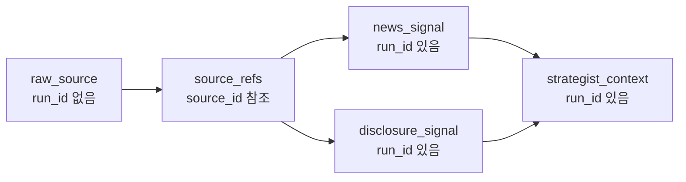
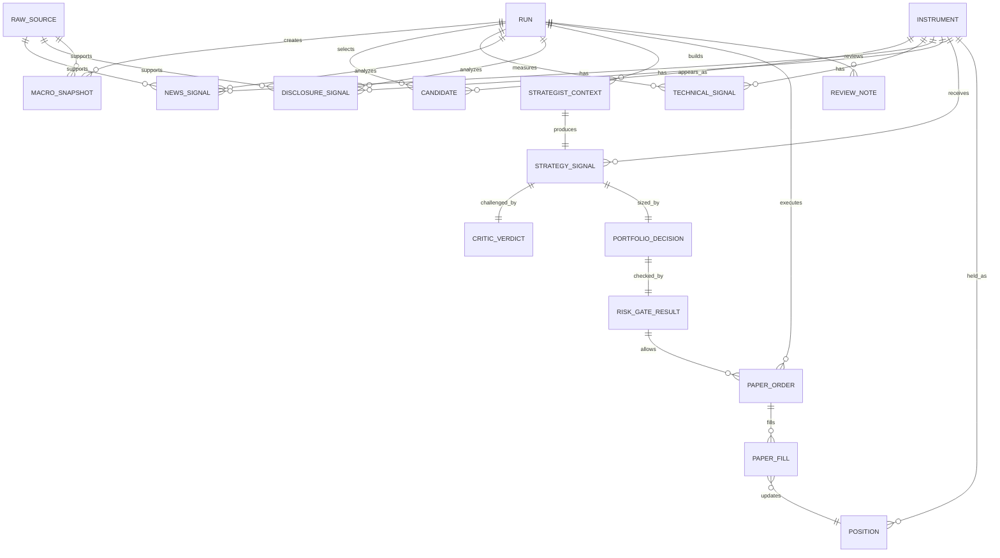
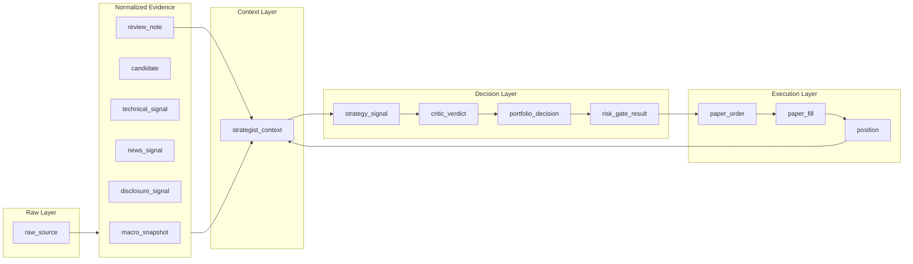
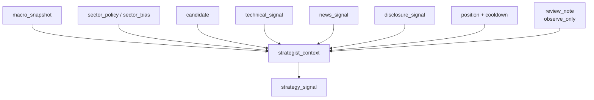

# Quantinue Attempt 1 데이터 스키마

## 1. 스키마 원칙

- 모든 판단은 `run_id`에 묶인다.
- 모든 종목 판단은 `symbol`과 `sector`를 가진다.
- 모든 근거는 `source_refs`를 가진다.
- Strategist는 여러 테이블을 직접 조회하지 않고 `strategist_context`를 받는다.
- LLM raw output은 저장하되, 시스템 판단은 정규화된 필드로 저장한다.
- `NO_TRADE`는 정상 action이다.
- Reviewer는 1차에서 `observe_only`이며 trading weight는 0이다.

### 1.1 현재 설계 판단

이 스키마는 1차 MVP 기준으로는 최선에 가깝다. 이유는 다음과 같다.

- 팀 병렬 개발에 필요한 계약값은 고정한다: `run_id`, `symbol`, `sector`, `source_refs`, `TradeAction`, `CriticDecision`, `RiskGateResult`.
- 변동 가능성이 큰 부분은 느슨하게 둔다: `sector_bias`, `llm_raw`, `ml_probs`, `review_note`, raw 원문 장기보관 방식.
- Strategist가 직접 여러 테이블을 뒤지지 않고 `strategist_context` 하나만 받게 하므로, 에이전트 간 결합도가 낮다.
- `NO_TRADE`, `blocked`, `skipped`, `failed`를 정상 데이터로 저장하므로 실패/비거래도 회고할 수 있다.

단, 이 스키마는 최종 운영 DB 설계가 아니라 **MVP 계약 스키마**다. 2차에서 실거래, AWS, 텔레그램, vector DB, 장기 백테스트가 붙으면 일부 테이블은 분리하거나 index를 다시 설계해야 한다.

### 1.2 필드 중요도 기준

필드의 필수 여부만으로는 개발 우선순위가 애매할 수 있다. 아래 등급을 함께 기준으로 쓴다.

| 등급 | 의미 | 예시 |
| --- | --- | --- |
| P0 | 없으면 파이프라인이 깨지는 계약 | `run_id`, `symbol`, `sector`, `action`, `source_refs` |
| P1 | 없어도 실행은 되지만 판단 품질과 디버깅이 크게 떨어짐 | `selection_reasons`, `risk_notes`, `rules_checked`, `content_hash` |
| P2 | 있으면 좋지만 1차에서는 null/빈 배열 허용 | `atr`, `support`, `resistance`, `sector_bias`, `themes` |
| Future | 2차 이후 연결용 자리 | `ml_probs`, vector 저장, 장기 memory weight |

### 1.3 `run_id` 적용 기준

`run_id`는 모든 데이터에 붙이는 값이 아니다. 기준은 **이 데이터가 특정 매매 판단 사이클의 결과인가**다.

| 구분 | `run_id` | 예시 | 기준 |
| --- | --- | --- | --- |
| 원천 수집 데이터 | N | `raw_source`, 뉴스 원문, SEC 원문, 가격 원본, provider cache | 특정 run과 무관하게 재사용 가능한 데이터 |
| 마스터/기준 데이터 | N | `instrument`, 섹터 분류, 거래소 정보, 유니버스 원본 | 시간이 지나도 여러 run이 공유하는 기준 데이터 |
| run 입력 스냅샷 | Y | `macro_snapshot`, `candidate`, `technical_signal` | 이 run에서 어떤 상태로 판단했는지 재현해야 하는 데이터 |
| run에서 생성한 분석 결과 | Y | `news_signal`, `disclosure_signal`, `strategy_signal`, `critic_verdict` | 특정 run의 후보와 context를 기준으로 만든 분석 결과 |
| 실행/회고 결과 | Y | `portfolio_decision`, `risk_gate_result`, `paper_order`, `review_note` | 특정 run의 판단과 실행 결과 |

뉴스/공시 수집은 `run_id` 없이 저장한다. 예를 들어 새벽에 SEC 공시와 뉴스를 미리 긁어두는 작업은 `source_id`, `symbol`, `published_at`, `fetched_at`, `content_hash`만 있으면 된다.

반대로 특정 run에서 “NVDA 후보에 대해 이 뉴스 3개를 근거로 positive strength 7이라고 판단했다”는 결과는 `news_signal`이고, 이때는 `run_id`가 필요하다. 즉, `run_id`는 **수집 시점**이 아니라 **판단에 사용된 시점**에 붙는다.



## 2. 공통 enum

### Sector

```text
information_technology
communication_services
consumer_discretionary
consumer_staples
health_care
financials
industrials
materials
energy
utilities
real_estate
unknown
```

### Profile

```text
balanced
stable      # 2차
aggressive  # 2차
```

### RunMode

```text
fixture_only
llm_dry_run
paper_dry_run
paper_live
backtest
```

### MarketRegime

```text
risk_on
neutral
risk_off
high_volatility
unknown
```

### TradeAction

```text
BUY
SELL
HOLD
NO_TRADE
```

### Sentiment

```text
positive
neutral
negative
mixed
unknown
```

### CriticDecision

```text
approve
reject
reduce_size
needs_more_evidence
```

### RiskGateResult

```text
allow
block
resize
cooldown
```

## 3. 공통 타입

### SourceRef

| 필드 | 타입 | 필수 | 설명 |
| --- | --- | --- | --- |
| `source_id` | string | Y | 내부 source ID |
| `source_type` | enum | Y | `price`, `macro`, `sec`, `news`, `calendar`, `review`, `llm` |
| `title` | string/null | N | 제목 |
| `url` | string/null | N | 원문 URL |
| `published_at` | datetime/null | N | 원문 공개 시각 |
| `fetched_at` | datetime | Y | 수집 시각 |
| `excerpt` | string/null | N | 짧은 근거 |
| `trust_score` | float/null | N | 0.0~1.0 |

코멘트:

- `SourceRef`는 스키마에서 가장 중요한 공통 타입이다. LLM 판단이 맞았는지보다 “무엇을 근거로 판단했는지”가 더 중요하다.
- 1차에서는 `url`이 없어도 된다. yfinance 가격, 내부 계산, fixture처럼 URL이 없는 근거도 있기 때문이다.
- `excerpt`는 있으면 좋다. 나중에 텔레그램/결정 저널에서 원문 전체를 보여주지 않고도 근거를 설명할 수 있다.
- `trust_score`는 초반에 정교하게 계산하지 않아도 된다. 기본값을 provider별로 정해도 충분하다. 예: SEC 0.95, 가격 데이터 0.85, 일반 뉴스 0.65, LLM 요약 0.4.

### Score Range

| 필드 유형 | 범위 | 설명 |
| --- | --- | --- |
| `confidence` | 0.0~1.0 | 결과 자체에 대한 신뢰 |
| `risk_score` | 0.0~1.0 | 높을수록 위험 |
| `selection_score` | 0.0~1.0 | 후보 선정 점수 |
| `technical_score` | 0.0~1.0 | 기술 신호 강도 |
| `conviction` | 0~10 | Strategist 확신 |
| `importance` | 0~10 | 공시 중요도 |
| `strength` | 0~10 | 뉴스 신호 강도 |

## 4. 주요 테이블





### 4.1 `run`

운영 사이클 단위.

| 필드 | 타입 | 필수 | 설명 |
| --- | --- | --- | --- |
| `run_id` | string PK | Y | 사이클 ID |
| `started_at` | datetime | Y | 시작 |
| `ended_at` | datetime/null | N | 종료 |
| `mode` | RunMode | Y | 실행 모드 |
| `profile` | Profile | Y | 투자유형 |
| `status` | string | Y | `running`, `completed`, `failed`, `paused` |
| `candidate_count` | int | Y | 후보 수 |
| `error` | text/null | N | 실패 사유 |

### 4.2 `instrument`

종목 마스터.

| 필드 | 타입 | 필수 | 설명 |
| --- | --- | --- | --- |
| `symbol` | string PK | Y | 티커 |
| `name` | string | Y | 회사명 |
| `sector` | Sector | Y | 11개 대분류 |
| `exchange` | string/null | N | 거래소 |
| `market_cap` | numeric/null | N | 시총 |
| `is_active` | bool | Y | 거래 가능 여부 |
| `updated_at` | datetime | Y | 갱신 시각 |

### 4.3 `macro_snapshot`

Macro Selector 산출물.

| 필드 | 타입 | 필수 | 설명 |
| --- | --- | --- | --- |
| `run_id` | FK | Y | 사이클 |
| `as_of` | datetime | Y | 기준 시각 |
| `regime` | MarketRegime | Y | 시장 국면 |
| `risk_score` | float | Y | 0.0~1.0 |
| `risk_budget_multiplier` | float | Y | PM 리스크 배수 |
| `allowed_sectors` | Sector[] | N | 허용 섹터 |
| `blocked_sectors` | Sector[] | N | 회피 섹터 |
| `sector_bias` | jsonb | N | 섹터별 점수/코멘트 |
| `market_notes` | text | N | 요약 |
| `source_refs` | jsonb | Y | 근거 |

### 4.4 `raw_source`

원천 데이터 저장소.

| 필드 | 타입 | 필수 | 설명 |
| --- | --- | --- | --- |
| `source_id` | string PK | Y | source ID |
| `source_type` | string | Y | news/sec/price/macro/llm 등 |
| `provider` | string | Y | yfinance, Finnhub, SEC 등 |
| `symbol` | string/null | N | 관련 종목 |
| `sector` | Sector/null | N | 관련 섹터 |
| `published_at` | datetime/null | N | 원문 공개 시각 |
| `fetched_at` | datetime | Y | 수집 시각 |
| `url` | text/null | N | 원문 URL |
| `title` | text/null | N | 제목 |
| `raw_payload` | jsonb/text | Y | 원본 |
| `content_hash` | string | Y | 중복 제거 |

코멘트:

- `raw_source`에는 `run_id`를 넣지 않는다. 같은 뉴스/공시/가격 원본은 여러 run에서 재사용될 수 있기 때문이다.
- 특정 run이 어떤 원천을 사용했는지는 `news_signal.source_refs`, `disclosure_signal.source_refs`, `strategist_context.context_payload`에서 `source_id`로 추적한다.
- 2차에서 사용 이력을 더 정교하게 보고 싶으면 `run_source_usage(run_id, source_id, usage_type)` 같은 연결 테이블을 추가할 수 있다. 1차에서는 `source_refs`로 충분하다.

### 4.5 `candidate`

후보 종목.

| 필드 | 타입 | 필수 | 설명 |
| --- | --- | --- | --- |
| `run_id` | FK | Y | 사이클 |
| `symbol` | FK | Y | 티커 |
| `sector` | Sector | Y | 섹터 |
| `rank` | int | Y | 순위 |
| `selection_score` | float | Y | 0.0~1.0 |
| `selection_reasons` | text[] | Y | 선정 이유 |
| `price` | numeric | Y | 기준 가격 |
| `volume_ratio` | float/null | N | 평균 대비 거래량 |
| `change_pct` | float/null | N | 변동률 |
| `volatility_score` | float/null | N | 변동성 |
| `macro_allowed` | bool | Y | 매크로 통과 |
| `status` | string | Y | `selected`, `blocked`, `skipped` |

PK: `(run_id, symbol)`

### 4.6 `technical_signal`

기술 신호.

| 필드 | 타입 | 필수 | 설명 |
| --- | --- | --- | --- |
| `run_id` | FK | Y | 사이클 |
| `symbol` | FK | Y | 티커 |
| `trend` | string | Y | `bullish`, `neutral`, `bearish` |
| `rsi` | float/null | N | RSI |
| `macd_signal` | string/null | N | MACD |
| `atr` | float/null | N | ATR |
| `support` | numeric/null | N | 지지선 |
| `resistance` | numeric/null | N | 저항선 |
| `technical_score` | float | Y | 0.0~1.0 |
| `ml_probs` | jsonb/null | N | 2차용 |

PK: `(run_id, symbol)`

### 4.7 `news_signal`

뉴스 분석 결과.

| 필드 | 타입 | 필수 | 설명 |
| --- | --- | --- | --- |
| `news_signal_id` | string PK | Y | ID |
| `run_id` | FK | Y | 사이클 |
| `symbol` | FK | Y | 티커 |
| `sector` | Sector | Y | 섹터 |
| `sentiment` | Sentiment | Y | 감성 |
| `strength` | int | Y | 0~10 |
| `themes` | text[] | N | 테마 |
| `is_confirmed` | bool | Y | 루머/확정 |
| `source_trust` | float | Y | 0.0~1.0 |
| `summary` | text | Y | 요약 |
| `source_refs` | jsonb | Y | 근거 |
| `llm_raw` | jsonb | N | LLM 원본 |

### 4.8 `disclosure_signal`

SEC 공시 분석 결과.

| 필드 | 타입 | 필수 | 설명 |
| --- | --- | --- | --- |
| `disclosure_signal_id` | string PK | Y | ID |
| `run_id` | FK | Y | 사이클 |
| `symbol` | FK | Y | 티커 |
| `sector` | Sector | Y | 섹터 |
| `sentiment` | Sentiment | Y | 감성 |
| `importance` | int | Y | 0~10 |
| `filing_type` | string/null | N | 8-K, 10-Q 등 |
| `summary` | text | Y | 요약 |
| `risk_flags` | text[] | N | dilution, lawsuit 등 |
| `confidence` | float | Y | 0.0~1.0 |
| `source_refs` | jsonb | Y | 근거 |
| `llm_raw` | jsonb | N | LLM 원본 |

### 4.9 `strategist_context`

Strategist 입력 스냅샷.

| 필드 | 타입 | 필수 | 설명 |
| --- | --- | --- | --- |
| `context_id` | string PK | Y | ID |
| `run_id` | FK | Y | 사이클 |
| `symbol` | FK | Y | 티커 |
| `profile` | Profile | Y | 투자유형 |
| `context_payload` | jsonb | Y | Strategist 입력 전체 |
| `built_at` | datetime | Y | 생성 시각 |

### 4.10 `strategy_signal`

Strategist 출력.

| 필드 | 타입 | 필수 | 설명 |
| --- | --- | --- | --- |
| `signal_id` | string PK | Y | ID |
| `context_id` | FK | Y | 입력 context |
| `run_id` | FK | Y | 사이클 |
| `symbol` | FK | Y | 티커 |
| `sector` | Sector | Y | 섹터 |
| `action` | TradeAction | Y | 행동 |
| `conviction` | int | Y | 0~10 |
| `expected_holding_days` | int/null | N | 예상 보유 |
| `entry_reason` | text | Y | 이유 |
| `risk_notes` | text[] | N | 리스크 |
| `required_conditions` | text[] | N | 진입 조건 |
| `source_refs` | jsonb | Y | 근거 |
| `llm_raw` | jsonb | N | LLM 원본 |

### 4.11 `critic_verdict`

Risk Critic 출력.

| 필드 | 타입 | 필수 | 설명 |
| --- | --- | --- | --- |
| `verdict_id` | string PK | Y | ID |
| `signal_id` | FK | Y | 대상 시그널 |
| `decision` | CriticDecision | Y | 판단 |
| `severity` | string | Y | `low`, `medium`, `high`, `critical` |
| `objections` | text[] | Y | 반박 |
| `missing_evidence` | text[] | N | 부족한 근거 |
| `confidence` | float | Y | 0.0~1.0 |
| `llm_raw` | jsonb | N | LLM 원본 |

### 4.12 `portfolio_decision`

PM 산출물.

| 필드 | 타입 | 필수 | 설명 |
| --- | --- | --- | --- |
| `decision_id` | string PK | Y | ID |
| `signal_id` | FK | Y | 대상 시그널 |
| `action` | TradeAction | Y | 행동 |
| `target_notional` | numeric | Y | 목표 주문 금액 |
| `quantity` | numeric | Y | 수량 |
| `stop_loss_pct` | float/null | N | 손절 |
| `take_profit_pct` | float/null | N | 익절 |
| `risk_amount` | numeric | Y | 이번 거래 리스크 |
| `sizing_reason` | text | Y | 계산 근거 |

### 4.13 `risk_gate_result`

RiskGate 결과.

| 필드 | 타입 | 필수 | 설명 |
| --- | --- | --- | --- |
| `gate_id` | string PK | Y | ID |
| `decision_id` | FK | Y | PM 결정 |
| `result` | RiskGateResult | Y | 결과 |
| `final_notional` | numeric | Y | 최종 주문 금액 |
| `rules_checked` | text[] | Y | 검사 규칙 |
| `violations` | text[] | N | 위반 |
| `reason` | text | Y | 이유 |

### 4.14 `paper_order` / `paper_fill`

가상 주문/체결.

| 필드 | 타입 | 필수 | 설명 |
| --- | --- | --- | --- |
| `order_id` | string PK | Y | 주문 ID |
| `run_id` | FK | Y | 사이클 |
| `account_id` | string | Y | 가상 계좌 |
| `symbol` | FK | Y | 티커 |
| `sector` | Sector | Y | 섹터 |
| `side` | string | Y | `buy`, `sell` |
| `quantity` | numeric | Y | 수량 |
| `requested_price` | numeric | Y | 기준가 |
| `fill_price` | numeric | Y | 체결가 |
| `slippage_bps` | float | Y | 슬리피지 가정 |
| `session` | string | Y | `regular`, `pre`, `after`, `overnight` |
| `status` | string | Y | `filled`, `rejected`, `skipped` |
| `idempotency_key` | string | Y | 중복 방지 |

### 4.15 `position`

현재 가상 보유 상태.

| 필드 | 타입 | 필수 | 설명 |
| --- | --- | --- | --- |
| `account_id` | string | Y | 가상 계좌 |
| `symbol` | FK | Y | 티커 |
| `sector` | Sector | Y | 섹터 |
| `quantity` | numeric | Y | 보유 수량 |
| `avg_price` | numeric | Y | 평균 단가 |
| `market_value` | numeric | Y | 평가 금액 |
| `unrealized_pnl` | numeric | Y | 미실현 손익 |
| `updated_at` | datetime | Y | 갱신 |

PK: `(account_id, symbol)`

### 4.16 `review_note`

Reviewer 기록.

| 필드 | 타입 | 필수 | 설명 |
| --- | --- | --- | --- |
| `review_id` | string PK | Y | ID |
| `run_id` | FK | Y | 관련 사이클 |
| `symbol` | string/null | N | 종목 |
| `sector` | Sector/null | N | 섹터 |
| `review_type` | string | Y | `entry_after_n_days`, `exit_after_n_days`, `weekly_summary` |
| `metric_summary` | jsonb | Y | 코드 계산 결과 |
| `lesson` | text | Y | LLM 회고 |
| `confidence` | float | Y | 0.0~1.0 |
| `actionability` | string | Y | `observe_only`, `suggest_backtest`, `candidate_rule_change` |
| `memory_weight` | float | Y | 1차는 0 |

### 4.17 테이블별 구현 코멘트

| 테이블 | 1차 최소 구현 | 있으면 좋은 것 | 주의할 점 |
| --- | --- | --- | --- |
| `run` | `run_id`, `mode`, `profile`, `status`, 시작/종료 시각 | `error`에 실패 단계와 원인 저장 | 실패 run도 지우면 안 된다. 발표/디버깅에서 실패 이력이 더 중요할 수 있다. |
| `instrument` | `symbol`, `name`, `sector`, `is_active` | `market_cap`, `exchange` | `sector=unknown`은 임시 허용하되 Strategist 입력 전에는 11개 섹터로 정리하는 것이 좋다. |
| `macro_snapshot` | `regime`, `risk_score`, `risk_budget_multiplier`, `source_refs` | `sector_bias`, `market_notes` | `allowed_sectors`, `blocked_sectors`는 null보다 빈 배열이 낫다. null은 “계산 안 함”과 “없음”이 헷갈린다. |
| `raw_source` | provider, raw payload, fetched_at, content_hash | URL, title, published_at | `content_hash`는 P1이지만 사실상 매우 중요하다. 같은 뉴스/공시 중복 분석을 막는다. |
| `candidate` | rank, selection_score, selection_reasons, price, macro_allowed, status | volume_ratio, change_pct, volatility_score | blocked 후보도 저장하는 편이 좋다. 그래야 “왜 안 봤는지”가 남는다. |
| `technical_signal` | trend, technical_score | RSI, MACD, ATR, support/resistance | `ml_probs`는 1차에서 비워둔다. 초반 데이터가 적으면 오히려 과신 위험이 크다. |
| `news_signal` | sentiment, strength, summary, source_refs | themes, source_trust, llm_raw | source가 없으면 Strategist 입력에서 제외하는 정책이 필요하다. |
| `disclosure_signal` | filing_type, sentiment, importance, summary, source_refs | risk_flags, llm_raw | SEC 공시는 늦게 반영되거나 중요도가 애매할 수 있으므로 `importance`와 `confidence`를 분리한다. |
| `strategist_context` | symbol별 context_payload snapshot | prompt 버전, token count | 재현성 핵심 테이블이다. raw 원문 전체를 넣지 말고 요약과 source_refs만 넣는다. |
| `strategy_signal` | action, conviction, entry_reason, source_refs | expected_holding_days, required_conditions | `NO_TRADE`도 반드시 저장한다. 매수보다 비거래 판단의 품질이 더 중요할 수 있다. |
| `critic_verdict` | decision, severity, objections, confidence | missing_evidence | `critical` 또는 `needs_more_evidence`는 RiskGate 이전에 NO_TRADE로 보내도 된다. |
| `portfolio_decision` | action, target_notional, quantity, risk_amount, sizing_reason | stop/take profit | `target_notional=0`인 NO_TRADE도 기록하면 흐름이 단순해진다. |
| `risk_gate_result` | result, final_notional, rules_checked, reason | violations | `allow`만 저장하지 말고 `block`, `resize`, `cooldown`도 저장해야 리스크 방어를 증명할 수 있다. |
| `paper_order` / `paper_fill` | order_id, run_id, symbol, side, quantity, price, status, idempotency_key | slippage_bps, session | `idempotency_key`는 중복 주문 방지 핵심이다. 재실행하면 같은 주문이 두 번 생기면 안 된다. |
| `position` | account_id, symbol, quantity, avg_price, market_value | sector exposure 계산값 | 1차에서는 현재 상태 테이블로 충분하다. 체결 히스토리는 `paper_fill`에서 추적한다. |
| `review_note` | run_id, lesson, actionability, memory_weight | metric_summary | 1차에서는 `memory_weight=0` 고정. Strategist 가중치로 연결하지 않는다. |

### 4.18 구현 팁

- 처음부터 완전한 RDB migration을 만들 필요는 없다. `Pydantic schema -> fixture JSON -> SQLite/Postgres` 순서가 안전하다.
- 날짜 필드는 모두 timezone-aware datetime으로 둔다. 미국장 데이터라도 저장 기준은 UTC 또는 명시된 timezone으로 통일한다.
- 배열 필드는 null보다 빈 배열을 선호한다. 예: `source_refs: []`, `risk_notes: []`, `missing_evidence: []`.
- 점수 필드는 반드시 범위를 clamp한다. LLM이 `11`이나 `-1` 같은 값을 내는 경우를 막아야 한다.
- LLM 출력은 `llm_raw`에 저장하되, 시스템 판단은 정규화된 필드만 사용한다. raw output을 직접 다음 에이전트 판단에 넣으면 재현성이 떨어진다.
- `run_id`는 사람이 읽을 수 있게 만드는 편이 좋다. 예: `2026-07-03-balanced-001`.
- 각 에이전트 output에는 가능하면 `schema_version` 또는 `prompt_version`을 붙이는 것이 좋다. 1차 테이블에 필수로 넣지 않아도 fixture에는 넣어두면 나중에 원인 추적이 쉽다.
- 수집 원문이 너무 커지면 `raw_payload`에 전체를 넣지 말고 파일 경로 또는 object key만 저장하는 방식으로 바꿀 수 있다. 1차 로컬에서는 jsonb/text로 충분하다.
- `account_id`는 1차에 하나만 있어도 반드시 넣는다. 나중에 멀티 계좌로 확장할 때 가장 덜 아프다.
- `symbol`만 믿지 말고 가능하면 provider별 식별자도 나중에 붙일 수 있게 열어둔다. 티커 변경, 합병, 상장폐지에서 문제가 생긴다.

### 4.19 있으면 좋지만 1차에서 강제하지 않을 것

| 항목 | 왜 있으면 좋은가 | 1차에서 강제하지 않는 이유 |
| --- | --- | --- |
| `schema_version` | fixture와 DB 변경 추적 | 파일/테이블 전체 버전으로도 일단 관리 가능 |
| `prompt_version` | LLM 결과 품질 회고 | prompt가 자주 바뀌는 초기에는 운영 부담이 생김 |
| `token_usage` | LLM 비용 추정 | cheap dry-run 이후 추가해도 됨 |
| `provider_latency_ms` | 병목 파악 | 로컬 MVP에서는 우선순위 낮음 |
| `data_quality_flags` | 결측/지연/오염 데이터 표시 | 초반에는 `confidence`, `source_trust`, `missing_evidence`로 대체 가능 |
| `market_session_calendar` | 정규장/휴장/반장 처리 | 1차는 정규장 중심 paper이므로 단순 구현 가능 |
| vector embedding | 검색/텔레그램/시각화 확장 | MVP 성공 전에는 과설계 위험이 큼 |

## 5. Strategist Context JSON 예시



```json
{
  "run_id": "2026-07-03-balanced-001",
  "profile": "balanced",
  "macro": {
    "regime": "neutral",
    "risk_score": 0.44,
    "risk_budget_multiplier": 0.8,
    "allowed_sectors": ["information_technology", "health_care"],
    "blocked_sectors": []
  },
  "candidate": {
    "symbol": "NVDA",
    "sector": "information_technology",
    "rank": 2,
    "selection_score": 0.78,
    "selection_reasons": ["volume_spike", "trend_positive", "sector_allowed"]
  },
  "technical": {
    "trend": "bullish",
    "rsi": 66,
    "atr": 4.2,
    "technical_score": 0.72
  },
  "news": {
    "sentiment": "positive",
    "strength": 7,
    "source_trust": 0.8,
    "summary": "AI 수요 관련 긍정 뉴스 확인"
  },
  "disclosure": {
    "sentiment": "neutral",
    "importance": 2,
    "summary": "중요 신규 공시 없음"
  },
  "position": {
    "has_position": false,
    "sector_exposure_pct": 0.0,
    "cooldown_until": null
  },
  "memory": {
    "mode": "observe_only",
    "weight": 0,
    "recent_notes": []
  }
}
```

## 6. 1차에서 반드시 고정할 계약

- 섹터 enum
- `TradeAction`
- `NO_TRADE` 경로
- `SourceRef`
- `run_id`
- `account_id`
- `symbol`
- `as_of`
- `confidence` 범위
- `risk_score` 범위
- `CriticDecision`
- `RiskGateResult`

## 7. 1차에서 느슨하게 둬도 되는 것

- DB index 최적화
- sector_bias 세부 계산식
- ML 확률 구조
- Reviewer 장기 메모리 검색
- source 원문 장기 보관 방식
- vector DB
- 완전한 migration 자동화
