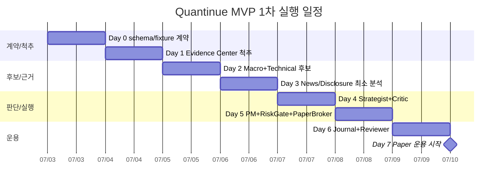
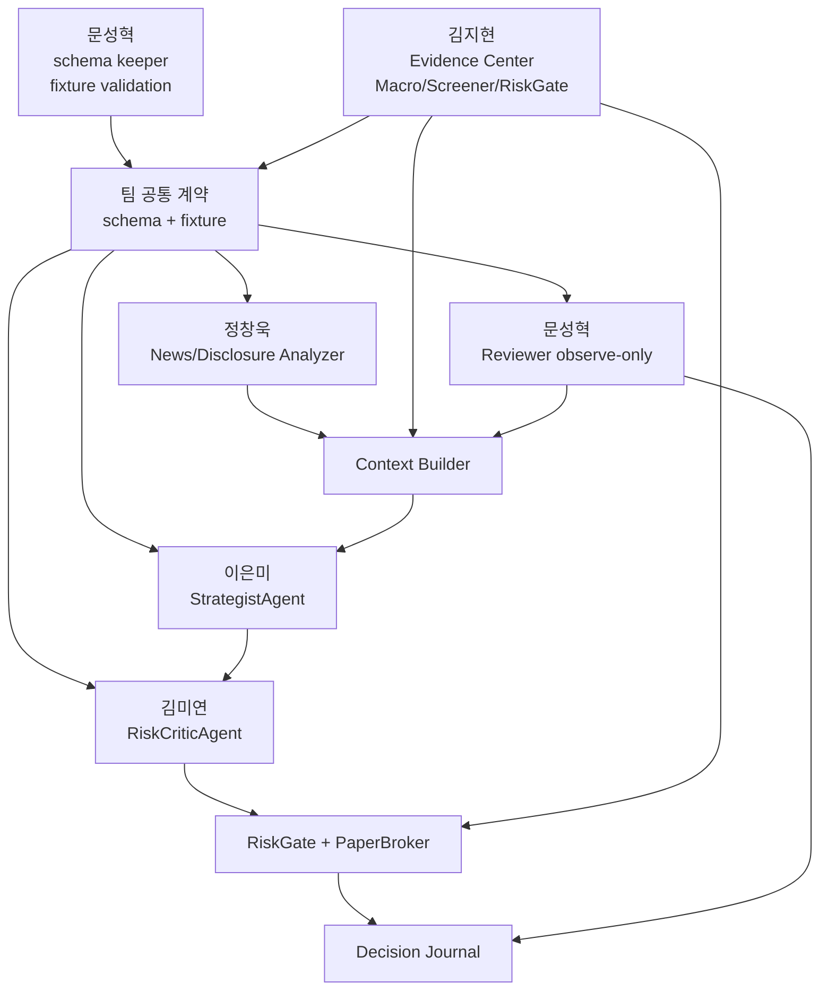
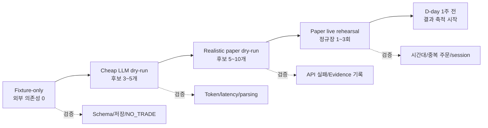
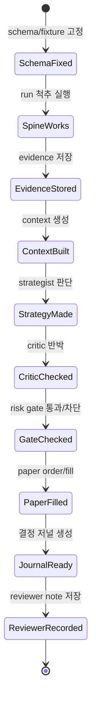

# Quantinue Attempt 1 MVP 1차 계획서

## 1. 목표

MVP 1차의 목표는 “완성도 높은 자동매매 플랫폼”이 아니라 **가상 자동매매 루프를 조기에 완주시키고, D-day보다 약 1주일 빨리 paper 결과를 쌓기 시작하는 것**이다.

따라서 우선순위는 다음과 같다.

1. schema 계약 확정
2. Evidence Center 저장
3. macro-first 후보 생성
4. Strategist 판단 패키지 생성
5. Risk Critic과 RiskGate로 방어
6. PaperBroker 가상 체결
7. 결정 저널로 설명 가능하게 만들기
8. Reviewer observe-only 기록

## 2. MVP 1차 범위

### 반드시 구현

| 영역 | 구현 수준 |
| --- | --- |
| 투자유형 | 균형형 1종 |
| 계좌 | 로컬 가상 계좌 1개 이상 |
| 시장 | 미국 주식 |
| 섹터 | 11개 대분류 |
| 실행 | 로컬 dry-run / paper |
| 후보 수 | 5~10개 |
| Macro Selector | 규칙 기반 + 요약 |
| Technical Screener | 가격/거래량/추세/변동성 점수 |
| News/Disclosure | 후보에 대해서만 최소 분석 |
| Evidence Center | raw + normalized evidence 저장 |
| Context Builder | Strategist 입력 JSON 생성 |
| Strategist | structured output |
| Risk Critic | 반박 체크리스트 |
| PM | 수량/금액 계산 |
| RiskGate | 한도/쿨다운/NO_TRADE |
| PaperBroker | 가상 주문/체결/포지션 |
| Reviewer | observe-only |
| 결정 저널 | DB/JSON 산출물 우선 |

### 1차 제외

- AWS
- 텔레그램
- 멀티계좌
- 안정형/공격형 운용
- ML 매매 연결
- 소셜 감성
- 시간외 신규 진입
- 실거래 브로커
- 완전한 백테스트
- 화려한 웹 대시보드

## 3. 권장 일정

아래 일정은 “D-day보다 1주 빠르게 paper 운용 시작”을 전제로 한다.

### Day 0: 계약 고정

목표: 팀원이 각자 개발을 시작해도 통합이 깨지지 않게 한다.

산출물:

- sector enum 확정
- `TradeAction` 확정
- `SourceRef` 확정
- `StrategySignal`, `CriticVerdict`, `ReviewNote` fixture 확정
- sample `strategist_context.json` 작성

담당:

- 문성혁: schema keeper, fixture 모음, validation checklist
- 김지현: DB/코어 schema 확정
- 각 에이전트 담당: 자기 output fixture 3개 제출

성공 기준:

- LLM 없이 sample JSON만으로 전체 흐름을 설명할 수 있다.

### Day 1: Evidence Center와 척추

목표: 분석이 없어도 저장과 실행 흐름이 돈다.

구현:

- `run`
- `instrument`
- `raw_source`
- `macro_snapshot`
- `candidate`
- `strategist_context`
- `paper_order`
- `position`

최소 기능:

- fixture 후보 5개 저장
- dummy context 생성
- dummy strategy signal 저장
- PaperBroker가 가상 주문 1건 생성

성공 기준:

- DB 또는 JSON 저장소에 run 하나가 처음부터 끝까지 남는다.

### Day 2: Macro Selector + Technical Screener

목표: 후보를 사람이 고르는 것이 아니라 시스템이 고른다.

구현:

- macro snapshot 생성
- 섹터 허용/회피 판단
- 가격/거래량 기반 후보 점수
- 후보 5~10개 선정

1차 규칙 예시:

- `risk_score > 0.75`: 신규 진입 후보 0~3개 또는 `NO_TRADE` 중심
- `risk_score 0.45~0.75`: 후보 5개, size multiplier 0.5~0.8
- `risk_score < 0.45`: 후보 10개, 정상 size
- blocked sector는 candidate status를 `blocked`로 저장

성공 기준:

- 후보마다 sector, selection_score, selection_reasons가 있다.

### Day 3: News/Disclosure 최소 분석

목표: 후보에 근거를 붙인다.

구현:

- 후보별 최근 뉴스 N개 수집/fixture
- 후보별 SEC filing metadata 또는 fixture
- NewsSignal Pydantic output
- DisclosureSignal Pydantic output
- source_refs 저장

성공 기준:

- 후보 5개 중 최소 3개에 news/disclosure evidence가 붙는다.
- 출처 없는 LLM 판단이 없다.

### Day 4: Strategist + Risk Critic

목표: 거래/비거래 판단이 구조화되어 나온다.

구현:

- Context Builder
- StrategistAgent
- RiskCriticAgent
- `NO_TRADE` 경로

Critic 정책:

- `critical` objection -> reject
- `needs_more_evidence` -> NO_TRADE
- high severity -> reduce_size 또는 reject

성공 기준:

- 후보별 `StrategySignal`과 `CriticVerdict`가 저장된다.
- BUY보다 NO_TRADE가 많이 나와도 정상으로 인정한다.

### Day 5: PM + RiskGate + PaperBroker

목표: 판단을 안전한 가상 주문으로 바꾼다.

구현:

- PortfolioDecision
- RiskGateResult
- PaperOrder/PaperFill
- Position 갱신
- idempotency key

필수 규칙:

- 종목당 최대 10%
- 거래당 리스크 2% 이하
- risk_budget_multiplier 반영
- blocked sector 주문 금지
- cooldown 종목 주문 금지
- pause 상태 주문 금지

성공 기준:

- 허용/차단/축소 결과가 모두 테스트된다.
- 같은 run을 두 번 돌려도 주문이 중복되지 않는다.

### Day 6: 결정 저널 + Reviewer observe-only

목표: 발표와 디버깅에 필요한 설명 가능성을 확보한다.

구현:

- run summary
- candidate summary
- signal summary
- critic summary
- gate/order/fill summary
- Reviewer note

Reviewer 정책:

- `memory_weight = 0`
- `actionability = observe_only`
- 전략 반영 없음
- 패턴 기록만 수행

성공 기준:

- “왜 이 종목을 봤고, 왜 샀거나 안 샀는지” 한 화면/JSON으로 설명된다.

### Day 7: 첫 paper 운용 시작

목표: D-day보다 1주일 정도 빠르게 결과를 쌓기 시작한다.

운영:

- 하루 1~3회 dry-run/paper run
- 정규장 중심
- 후보 5~10개
- 실패 run도 저장
- 매일 Reviewer summary 생성

성공 기준:

- 최소 5영업일치 run 결과가 발표 전까지 쌓인다.

## 4. 팀별 역할

| 담당 | 1차 핵심 역할 | 보조 역할 |
| --- | --- | --- |
| 김지현 | DB, Evidence Center, Macro Selector, Screener, PM, RiskGate, PaperBroker | 전체 통합 |
| 정창욱 | News/Disclosure Analyzer | source_refs 품질, 공시/뉴스 fixture |
| 이은미 | StrategistAgent | Context 입력 품질 피드백 |
| 김미연 | RiskCriticAgent | 반박 체크리스트, RiskGate 규칙 일부 보조 |
| 문성혁 | ReviewerAgent, schema keeper, fixture validation | 결정 저널 mock, 통합 테스트 추적 |

## 5. 문성혁 보조 포지션

문성혁은 Reviewer 담당이지만 1차에서는 Reviewer 자체보다 통합 보조가 더 중요하다.

추천 작업:

- schema 변경 관리
- 팀원 output fixture 수집
- 각 fixture가 schema에 맞는지 검증
- `strategist_context` sample 생성
- 결정 저널에 필요한 필드 체크
- run 결과를 사람이 읽을 수 있게 요약
- Reviewer observe-only prompt 작성
- dry-run 실패 원인 기록

문성혁이 보면 좋은 체크 질문:

- 이 데이터는 나중에 회고할 수 있는가?
- 이 판단은 source_refs로 설명 가능한가?
- Strategist가 이 정보를 읽고 과신하지 않게 되어 있는가?
- NO_TRADE 이유가 저장되는가?
- 같은 run을 다시 봐도 판단 과정을 재현할 수 있는가?

## 6. Dry-run 전략

### 6.1 Fixture-only

외부 API와 LLM 없이 전체 루프를 검증한다.

검증:

- schema 연결
- 저장 흐름
- Context Builder
- NO_TRADE
- RiskGate block
- PaperBroker fill

### 6.2 Cheap LLM dry-run

후보 3~5개만 실제 LLM에 넣는다.

검증:

- PydanticAI output
- prompt 길이
- token 비용
- latency
- schema parsing

### 6.3 Realistic paper dry-run

후보 5~10개, 일부 실제 데이터, 실제 PaperBroker.

검증:

- API 실패 처리
- LLM 실패 처리
- Evidence Center 기록
- 결정 저널 설명력

### 6.4 Paper live rehearsal

정규장 중 1~3회 실행한다. 실제 주문은 없다.

검증:

- 시간대 처리
- 가격 갱신
- session 처리
- 중복 주문 방지

## 7. 1차 RiskGate 기본 규칙

| 규칙 | 1차 기준 |
| --- | --- |
| 종목당 최대 비중 | 10% |
| 거래당 리스크 | 계좌 2% 이하 |
| 신규 진입 가능 세션 | 정규장 |
| blocked sector | 신규 진입 금지 |
| risk_score > 0.75 | 신규 진입 금지 또는 극소 후보 |
| Critic critical | 무조건 기각 |
| needs_more_evidence | NO_TRADE |
| 이벤트 임박 | 신규 진입 금지 |
| 쿨다운 | 신규 진입 금지 |
| pause 상태 | 주문 금지 |

## 8. 1차 Context Builder 규칙

Strategist에게 모든 데이터를 던지지 않는다. 아래만 포함한다.

- macro summary
- sector policy
- candidate reason
- technical score
- news summary
- disclosure summary
- current position
- cooldown state
- Reviewer observe-only 메모 0~2개
- source_refs

제외:

- 긴 뉴스 원문 전체
- 긴 공시 원문 전체
- raw API payload
- 과거 모든 review
- ML 확률

## 9. 결정 저널 최소 필드

| 영역 | 보여줄 내용 |
| --- | --- |
| Run | 시각, 모드, profile, status |
| Macro | regime, risk_score, 허용/회피 섹터 |
| Candidate | symbol, sector, rank, 선정 이유 |
| Evidence | news/disclosure 요약과 source |
| Strategy | action, conviction, reason |
| Critic | decision, objections, severity |
| RiskGate | allow/block/resize, reason |
| Paper | order/fill/position |
| Review | observe-only lesson |

## 10. 완료 조건

MVP 1차 완료는 아래가 모두 만족될 때다.

- 로컬에서 한 run이 끝까지 완료된다.
- Evidence Center에 모든 단계 산출물이 저장된다.
- 후보 5개 이상에 대해 Context Builder가 작동한다.
- Strategist가 구조화된 action을 낸다.
- Risk Critic이 구조화된 verdict를 낸다.
- RiskGate가 허용/차단/축소 중 하나를 낸다.
- PaperBroker가 중복 없이 가상 체결한다.
- Reviewer가 observe-only note를 남긴다.
- 결정 저널용 summary가 생성된다.
- 실제 실거래 기능이 없다.

## 11. 발표에서 강조할 포인트

- 매크로가 먼저 시장 상황을 보고 후보군을 좁힌다.
- 뉴스/공시는 비용을 아끼기 위해 후보에 대해서만 분석한다.
- Strategist는 모든 근거를 Evidence Center에서 조립한 context로 판단한다.
- Risk Critic과 RiskGate가 과신을 막는다.
- 거래하지 않는 판단도 시스템의 정상 결과다.
- Reviewer는 초반에 전략을 바꾸지 않고 observe-only로 교훈을 쌓는다.
- 전부 가상매매라 실제 돈을 움직이지 않는다.
