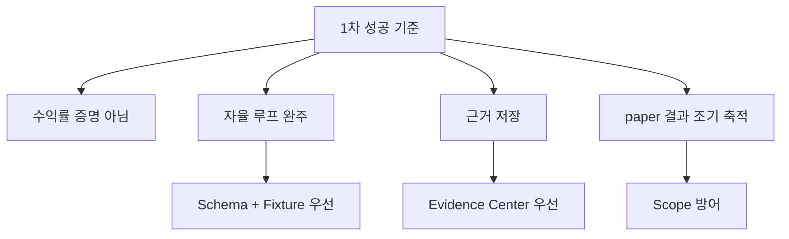

# Quantinue Attempt 1 추가 코멘트

이 문서는 기획서, 설계서, 데이터 스키마, MVP 계획서에 이미 들어간 내용을 반복하지 않고, 실제 개발을 시작하기 전에 팀이 합의해두면 좋은 판단 기준과 주의점을 정리한다.

## 1. 전체 판단

현재 방향은 1차 MVP 기준으로 맞다. 특히 아래 결정은 유지하는 편이 좋다.

- macro-first로 후보를 줄인 뒤 뉴스/공시 LLM 분석을 실행한다.
- Strategist가 DB를 직접 뒤지지 않고 `Context Builder`가 만든 입력만 받는다.
- 모든 판단은 Evidence Center에 저장한다.
- Reviewer는 1차에서 `observe_only`, `memory_weight=0`으로 둔다.
- 실거래, AWS 상시 운영, 텔레그램, ML 매매 연결은 1차에서 제외한다.

최선이라는 뜻은 “가장 많은 기능을 넣었다”가 아니라 **D-day보다 1주일 먼저 paper 결과를 쌓을 가능성이 가장 높은 구조**라는 뜻이다.

## 2. 가장 중요한 코멘트

1차에서 제일 위험한 것은 기술 난도가 아니라 **범위가 다시 커지는 것**이다.

아래는 1차 중간에 추가하고 싶어질 가능성이 높지만 막아야 한다.

- 텔레그램 알림
- 예쁜 대시보드
- vector DB/llmwiki
- 실시간 스트리밍 가격
- ML 예측값을 실제 판단에 반영
- 공격형/안정형 투자유형
- 실거래 API 연결
- 장기 백테스트

이것들은 나쁜 기능이 아니라 **순서가 뒤에 있어야 하는 기능**이다. 1차에서 먼저 해야 하는 것은 `run_id` 하나가 처음부터 끝까지 남는지 확인하는 것이다.

## 3. Macro-first 관련 코멘트

Macro Selector는 “오늘의 시장을 예측하는 AI”가 아니라 **후보군과 리스크 예산을 좁히는 규칙 계층**으로 시작해야 한다.

좋은 1차 역할:

- 오늘 신규 진입 후보 수를 조절한다.
- 섹터를 허용/회피로 나눈다.
- `risk_budget_multiplier`를 만든다.
- `NO_TRADE` 가능성을 높이거나 낮춘다.

피해야 할 역할:

- 특정 종목의 매수/매도 결정을 직접 내림
- 뉴스/공시보다 먼저 기업 이벤트를 해석함
- 너무 복잡한 경제 지표 조합을 사용함
- 근거 없이 `risk_on`, `risk_off`를 LLM이 선언함

1차에서는 `risk_score`가 정확한 예측값일 필요가 없다. 대신 같은 입력이면 같은 결과가 나오는 deterministic rule이면 충분하다.

## 4. Evidence Center 관련 코멘트

사용자가 말한 “하나의 데이터 센터” 방향은 맞다. Strategist가 복합 판단을 하려면 macro, candidate, technical, news, disclosure, position, reviewer note가 같은 기준으로 모여 있어야 한다.

다만 Evidence Center를 처음부터 지식 그래프나 vector DB처럼 만들 필요는 없다.

추천 순서:

1. `raw_source`에 원본과 hash를 저장한다.
2. normalized evidence 테이블에 요약 결과를 저장한다.
3. `strategist_context`에 당시 판단 입력 스냅샷을 저장한다.
4. decision journal view를 만든다.
5. 나중에 검색/텔레그램/시각화가 필요해지면 vector index나 llmwiki류를 붙인다.

핵심은 “나중에 더 똑똑하게 검색할 수 있나”보다 “오늘 판단을 내일 재현할 수 있나”다.

## 5. LLM/Agent 관련 코멘트

LLM은 판단 보조 계층이지 안전장치가 아니다. 특히 RiskGate는 LLM이 아니라 코드 규칙이어야 한다.

1차 권장 정책:

- Strategist는 structured output만 허용한다.
- Risk Critic은 자유로운 의견이 아니라 거부권 체크리스트로 둔다.
- source가 없는 LLM 판단은 Strategist 입력에서 제외한다.
- LLM이 `BUY`를 내도 RiskGate가 막으면 최종 결과는 block이다.
- `NO_TRADE`가 많이 나오는 것은 실패가 아니다.
- Reviewer는 초반에 절대 전략을 바꾸지 않는다.

LLM 비용은 후보 수와 context 길이가 거의 결정한다. 1차에서는 후보 5~10개, 뉴스/공시 요약만 입력, raw 원문 제외가 맞다.

## 6. RiskGate 관련 코멘트

RiskGate는 발표에서 강하게 보여줄 수 있는 장점이다. “AI가 샀다”가 아니라 “AI가 사고 싶어도 코드 규칙이 막는다”가 설득 포인트다.

1차에 꼭 보여주면 좋은 케이스:

- 허용: 정상 BUY가 paper order로 이어짐
- 차단: blocked sector라 주문 금지
- 축소: conviction은 높지만 macro risk가 높아 size 감소
- 보류: `needs_more_evidence`라 `NO_TRADE`
- 중복 방지: 같은 run 재실행에도 주문 1건만 존재

이 다섯 가지가 되면 실거래가 없어도 자동매매 시스템의 안전 구조를 설명할 수 있다.

## 7. Data/API 관련 코멘트

무료/저가 API를 쓰면 데이터 품질 문제는 피할 수 없다. 그래서 1차는 완벽한 데이터보다 **결측과 지연을 정상 상태로 처리하는 구조**가 중요하다.

필수 방어:

- 수집 실패도 `run`에 남긴다.
- 가격/뉴스/공시에는 `fetched_at`을 남긴다.
- 오래된 데이터는 Strategist 입력에 표시한다.
- 후보 5개 중 일부 뉴스가 없어도 전체 run은 실패시키지 않는다.
- source가 없거나 너무 약하면 `needs_more_evidence` 또는 `NO_TRADE`로 보낸다.

정규장 중심이어도 프리마켓/애프터마켓 데이터는 참고할 수 있다. 다만 1차 신규 진입은 정규장으로 제한하고, 시간외 데이터는 `market_notes`나 `technical_signal`의 보조 신호로만 쓰는 편이 안전하다.

## 8. ML/Backtest 관련 코멘트

1차에서 ML은 “자리만 만들어두고 판단에는 쓰지 않는 것”이 맞다.

이유:

- 초반에는 학습 데이터가 거의 없다.
- paper run도 시장 기간이 짧으면 통계 의미가 약하다.
- 잘못된 ML 확률은 LLM 판단보다 더 그럴듯하게 보일 수 있다.
- 발표 전까지는 ML 성능보다 자동 루프와 근거 추적이 더 중요하다.

대신 1차에서 쌓아야 할 것은 future ML용 로그다.

- 후보가 왜 선정됐는가
- Strategist는 무엇을 판단했는가
- Critic은 무엇을 반박했는가
- RiskGate는 왜 막았는가
- paper 결과는 어떻게 됐는가
- 며칠 뒤 결과는 어땠는가

이 데이터가 있어야 2차에서 백테스트나 Reviewer/ML 가중치를 논의할 수 있다.

## 9. Frontend/텔레그램 관련 코멘트

1차에서 프론트는 “서비스 화면”이 아니라 “결정 저널 뷰”면 충분하다.

우선순위:

1. run summary
2. candidate summary
3. action / no-trade reason
4. critic objections
5. risk gate result
6. paper order/fill
7. source_refs

텔레그램도 지금 만들 필요는 없다. 다만 Decision Journal을 잘 만들면 나중에 텔레그램 메시지는 그 view를 요약해서 보내면 된다. 즉, 1차에서 텔레그램을 제외해도 텔레그램을 위한 기반 작업은 이미 하는 셈이다.

## 10. AWS/운영 관련 코멘트

AWS는 2차가 맞다. 1차에서 AWS를 하지 않아도 되는 이유는 운영 인프라보다 파이프라인 계약이 더 불확실하기 때문이다.

그래도 지금부터 지켜야 할 운영 전제는 있다.

- `run_id`를 모든 단계에 전달한다.
- 같은 run 재실행에서 주문이 중복되지 않게 한다.
- API key와 LLM key는 코드에 박지 않는다.
- 각 collector는 실패해도 전체 프로세스를 죽이지 않는다.
- 장기 실행보다 단발성 run script를 먼저 만든다.

이렇게 해두면 나중에 로컬 스크립트를 AWS cron, ECS task, Lambda, Batch 중 무엇으로 옮겨도 구조가 크게 흔들리지 않는다.

## 11. 팀 진행 관련 코멘트

문성혁의 보조 역할은 “코드를 대신 많이 짜는 것”보다 **계약을 깨지 않게 만드는 것**이 더 중요하다.

추천 운영 방식:

- Day 0에 fixture를 팀원별로 3개씩 받는다.
- 각 fixture가 schema validation을 통과하는지 확인한다.
- 매일 통합 run을 1번 이상 돌린다.
- LLM이 없어도 fixture-only run이 항상 돌아야 한다.
- schema 변경은 한 사람이 기록하고 공지한다.
- 각 에이전트는 자기 output만 책임지고, 다른 에이전트 내부 구현을 가정하지 않는다.

팀이 각자 잘 만들어도 통합에서 깨지는 경우가 많다. 이 프로젝트에서는 “fixture 계약”이 팀 운영의 중심이어야 한다.

## 12. 발표/평가 관점 코멘트

발표에서 수익률을 앞세우면 위험하다. paper 기간이 짧기 때문에 수익률은 운의 영향을 크게 받는다.

대신 아래를 강조하는 편이 좋다.

- macro-first로 비용과 후보 수를 줄였다.
- 뉴스/공시는 후보에 대해서만 분석해 낭비를 줄였다.
- Evidence Center로 모든 판단 근거를 재현할 수 있다.
- Risk Critic과 RiskGate가 AI 과신을 막는다.
- 거래하지 않는 판단도 정상 결과로 저장된다.
- D-day보다 먼저 paper run을 시작해 실제 운용 로그를 확보했다.

결과가 좋으면 수익률도 보여주되, 결과가 애매해도 시스템 완성도를 설명할 수 있어야 한다.

## 13. 지금 당장 추가하면 좋은 작은 결정

아래는 문서에 이미 암묵적으로 있지만, 개발 시작 전에 명시 합의하면 좋은 것들이다.

| 결정 | 추천 |
| --- | --- |
| 기본 저장소 | 로컬 SQLite 또는 JSON fixture 후 SQLite |
| 시간 기준 | UTC 저장, 화면/로그에서 KST 또는 ET 표시 |
| 기본 계좌 ID | `paper-balanced-001` |
| 기본 run ID | `YYYY-MM-DD-balanced-001` |
| 기본 후보 수 | 정상장 5개, risk-on 10개, risk-off 0~3개 |
| 기본 LLM 전략 | fixture-only 통과 전 LLM 호출 금지 |
| 기본 실패 정책 | 부분 실패 허용, run 전체 기록 |
| 기본 Review 정책 | `observe_only`, `memory_weight=0` |

## 14. 결론

추가로 코멘트할 핵심은 하나다.

**1차 MVP는 자동매매 성능을 증명하는 프로젝트가 아니라, 자동매매 판단 과정을 안전하고 재현 가능하게 만드는 프로젝트로 잡아야 한다.**

이 방향을 지키면 나중에 AWS, 텔레그램, vector search, Reviewer memory, ML/backtest를 붙일 때도 자연스럽게 확장할 수 있다.
