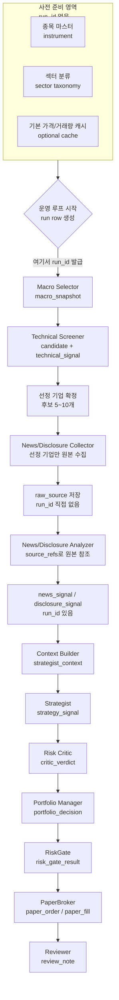
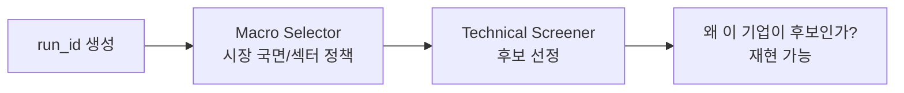
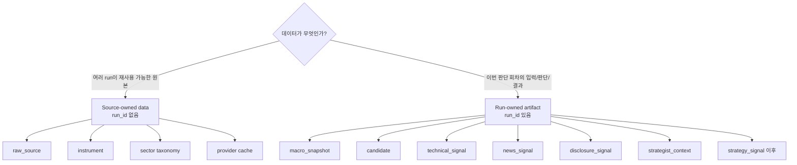
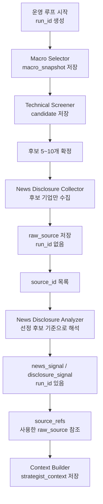
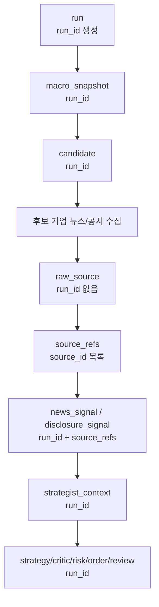
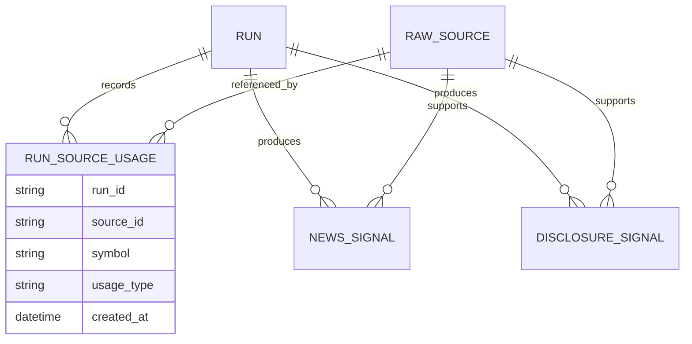

# Quantinue Run ID 파이프라인 기준

이 문서는 `run_id`가 언제 생성되고, 어디까지 직접 들어가야 하는지 정리한다.

핵심 결론:

- `run_id`는 **운영 루프 시작 시점**, 즉 Macro Selector 실행 직전에 생성한다.
- 뉴스/공시는 스크리너 이후 선정 기업만 수집한다.
- 뉴스/공시 원본 `raw_source`에는 원칙적으로 `run_id`를 직접 넣지 않는다.
- 이번 run에서 그 원본을 해석한 결과인 `news_signal`, `disclosure_signal`부터 `run_id`를 붙인다.
- 다시 말해 `run_id`는 “수집된 모든 데이터”가 아니라 **이번 판단 회차의 산출물**에 붙는다.

## 1. 전체 파이프라인

이 그림에서 중요한 점은 두 가지다.

1. `run_id` 생성은 스크리너 이후가 아니라 Macro Selector 직전이다.
2. 뉴스/공시 수집이 run 내부에서 일어나더라도, 원본 저장소인 `raw_source`는 재사용 가능한 데이터로 두고 `run_id`를 직접 넣지 않는다.

## 2. 왜 Macro 전부터 `run_id`가 필요한가

스크리너가 기업을 확정한 뒤부터 `run_id`를 만들면 “왜 그 기업이 후보가 됐는지”를 완전히 재현하기 어렵다.

후보 선정에는 아래 판단이 모두 영향을 준다.

- 이번 run의 시장 국면
- 이번 run의 `risk_score`
- 이번 run에서 허용/회피한 섹터
- 이번 run에서 적용한 후보 수 제한
- 이번 run에서 계산한 기술 점수

그래서 `run_id`는 후보가 확정된 후가 아니라, 후보를 만들기 위한 첫 판단인 Macro Selector 이전에 만들어야 한다.

## 3. 데이터 소유권 기준

`run_id`를 넣을지 말지는 “언제 만들어졌는가”보다 **누가 소유하는 데이터인가**로 판단한다.

예외처럼 보이는 부분은 뉴스/공시 수집이다.

뉴스/공시는 스크리너 이후 run 내부에서 수집하지만, 수집된 원문 자체는 다음 run에서도 재사용할 수 있다. 그래서 원본은 `Source-owned data`로 보고 `raw_source`에 저장한다.

그 원문을 이번 run의 후보에 대해 요약/해석한 결과는 `Run-owned artifact`다. 그래서 `news_signal`, `disclosure_signal`에는 `run_id`가 들어간다.

## 4. 뉴스/공시 수집 기준

현재 프로젝트 방향은 “전체 유니버스 뉴스/공시 수집”이 아니라 “스크리너가 추린 기업만 수집”이다. 이 기준을 반영하면 흐름은 아래와 같다.

이 방식이면 수집 범위는 작게 유지하면서도, 판단 재현성은 유지할 수 있다.

## 5. 테이블별 기준

| 테이블/데이터 | `run_id` | 이유 |
| --- | --- | --- |
| `instrument` | N | 종목 마스터는 여러 run이 공유한다. |
| `sector taxonomy` | N | 기준 분류이며 특정 run의 결과가 아니다. |
| 가격/거래량 원본 cache | N 또는 선택 | 단순 provider cache면 없음. 이번 run의 판단 snapshot이면 `technical_signal`에 저장한다. |
| `run` | Y | `run_id` 자체를 발급하는 루트 테이블이다. |
| `macro_snapshot` | Y | 이번 run이 본 시장 국면이다. |
| `candidate` | Y | 이번 run에서 선택/차단된 후보 목록이다. |
| `technical_signal` | Y | 이번 run 후보에 대해 계산한 기술 신호다. |
| `raw_source` | N | 뉴스/공시 원본은 여러 run에서 재사용 가능하다. |
| `news_signal` | Y | 이번 run 후보에 대해 뉴스 원본을 해석한 결과다. |
| `disclosure_signal` | Y | 이번 run 후보에 대해 공시 원본을 해석한 결과다. |
| `strategist_context` | Y | 이번 run에서 Strategist가 실제로 본 입력이다. |
| `strategy_signal` | Y | 이번 run의 전략 판단이다. |
| `critic_verdict` | Y | 이번 run의 반박/검증 결과다. |
| `portfolio_decision` | Y | 이번 run의 수량/금액 결정이다. |
| `risk_gate_result` | Y | 이번 run의 최종 안전 검사 결과다. |
| `paper_order` / `paper_fill` | Y | 이번 run으로 발생한 가상 주문/체결이다. |
| `position` | N 또는 간접 | 현재 상태 테이블이다. 체결 이력은 `paper_fill.run_id`로 추적한다. |
| `review_note` | Y | 이번 run의 결과를 보고 남긴 회고다. |

## 6. 최소 구현안

MVP 1차에서는 아래처럼 구현하면 충분하다.

최소 구현에서 필요 없는 것:

- `raw_source.run_id`
- `run_source_usage` 별도 테이블
- 전체 유니버스 뉴스/공시 수집
- vector DB
- 뉴스/공시 장기 검색 인덱스

최소 구현에서 반드시 필요한 것:

- `run.run_id`
- `macro_snapshot.run_id`
- `candidate.run_id`
- `news_signal.run_id`
- `disclosure_signal.run_id`
- `news_signal.source_refs`
- `disclosure_signal.source_refs`
- `strategist_context.run_id`

## 7. 더 정확한 2차 확장안

나중에 “이번 run 때문에 어떤 원본을 수집했는지”까지 명확히 보고 싶으면 연결 테이블을 추가한다.

`run_source_usage`는 이런 경우에만 필요하다.

- 수집 비용을 run별로 계산하고 싶다.
- 특정 run이 어떤 원본을 수집했지만 분석에는 쓰지 않았는지 알고 싶다.
- duplicate라서 버린 원본까지 추적하고 싶다.
- 나중에 감사/디버깅 수준을 더 높이고 싶다.

1차에서는 `source_refs`만으로 충분하다.

## 8. 한 줄 기준

`run_id`는 **이번 판단 회차를 재현하는 데 필요한 산출물**에 붙인다.

뉴스/공시 원본은 수집 시점이 run 내부여도 원본 데이터라서 `run_id`를 직접 붙이지 않는다. 대신 그 원본을 이번 후보 판단에 사용해 만든 `news_signal`, `disclosure_signal`에는 `run_id`를 붙인다.
