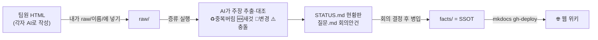

# 🧭 이어서 시작 — 세션 요약 & 핸드오프

> 이 폴더(`ClaudeCode/quantinue-wiki`)가 무엇이고, 지금까지 뭘 했고, 다음에 뭘 하면 되는지 한 장 요약.
> 새 세션에서 이 파일을 클로드에게 보여주면 맥락을 이어받을 수 있음. (작성 2026-07-05)

---

## 0. 30초 요약

- **이 폴더 = "DocStill" 문서 관리 시스템** (팀 위키). 팀원들이 각자 AI로 만든 HTML 문서를 → 내가 raw에 넣고 → AI가 "주장" 단위로 증류·대조 → 확정된 것만 `facts/`(SSOT)에 쌓고 → MkDocs로 웹 위키 배포.
- **라이브 위키:** https://jaymunsh.github.io/quantinue-wiki/ (GitHub Pages, 무료)
- **문서화 대상 = "Quantinue"** — 팀 여름이었다(5인)의 미국주식 자율 AI 자동매매 시스템(전부 가상매매). 부트캠프 4주 프로젝트, 발표 7/29.
- **나(사용자) = 문성혁** — 파이프라인의 ⑩Reviewer(회고) 담당 + **schema keeper**(문서·계약 통합 관리자).

---

## 1. 이 시스템(DocStill) 원리



**핵심 원칙:** 팀원 행동은 안 바꾼다(그냥 올리기만) · 수동은 딱 2곳(raw에 넣기·확정 판단) · 나머지 자동 · facts가 유일한 확정 기준 · raw는 불변(언제든 재증류).

---

## 2. 폴더 & 운영 3동작

```
quantinue-wiki/
├ raw/{공용,지현,창욱,은미,미연,성혁,멘토}/  원본(불변)
├ facts/  SSOT (병입으로만 채움) — 파이프라인·데이터계약·MVP1차·결정로그·일정·화면
├ STATUS.md  현황판 · 질문.md  회의안건 · 산출물_현황판.md
├ tools/  distill.py(증류 러너) · distill_prompt.md(지시서=소스코드) · config.json
├ wiki/  mkdocs가 읽는 심볼릭 링크 · mkdocs.yml · site/(빌드결과)
├ 증류실행.command / 위키보기.command  더블클릭 실행
└ 사용가이드.md  (운영 상세 — 꼭 참고)
```

| 동작 | 방법 |
|---|---|
| **문서 들어오면** | `raw/이름/`에 드래그 (10초) |
| **증류** (회의 전날) | `./증류실행.command` 더블클릭 or `python3 tools/distill.py` |
| **로컬 위키 보기** | `./위키보기.command` → http://localhost:8000 |
| **병입** (회의 후) | 클로드에게 "안건 N번 ○○로 확정, 병입해줘" |
| **웹 배포** | `python3 -m mkdocs gh-deploy --force` (1분) |

- **LLM 벤더 중립:** config.json의 `backend`로 claude/codex/ollama/openai_compat 교체(어떤 LLM이든). 상세는 사용가이드 §2-B.
- **Mermaid:** 지시서에 "흐름·구조는 Mermaid 적극 활용" 규칙 있음 → 증류·병입 시 자동으로 다이어그램 그려짐.

---

## 3. 현재 상태 (증류 2회차까지 완료)

**병입 완료된 facts:** ✅ 파이프라인(다이어그램 3개) · ✅ 데이터계약(ERD) · ✅ MVP1차 정의 · ✅ 결정로그(#1 tb_ 접두사)
**아직 빈 facts:** 일정(solutions Day계획으로 병입 가능) · 화면(재료 없음=산출물 안건)
**대기:** 확정후보 26건(회의서 이의없음 확인 후 일괄 병입 가능)

**⚠️ 미처리:** `raw/공용/`에 새 파일 **"Quantinue — 파이프라인 흐름순 상세 명세"** HTML이 들어와 있음 → **3회차 증류 아직 안 돌림.** (다음에 `증류실행.command` 돌리면 반영)

---

## 4. Quantinue 프로젝트 핵심 (문서화 대상)

**한 사이클(매일 08:30 ET · cycle_id로 묶임):**
① 스크리너(지현) → ② 기술(지현) → ③ 매크로(지현) → ④ 공시(창욱) → ⑤ 뉴스(창욱) → ⑥ Strategist(은미) → ⑦ Risk Critic(미연) → ⑧ PM·게이트(지현) → ⑨ 실행 PaperBroker(지현) → ⑩ Reviewer(성혁)

**확정 원칙:** Macro-first(후보 압축) · Pull 방식(각 팀 저장→Strategist SELECT) · 코드게이트 샌드위치(LLM은 제안, 앞뒷문은 코드 강제) · NO_TRADE 정상 · 전부 가상.

**팀 역할:** 지현=코어(스크리너·기술·매크로·PM·게이트·실행) · 창욱=공시·뉴스 · 은미=Strategist · 미연=Risk Critic · **성혁(나)=Reviewer + schema keeper**.

---

## 5. 🔴 미결정 안건 (회의 필요 — 파이프라인 착수를 막는 것)

| # | 안건 | 실태 |
|---|---|---|
| A1 | **투자유형 1종?** | 설계서=공격형1 / 은미=안정+공격2 / solutions=균형 (3자 불일치) |
| A2 | **저장소** | 창욱=SQLite(코드有) / 은미·설계서=Postgres → "로컬 SQLite→통합 Postgres" 제안 |
| A3 | **cycle_id 생성 주체** | 오케스트레이터 발급 제안 (은미 요청) |
| A4 | **매크로 risk_score 범위** | 0~100 제안 (0~10 vs 0~1 vs 0~100 갈림) |
| + | **ml_prob_up 1차 사용?** | 설계서=ML 1차 미연결인데 은미는 매수신호로 씀 → 모순 |
| B계열 | 필드 계약 | tb_접두사(✅확정) · category→sector · cross_source_confirmed · 기술값형태 등 (데이터계약 §7) |
| 멘토 | MVP 성공기준 · 화면흐름 산출물 · 간트 세분화 |

> 회의에서 A1~A4 + ml만 정하면 MVP1차 정의가 "확정 착수 기준선"이 됨.

---

## 6. 나(성혁)의 파트 — Reviewer

- **1차 = observe-only** (전략 반영 안 함, 기록만) → 2차에 피드백 루프.
- **출력 계약 = `tb_memory_entries`** (은미가 소비): `ticker·cycle_id·side·conviction·outcome·lesson·created_at`.
  - `outcome` = 내 Scorer가 코드로 채점 · `lesson` = 내 Reflector가 LLM으로 생성.
- **내 설계 초안:** `../project-summer/Reviewer_회고에이전트_초안.md` (Scorer→Aggregator→Reflector→메모리 2층). 이걸 tb_memory_entries 스키마에 맞추면 됨.

---

## 7. 다음 할 일 후보

1. **3회차 증류** — raw/공용/의 새 명세 HTML 반영 (미처리 상태)
2. **일정 페이지 병입** — solutions Day계획을 gantt 다이어그램으로
3. **내 Reviewer 파트 착수** — MVP1차 + tb_memory_entries 계약에 맞춰 실제 스켈레톤/스키마
4. **데이터계약 → Pydantic schemas.py 실코드** (Day0 계약 fixture)
5. **회의 후 병입** — A1~A4 결정 반영 + 확정후보 26건

---

## 8. 관련 문서 위치

- **위키 시스템/운영:** 이 폴더 `사용가이드.md` (필독)
- **설계 원본·논의:** `../project-summer/` — design.md · Quantinue_상세설계_개선판*.md · 진행방향_종합_260703.md · Reviewer_회고에이전트_초안.md · update_260703/(solutions·research·참고 자료)
- **라이브 위키:** https://jaymunsh.github.io/quantinue-wiki/
