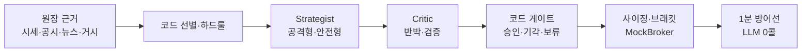

# 🛡️ AI 판단과 안전장치

!!! info "최종 프로젝트의 핵심 설계"
    LLM에게 매매 권한을 통째로 넘기지 않는다. 해석이 필요한 곳만 AI에 맡기고,
    위험·비용·재현성은 코드와 원장이 책임진다.

## 판단 구조

## 코드가 맡는 일

| 영역 | 코드가 강제하는 것 |
|---|---|
| 후보 | 원장 기반 랭킹·필터·보유 종목 이월 |
| 위험 | 하드 이벤트·리스크·손절·익절·기간 청산 |
| 판단 경계 | Critic 통과 여부·성향별 문턱·보류 처리 |
| 실행 | 계좌 잔고·신규 주문 한도·사이징·브래킷 |
| 비용 | LLM 호출 예산·일일 상한·위급 매도용 예약 |
| 재실행 | JOB 슬롯·주문 idempotency key·중복 호출 cooldown |
| 감사 | 모델·프롬프트·입력 지문·판정 주체·근거 계보 |

## AI가 맡는 일

- 여러 데이터의 의미를 읽고 매수·보유·매도 서사를 만든다.
- Strategist 제안을 Critic이 반대 관점에서 검토한다.
- 숫자 계산과 하드 차단을 대신하지 않는다.
- 근거 없는 입력이나 원장에 없는 사실을 새로 만들지 않는다.

## 비용과 재현성

전체 판단 중 상당수는 결정론 게이트에서 끝내고, 애매한 판단만 LLM에 보낸다.
07-19~27 실측에서는 Critic 검토 323건 중 271건이 결정론 경로에서 종료됐고,
유료 LLM 사용량은 4일 312콜·`$0.53`이었다.

판단 결과에는 모델·프롬프트 버전·입력 지문이 남아 이후 같은 판단이 어떤 근거로 나왔는지
확인할 수 있다. 원장에 없는 값은 “없음”으로 남기며 임의로 보완하지 않는다.

구성요소별 입력·게이트·원장 기록은 [핵심 기능 (최종)](핵심기능/index.md)에서 본다.
