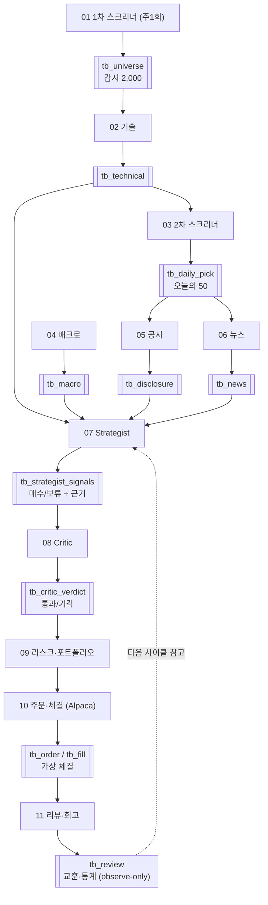

# 🎯 MVP 1차 정의서 (구현 토대)

!!! info "🧊 1차 MVP 동결본 · 2026-07-17"
    이 페이지는 1차 시점의 범위와 성공 기준을 보존하는 **역사 자료**다. 1차는 실제로
    한 사이클을 완주했고, 이후 2차에서 JOB 기반 운영·두 성향·장중 방어선으로 확장됐다.
    현재 정본은 [최종 프로젝트 한눈에](최종프로젝트.md)다.
    파이프라인 구조는 그대로 두고 "1차에 **실제로 만들 것**"만 잘라낸 영역.

    **왜 필요한가:** 설계서는 1차·2차가 섞여 "지금 뭘 만들지"가 흐릿했던 시점에 **IN/OUT을 못 박아** 개발 토대로 삼았다.

## 1. MVP 1차 = 한 문장

!!! success "MVP 1차 성공 = 자율 루프 완주"
    **"공격형 1종으로, 오늘의 후보를 골라 → 분석·판단·반박·리스크검문 → 가상 체결 → 회고 기록하는 한 사이클이, 로컬에서 처음부터 끝까지 도는 것."**

    수익이 목표가 아니라 **루프 완주 + 근거가 다 남는 것**이 성공. (전부 가상 Alpaca 페이퍼 · 실제 돈 0)

---

## 2. IN / OUT — 1차에 넣는 것과 미루는 것

| 영역 | 🟢 1차 IN (만든다) | 🔵 2차 OUT (미룬다) |
|---|---|---|
| 투자유형 | **공격형 단일 (✅ 확정)** | 나머지 유형 (config 복제로 추가) |
| 스크리너 | 시총 top 2,000 → 공통필터+5버킷 → **오늘의 50** (규칙) | 버킷·필터 백테스트 튜닝 |
| 공시·뉴스 | 후보 50만 LLM 분석 (1시간·5분 간격 누적) | 소셜 감성 |
| 기술 | 지표 규칙(trend·RSI·MACD) | **ML(ml_probs) — 1차 빈값 {}** |
| 매크로 | 규칙 risk_score(0~100) + regime (✅ 확정) | 유가 등 추가 지표·LLM 해석 |
| Strategist | 코드게이트 샌드위치 + GPT 판단 | 거장 페르소나(persona_notes) |
| Critic | 반박 1패스(통과/기각 → 스킵) | 멀티턴 재제안(1~2회 토론) |
| 리스크·포트폴리오 | 비중·손절·한도 (25%·5종목·−15%) | 정책 정교화 |
| 실행 | **Alpaca 페이퍼 가상 체결** (브래킷 주문) + 근거 기록 | 실거래 |
| 리뷰어(성혁) | **observe-only** — tb_review 채움 (기록만) | 전략 피드백 반영 |
| 저장소 | **Postgres 1개** (✅ 결정 #12 · 시계열 TimescaleDB hypertable) | tb_candle 분리 최적화 |
| 클라이언트 | 결정 저널(웹) | 텔레그램·앱·AWS 5계좌 |

!!! warning "⭐ 핵심 컷 2개"
    1. **ML은 1차 매매에 안 씀** — 은미 로직에서 ml_prob_up 조건 제거, trend만으로 기술 카운트 (설계서 원칙)
    2. **투자유형 1종만** — 공격형 단일

---

## 3. 1차 한 사이클 — 무엇이 무엇을 출력하나 (출력 명세)

> "언제 출력이 나오나"를 단계별 산출물로 못 박음. 각 단계는 **DB 테이블**을 쓴다(= 데이터 계약). 한 사이클 = 1개 `cycle_id`.


```mermaid
flowchart TB
  U["01 1차 스크리너 (주1회)"] --> UV[["tb_universe<br/>감시 2,000"]]
  UV --> TECH["02 기술"] --> T[["tb_technical"]]
  T --> SCR["03 2차 스크리너"] --> P[["tb_daily_pick<br/>오늘의 50"]]
  P --> DIS["05 공시"] & NEW["06 뉴스"]
  MAC["04 매크로"] --> M[["tb_macro"]]
  DIS --> D[["tb_disclosure"]]
  NEW --> N[["tb_news"]]
  T & M & D & N --> ST["07 Strategist"] --> SS[["tb_strategist_signals<br/>매수/보류 + 근거"]]
  SS --> CR["08 Critic"] --> CV[["tb_critic_verdict<br/>통과/기각"]]
  CV --> PM["09 리스크·포트폴리오"] --> EX["10 주문·체결 (Alpaca)"] --> OF[["tb_order / tb_fill<br/>가상 체결"]]
  OF --> RV["11 리뷰·회고"] --> ME[["tb_review<br/>교훈·통계 (observe-only)"]]
  ME -.다음 사이클 참고.-> ST
```

- **각 테이블 스키마·필드 = `데이터 계약` 페이지 참조** (여기선 "무엇을 출력하나"만)
- cycle_id 발급 주체 = 오케스트레이터 (팀 확인 중 → 회의 안건)

---

## 4. 1차 완료 조건 (= MVP 성공 기준 · 멘토 요구 답)

아래가 **전부 되면 1차 성공**. 수익률 아님.

- [x] 스크리너가 오늘의 후보를 자동 선정 (사람이 안 고름)
- [x] 후보에 공시·뉴스 분석이 연결됨
- [x] Strategist가 `매수 / 보류(NO_TRADE)` 를 근거와 함께 출력
- [x] Critic이 `통과 / 기각` 을 반박과 함께 출력
- [x] 게이트가 하드룰로 허용·차단·축소를 판정
- [x] 중복 없이 모의 체결 (재실행 멱등성)
- [x] Reviewer가 observe-only 회고를 기록
- [x] 결정 저널에서 매수·보류 근거를 추적
- [x] 한 사이클의 시작부터 회고까지 원장 계보를 연결
- [x] **실거래 기능 없음** (전부 가상)

> 💡 발표 킬포인트: "AI가 사고 싶어도 코드 게이트가 막고, 안 사는 판단(NO_TRADE)도 근거와 함께 남는다."

---

## 5. 1차에 걸린 결정

투자유형(공격형 단일)·risk_score 범위 등은 **1차에서 확정·구현 완료**됐다. 당시
남은 계약 논의는 7월 10일 회의와 2차 설계에서 원문/집계 신호 분리, 코드 하드룰,
원장 계보 구조로 정리됐다.

---

## 6. 착수 순서 (solutions/04 Day 계획 기반)

```
Day0 계약 고정(데이터 계약 fixture) → Day1 DB 척추(cycle_id 흐름) →
Day2 스크리너+기술+매크로 → Day3 공시+뉴스 → Day4 Strategist+Critic →
Day5 PM+게이트+PaperBroker → Day6 결정저널+Reviewer → Day7 페이퍼 운용 시작
```
> 상세 일정·담당은 [일정](일정.md) 페이지 참조. 이 정의서는 "무엇을 만드나"의 경계, Day 계획은 "언제 만드나".
