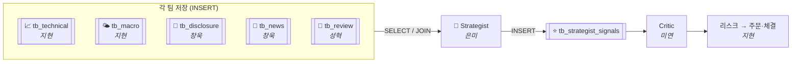
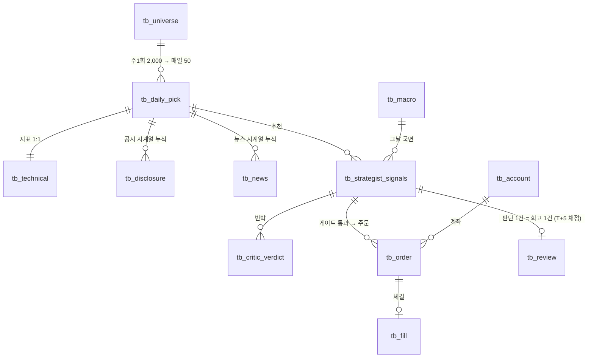

# 🔌 데이터 계약 (통합 스키마)

!!! abstract "🟡 부분 확정 (2026-07-06) · 13개 테이블"
    김지현 「파이프라인 흐름순 상세 명세」의 ERD를 기준으로, schema keeper(성혁)가 팀 계약으로 정리. 각 테이블 = **전체 컬럼 + 샘플 데이터 + 계약 노트**. ⚠️ 표시만 회의에서 결정하면 완전 확정 → **[회의 안건](../질문.md)**.

!!! tip "왜 제일 중요한가"
    파이프라인은 각 파트가 데이터를 주고받아 돈다. **필드 이름 하나·타입 하나만 어긋나도 SELECT/파싱이 깨져 전체가 멈춘다.** 이 문서가 그 "주고받기 규칙(계약)".

---

## 1. 전체 그림

### 데이터가 흐르는 법 — Pull(우편함) 방식

각 팀은 "저장"만 하고, 읽을 필드 선택은 Strategist가 한다.

### 테이블 관계 (ERD) — 중심은 `tb_daily_pick` (오늘의 50)

> **까치발 기호:** `||` 정확히 1개 · `o{` 0개 이상 · `o|` 0 또는 1개. 예: `tb_daily_pick ||--|| tb_technical` = 한 종목당 지표 딱 한 줄(1:1).
> (확장) 대용량 시계열 `tb_candle`은 나중에 분리 후보 — §3 끝 참조.

### 테이블 목록 (실행 순서)

| # | 테이블 | 무엇 | 소유 | 주기 | 상태 |
|---|---|---|---|---|---|
| 01 | [tb_universe](#tb_universe) | 감시 유니버스 2,000 | 김지현 | 주1회 | 🟢 확정 |
| 02 | [tb_technical](#tb_technical) | 기술 지표 (오늘의 50) | 김지현 | 매일 | 🟢 확정 |
| 03 | [tb_daily_pick](#tb_daily_pick) | 오늘의 50 선정 결과 | 김지현 | 매일 | 🟢 확정 |
| 04 | [tb_macro](#tb_macro) | 시장 국면 (시장 전체) | 김지현 | 1시간 | 🟢 확정 |
| 05 | [tb_disclosure](#tb_disclosure) | 공시 분석 | 정창욱 | 1시간 | 🟡 필드 협의 |
| 06 | [tb_news](#tb_news) | 뉴스 분석 | 정창욱 | 5분 | 🟡 필드 협의 |
| 07 | [tb_strategist_signals](#tb_strategist_signals) | 전략 판단 (매수/보류) | 이은미 | 장중 상시 | 🟡 조율 중 |
| 08 | [tb_critic_verdict](#tb_critic_verdict) | 반박·검증 | 김미연 | 매일 | 🔘 설계 예정 |
| 09~10 | [tb_account · tb_order · tb_fill](#tb_account-tb_order-tb_fill) | 계좌·주문·체결 | 김지현 | 매일 | 🔘 설계 예정 |
| 11 | [tb_review](#tb_review) | 회고 (결과 채점·교훈) | 문성혁 | 매일 | 🟢 확정 (#9 · 은미 확인 B8) |

---

## 2. 공통 규칙

| 항목 | 내용 | 상태 |
|---|---|---|
| 저장소 | **Postgres 1개** — 표들이 FK로 촘촘히 엮여(대부분 tb_daily_pick 조인) 두 DB로 나누면 FK가 깨짐. 시계열(🕐)은 TimescaleDB hypertable 후보 | ⚠️ SQLite→PG 통합 시점만 미정 |
| 테이블명 | `tb_` 접두사 (✅ 결정 #1) | ⚠️ `_signals` 접미사 유무는 미정 — 이 문서는 파이프라인 명세(지현) 이름 기준 |
| 판단 회차 키 | `cycle_id` BIGINT — 오케스트레이터가 발급(팀 확인 중). 상류 테이블은 `trade_date`/`collected_at` 키 → **매핑 규칙 미정** | ⚠️ |
| 점수 스케일 | **신호 점수 0~1** · **conviction·문턱 0~10** (서로 다름 주의!) · 매크로 risk_score만 **0~100** (✅ 결정 #6) | 🟢 |
| 투자유형 | `inv_type='공격형'` 단일 (✅ 결정 #2) | 🟢 |
| **공통 컬럼** | **`created_at`(행 기록 시각) = 전 테이블 필수.** `updated_at`(행 수정 시각) = **상태가 바뀌는 `tb_account`·`tb_order` 2개만** — 나머지는 append-only(덮어쓰기 ❌)라 불필요, 있으면 불변 원칙만 약화 (✅ 결정 #10, #8 변경) | 🟢 |
| 전송 형식 | JSON(`model_dump_json()`) = DB row 한 줄 · **core/schemas.py Pydantic 모델과 1:1** | 🟢 |
| LLM 모델 | 분석가=싼 모델(mini급) · Strategist=상위 제안 | ⚠️ 모델명 미정 |

---

## 3. 테이블 스키마 레퍼런스 (01 → 11)

> 표 안 표기: 🔑 PK(기본키) · 🔗 FK(외래키) · ⭐ = **Strategist가 판단에 쓰는 필수 필드** · 🕐 = 시계열 누적
> `created_at`은 전 테이블 공통(생략 표기). `updated_at`은 `tb_account`·`tb_order`에만(결정 #10) — 두 표에서 명시.

### tb_universe

**감시 유니버스 2,000** 🕐
👤 소유자 **김지현** · 🔁 주1회 갱신 · 🔑 PK `(as_of_date, ticker)`
NASDAQ 시총 top 2,000. 1차는 시총 컷만 — 페니주·유동성 컷은 03이 그날 가격으로 판정(그래서 last_price 저장 안 함).

| 컬럼 | 타입 | 키 | 설명 |
|---|---|---|---|
| as_of_date | DATE | 🔑 | 유니버스 갱신일(주1회) |
| ticker | TEXT | 🔑 | 티커 (예: NVDA) |
| company_name | TEXT | | 회사 정식명 |
| market_cap | BIGINT | | 시가총액 — top 2,000 정렬 기준(1차에서 쓰는 유일한 컷) |
| sector | TEXT | | 11 GICS 대분류 (국면 파악용, 분산 강제 아님) |
| created_at | TIMESTAMP | | 기록 시각 |

??? example "샘플 데이터 (이해용 가짜값)"
    | as_of_date | ticker | company_name | market_cap | sector |
    |---|---|---|---|---|
    | 2026-07-06 | NVDA | NVIDIA Corporation | 3,200,000,000,000 | IT |
    | 2026-07-06 | AAPL | Apple Inc. | 3,050,000,000,000 | IT |
    | 2026-07-06 | JPM | JPMorgan Chase & Co. | 620,000,000,000 | 금융 |
    | … | | 주1회 시총 내림차순 top 2,000행 | | |

### tb_daily_pick

**오늘의 50 (선정 결과)** 🕐
👤 소유자 **김지현** · 🔁 매일 · 🔑 PK `(trade_date, ticker)` · 🔗 FK→tb_universe
공통필터 5개 + 5버킷(각 10) + 백필 = 50. "뽑혔다는 사실(버킷·순위)"만 담고, 지표 수치는 tb_technical에(1:1 분리).

| 컬럼 | 타입 | 키 | 설명 |
|---|---|---|---|
| trade_date | DATE | 🔑 | 선정 날짜 |
| ticker | TEXT | 🔑🔗 | → tb_universe.ticker |
| bucket | TEXT (ENUM 6값) | | 출신 버킷: 추세리더/거래량급증/신고가돌파/눌림목/스퀴즈돌파/백필 — 한 종목 = 한 버킷 |
| rank | INT | | 버킷 내 순위 (1~10) |
| sector | TEXT | | 섹터 (tb_universe에서 복사) |
| score | NUMERIC | | 통합 모멘텀 점수(rs_20+vol_ratio+ret_20d) — 백필 정렬용 |
| created_at | TIMESTAMP | | 기록 시각 |

??? example "샘플 데이터"
    | trade_date | ticker | bucket | rank | sector | score |
    |---|---|---|---|---|---|
    | 2026-07-06 | NVDA | 추세리더 | 1 | IT | 87.3 |
    | 2026-07-06 | COIN | 거래량급증 | 1 | 금융 | 82.0 |
    | 2026-07-06 | AVGO | 신고가돌파 | 1 | IT | 79.9 |
    | … | | 5버킷 × 각 10 + 백필 = 50행 | | | |

### tb_technical

**기술 지표 (오늘의 50)** 🕐
👤 소유자 **김지현** · 🔁 매일 · 🔑 PK `(trade_date, ticker)` · tb_daily_pick과 **1:1**
2,000개 캔들을 매일 배치 로드(~4분)해 지표를 한 번에 계산 → 필터·버킷 통과한 **50행만 저장**(나머지 1,950행 버림).

| 구분 | 컬럼 | 타입 | 설명 |
|---|---|---|---|
| 🔑 키 | trade_date · ticker | DATE·TEXT | 🔑🔗 → tb_daily_pick |
| 기준가 | close | NUMERIC | 오늘 종가 — 필터·손절·포지션사이징 기준 |
| 선정용 | rs_20 | NUMERIC | 상대강도: 20일간 종목−S&P500 수익률(%p). 0↑=시장보다 강함 |
| 선정용 | vol_ratio | NUMERIC | 거래량비: 오늘÷20일 평균 (2.0=평소의 2배) |
| 선정용 | ret_5d · ret_20d | NUMERIC | 5일·20일 수익률(%) — 20d>0 = 지속성 게이트 |
| 선정용 | atr_pct | NUMERIC | 변동성(ATR÷종가 %) — 상한 15% |
| 선정용 | high_252_ratio | NUMERIC | 52주 고가 대비(1.0=신고가) |
| 판단용⭐ | rsi | NUMERIC | RSI(14) — 과열 70↑·과매도 30↓ |
| 판단용⭐ | macd | NUMERIC | 12−26일 이평 차 — +커지면 상승 모멘텀 |
| 판단용⭐ | ma20 · ma50 | NUMERIC | 이동평균 — ma20>ma50 정배열 |
| 판단용⭐ | trend | TEXT | 추세 라벨: **상승/혼조/하락** |
| 2차 | ml_probs | JSONB | 상승/보합/하락 확률 — **1차 빈값 `{}`** (ML은 2차) |
| 공통 | created_at | TIMESTAMP | 기록 시각 |

> 선정용 vs 판단용 = **쓰이는 시점** 차이(계산은 2,000행에서 함께). 앞은 종목 고를 때, 뒤는 "살까?" 판단할 때 Strategist·Critic이 씀.

??? example "샘플 데이터"
    | trade_date | ticker | close | rs_20 | vol_ratio | ret_20d | atr_pct | high_252 | rsi | macd | trend | ml_probs |
    |---|---|---|---|---|---|---|---|---|---|---|---|
    | 2026-07-06 | NVDA | 128.50 | +7.2 | 2.4 | +15.3 | 4.8 | 0.98 | 68 | +1.9 | 상승 | {} |
    | 2026-07-06 | MRNA | 92.10 | +5.1 | 1.8 | +11.0 | 6.2 | 0.91 | 61 | +0.7 | 상승 | {} |

### tb_macro

**시장 국면 (시장 전체 — ticker 없음)** 🕐
👤 소유자 **김지현** · 🔁 1시간 · 🔑 PK `(as_of)`
risk_score(0~100) = `0.40×VIX + 0.30×지수등락 + 0.15×금리 + 0.15×달러` → 구간으로 regime 판정 (✅ 결정 #6).

| 컬럼 | 타입 | 키 | 설명 |
|---|---|---|---|
| as_of | TIMESTAMP | 🔑 | 수집 시각(1시간 단위) |
| regime ⭐ | TEXT (ENUM) | | risk_on(≤30) / neutral(30~70) / risk_off(≥70) |
| risk_score ⭐ | NUMERIC | | 0~100, 클수록 위험 — 가중합 결과 |
| vix | NUMERIC | | 공포지수 원값 (가중 0.40 — 위험을 가장 직접 반영) |
| nasdaq_ret · sp500_ret | NUMERIC | | 지수 등락률(%) |
| rate | NUMERIC | | 미 국채 금리 |
| dollar | NUMERIC | | 달러 강세 지표 |
| created_at | TIMESTAMP | | 기록 시각 |

??? example "샘플 데이터 — 11시 VIX 급등 → neutral→risk_off 전환"
    | as_of | regime | risk_score | vix | nasdaq_ret | rate | dollar |
    |---|---|---|---|---|---|---|
    | 07-06 09:00 | neutral | 55 | 18.2 | −0.3 | 4.30 | 104.1 |
    | 07-06 10:00 | neutral | 58 | 19.0 | −0.6 | 4.31 | 104.3 |
    | 07-06 11:00 | **risk_off** | **72** | 24.5 | −1.8 | 4.35 | 104.9 |
    | 07-06 12:00 | risk_off | 70 | 23.8 | −1.6 | 4.34 | 104.7 |

### tb_disclosure

**공시 분석** 🕐
👤 소유자 **정창욱** · 🔁 1시간 간격(새 공시만 append) · 🔑 PK `(ticker, collected_at)` · 🔗 FK→tb_daily_pick
같은 날 8-K가 여러 건 뜰 수 있어 **덮어쓰기 ❌, 새 공시마다 새 행**(accession 번호로 중복 제거). Strategist는 종목별 **최신 행**을 읽는다.

| 컬럼 | 타입 | 키 | 설명 |
|---|---|---|---|
| ticker | TEXT | 🔑🔗 | → tb_daily_pick |
| collected_at | TIMESTAMP | 🔑 | 수집(스냅샷) 시각 — 새 공시마다 새 행 |
| trade_date | DATE | 🔗 | 분석 기준일 |
| event_type ⭐ | TEXT | | 사건 종류 11종 (§4 온톨로지) |
| sentiment_score ⭐ | NUMERIC 0~1 | | 호재↔악재 강도 (1=강한 호재) |
| importance ⭐ | NUMERIC 0~1 | | 얼마나 큰일인가 (1=주가 흔들 대형) |
| risk_score | NUMERIC 0~1 | | 위험도 (소송·규제·희석) — 호재/악재와 별개 축 |
| confidence | NUMERIC 0~1 | | LLM 자기확신 (신뢰 가중용) |
| hard_block ⭐ | INT 0/1 | | 🛡️ **1=매수 즉시 차단** (파산·상폐·대규모 희석) |

??? example "샘플 데이터 — NVDA는 하루 2건(오전·오후) → 2행"
    | ticker | collected_at | event_type | sentiment | importance | risk | hard_block | reason |
    |---|---|---|---|---|---|---|---|
    | NVDA | 07-02 10:05 | ma | 0.86 호재 | 0.80 | 0.30 | 0 | 35% 인수 프리미엄·전액 현금 |
    | XYZ | 07-02 11:30 | delisting_halt | 0.05 악재 | 0.90 | 0.90 | **1** | 10-Q에 계속기업 불확실성 |
    | NVDA | 07-02 14:10 | earnings | 0.72 호재 | 0.70 | 0.20 | 0 | 실적 컨센서스 상회 (오후 새 공시 → 새 행) |

!!! note "JSON Bundle 협의 (창욱 ↔ 지현)"
    창욱 DisclosureBundle 원안 **24필드 → 18필드 감축 제안**: company_name·category(→tb_universe JOIN) · confirmed_score(공시는 항상 1.0) · fact_check·verdict(파생 중복) · ref(accession과 중복) 제거. reason·sentiment 라벨·summary·keywords 등은 유지. → 창욱 협의 후 core/schemas.py PR로 확정.

### tb_news

**뉴스 분석** 🕐
👤 소유자 **정창욱** · 🔁 5분 간격(새 기사만 append) · 🔑 PK `(ticker, collected_at)` · 🔗 FK→tb_daily_pick
새 기사가 뜰 때마다 "그 시점까지 오늘 뉴스 전체 재집계" 스냅샷을 append. 기사 없으면 안 씀(공시와 동일 구조, 매크로와 달리 이산적).

| 컬럼 | 타입 | 키 | 설명 |
|---|---|---|---|
| ticker | TEXT | 🔑🔗 | → tb_daily_pick |
| collected_at | TIMESTAMP | 🔑 | 수집 시각 — 새 기사마다 새 행 |
| trade_date | DATE | 🔗 | 분석 기준일 |
| event_type ⭐ | TEXT | | 11종 온톨로지 (공시와 공유) |
| sentiment_score ⭐ | NUMERIC 0~1 | | 오늘 뉴스 **전체**의 호재↔악재 (여러 건 평균) |
| importance ⭐ | NUMERIC 0~1 | | 전체 평균 중요도 (+ peak_importance로 대형 1건 방어) |
| source_trust ⭐ | NUMERIC 0~1 | | 출처 신뢰 — **LLM이 내용까지 보고** 판단 (사후·해석) |
| confirmed_score ⭐ | NUMERIC 0~1 | | 팩트 확인 비율 (확정÷전체, 예: 2/3=0.67) |
| hard_block ⭐ | INT 0/1 | | 🛡️ 1=매수 즉시 차단 |

??? example "샘플 데이터 — XYZ는 source_trust 0.30·confirmed 0 = 루머성"
    | ticker | collected_at | event_type | sentiment | importance | source_trust | confirmed | count |
    |---|---|---|---|---|---|---|---|
    | NVDA | 07-02 10:03 | earnings | 0.60 호재 | 0.55 | 0.88 | 0.50 | 2 (확정1·루머1) |
    | MRNA | 07-02 13:46 | regulation_legal | 0.89 호재 | 0.90 | 0.97 | 1.00 | 1 (확정1) |
    | XYZ | 07-02 12:05 | ma | 0.51 중립 | 0.53 | **0.30** | **0.00** | 2 (루머2) |
    | NVDA | 07-02 16:31 | earnings | 0.73 호재 | 0.72 | 0.91 | 0.67 | 3 (재집계 → 새 행) |

!!! note "JSON Bundle 협의 (창욱 ↔ 지현) + 필드 2개 축 구분"
    NewsBundle 원안 **31필드 → 28필드 감축 제안** (company_name·category·verdict만 제거 — 나머지는 Strategist가 LLM이라 겹쳐 보이는 값도 비교에 유용해 유지).
    **grade_score vs source_trust는 별개 축**: grade=코드가 도메인만 보고 사전 관문(로이터 1.0/미등록 0.6/차단 0.0) · source_trust=LLM이 내용 보고 사후 해석.
    ⚠️ 은미가 요청한 **cross_source_confirmed**(교차확인 +0.15)는 Bundle에 없음 → 신설 협의 → [회의 안건](../질문.md).

### tb_strategist_signals

**전략 판단 (매수/보류)**
👤 소유자 **이은미** · 🔁 장중 상시 · 🔑 PK `(id)` · 🔗 FK cycle_id · ticker→tb_daily_pick
5신호 SELECT + 현재 시세 즉석 조회 → 코드게이트+GPT 샌드위치 → 판단 저장. Critic 설득용 payload 포함.

| 컬럼 | 타입 | 키 | 설명 | 예시 |
|---|---|---|---|---|
| id | BIGSERIAL | 🔑 | 행 고유번호 | 1, 2, 3… |
| cycle_id | BIGINT | 🔗 | 판단 사이클 — 원본 신호 연결 열쇠 | 123 |
| ticker | VARCHAR | 🔗 | 종목 | NVDA |
| inv_type | VARCHAR | | 투자유형 (공격형 단일) | 공격형 |
| side ⭐ | VARCHAR | | 최종 결정 | 매수/매도/보류 |
| conviction ⭐ | NUMERIC(3,1) | | 확신 0~10 (min_conviction 5.0 미달 → 보류 강등) | 8.5 |
| signal_consensus | SMALLINT | | 매수 방향 신호 개수 0~4 (필요 합의 2/4) | 4 |
| summary | TEXT | | 한 줄 요약 (Critic이 빠르게 파악) | "4개 전원 매수" |
| bull_case | TEXT | | 매수 근거 상세 (설득 핵심) | "①인수 ②실적…" |
| key_risk | TEXT | | 스스로 인정한 핵심 위험 (신뢰↑) | "프리미엄 과다" |
| risk_rebuttal | TEXT | | 그 위험에 대한 반박·방어 | "교차확인+차단없음" |
| counter_scenarios | JSONB | | 틀렸을 때 대응책 (배열) | ["무산 시 -5% 손절"] |
| evidence | JSONB | | 숫자 증거 묶음 | {cross_source_confirmed:1} |
| sizing_hint | JSONB | | PM에게 주는 크기 제안 (최종은 PM) | {suggested_weight:0.03} |
| persona_notes | TEXT·null | | 투자 거장 관점 (2차, 지금 null) | null |
| created_at | TIMESTAMPTZ | | 저장 시각 (타임존 포함) | 07-03 08:30 |

!!! warning "조율 중 (지현 ↔ 은미)"
    ① **현재 시세** — 은미 문서엔 없음, 즉석 조회 추가 필요("정보 2층 구조": 느린 층=DB, 빠른 층=시세 즉석 1회) · ② 상류 키(trade_date) ↔ cycle_id 매핑 → [회의 안건](../질문.md)

### tb_critic_verdict

**반박·검증** 🔘 설계 예정
👤 소유자 **김미연** · 🔁 매일 · 🔑 PK `(id)` · 🔗 FK→tb_strategist_signals
한 추천에 반박이 여러 번 쌓일 수 있어 별도 테이블. 1차 = 단일턴(거절 시 스킵) · 2차 = 멀티턴 재제안. 최근 기각 종목은 N일 재제안 억제(쿨다운).

| 컬럼 | 타입 | 키 | 설명 |
|---|---|---|---|
| id | BIGINT | 🔑 | 검증 고유 id |
| signal_id | BIGINT | 🔗 | → tb_strategist_signals |
| agree | BOOL | | 추천 동의 여부 |
| objection | TEXT | | 반론 내용 |
| confidence | NUMERIC | | 반박 확신도 |

### tb_account · tb_order · tb_fill

**계좌·주문·체결 (Alpaca 페이퍼)** 🔘 설계 예정 — Alpaca API 연동 후 컬럼 확정
👤 소유자 **김지현** · 🔁 매일

| 테이블 | 담는 것 | 키 |
|---|---|---|
| tb_account | 5인 각 계좌 잔고·보유 (시드 각 1억 상당) | 🔑 id · **+updated_at**(체결마다 잔고 갱신) |
| tb_order | 매수/매도 주문 (종목·수량·유형·상태) | 🔑 id · 🔗 tb_strategist_signals·tb_account · **+updated_at**(제출→체결/취소 전이) |
| tb_fill | 체결 기록 (체결가·수량·시각) | 🔑 id · 🔗 tb_order (append-only) |

### tb_review

**회고 (결과 채점 + 교훈)** · 갱신 2026-07-06 (담당 확정 · 결정 #9)
👤 소유자 **문성혁** · 🔁 매일 배치 — 5영업일 지난 판단을 확정 채점 · 🔑 PK `(id)` · 🔗 FK signal_id→tb_strategist_signals
**판단 데이터는 복사하지 않는다** — signal_id JOIN으로 ticker·cycle_id·side·conviction·근거 전부 도달. ⑪이 새로 만드는 값(결과·교훈)만 저장. **1차 observe-only.**

| 컬럼 | 타입 | 키 | 설명 |
|---|---|---|---|
| id | BIGSERIAL | 🔑 | 회고 고유 id |
| signal_id | BIGINT | 🔗 **UNIQUE** | → tb_strategist_signals.id — 판단 1건 = 회고 1건 (멱등성) |
| ret_1d · ret_3d · ret_5d | NUMERIC | | 판단 후 전방 수익률(%) — 기준가 P0: 매수=체결가·보류=판단일 종가 |
| hit | BOOL | | 방향 적중 — 매수: ret_5d>0 · 보류: ret_5d≤0 ("안 사길 잘했다") |
| max_drawdown | NUMERIC | | 5일 중 최저 종가 기준 최대 낙폭(%) — 손절 −15% 대비 여유 |
| lesson | TEXT | | 교훈 한 줄 — Reflector(LLM) 생성, 120자·숫자 인용·[패턴]→[다음 행동] |
| created_at | TIMESTAMPTZ | | 기록 시각 — **완전 insert-once**(Scorer+Reflector 한 배치 완성, 실패 시 통째 재시도)라 updated_at 없음 |

??? example "샘플 데이터 — 매수 적중 / 보류 실기"
    | id | signal_id | ret_1d | ret_3d | ret_5d | hit | max_drawdown | lesson |
    |---|---|---|---|---|---|---|---|
    | 41 | 987 | +1.2 | −2.0 | +3.1 | true | −2.0 | "Critic의 프리미엄 과다 우려에도 T+3 −2%가 바닥 → +3.1% 적중. 교차확인된 M&A는 초반 눌림을 버틸 것." |
    | 42 | 991 | +1.8 | +4.0 | +6.0 | false | −0.4 | "FDA 승인 확정(confirmed 1.0)에 conviction 4.2 보류 → +6.0% 놓침. 확정 규제 이벤트는 conviction 가점 검토." |

!!! note "남은 확인 (회의)"
    은미 소비 스펙 충족 확인(B8 — 구 tb_memory_entries 컬럼은 JOIN으로 전부 제공) · 채점 세부 파라미터 이의(B11: P0·T+5 창·NO_TRADE 범위·1차 주입 여부) → **[회의 안건](../질문.md)**

### (확장) tb_candle

대용량 시계열 캔들 🕐 · PK `(ts, ticker)` · open/high/low/close/volume — **1차엔 DB 저장 안 함**(메모리/CSV 캐시). 확장 시 hypertable 분리 후보.

---

## 4. 공유 온톨로지 — event_type 11종 (공시·뉴스 공통 · 👤 소유자 정창욱)

`earnings · guidance_change · ma · capital_raise · management_change · insider_trade · product_deal · analyst_rating · regulation_legal · delisting_halt · other`

> 하드리스크(거래정지·파산·상폐·회계문제·희석)는 event_type과 별개로 **hard_block=1**로 강제. Strategist·게이트가 최우선 존중.

---

## 5. 확정 현황

확정된 결정과 이유는 **[결정 로그](결정로그.md)**, 남은 결정(⚠️ 필드들)의 상세와 논의 배경은 **[회의 안건](../질문.md)** 한 곳에서만 관리한다. 회의에서 남은 항목만 정하면 이 문서가 **완전 확정 데이터 계약**이 된다.
