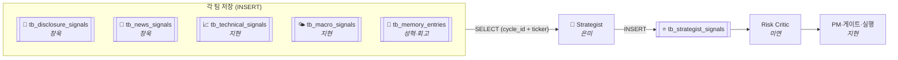
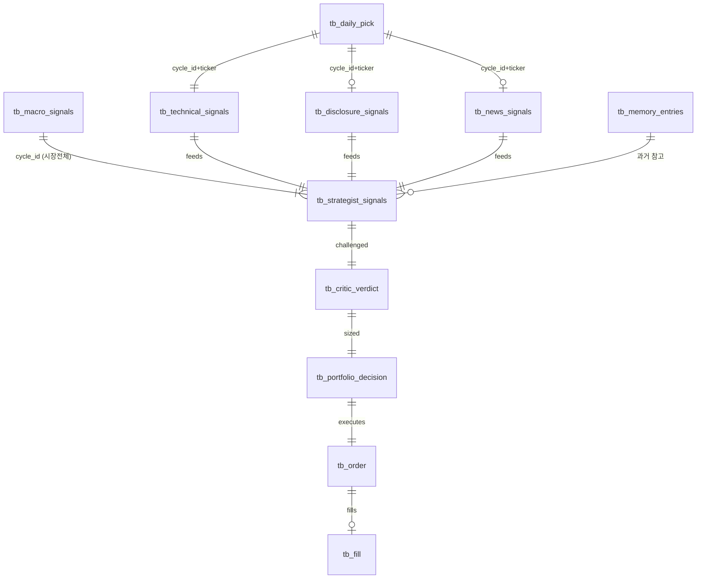

# 🔌 데이터 계약 (통합 인터페이스)

!!! abstract "🟡 부분 확정 (2026-07-06)"
    - ✅ **확정** — A1 투자유형(공격형 단일) · A4 risk_score(0~100) (결정 #2·#6)
    - ⏸️ **미확정** — 필드 계약(B8~B10 등)은 회의 전

    schema keeper(성혁)가 은미·창욱·지현 스키마를 하나로 맞춘 제안.

!!! tip "왜 제일 중요한가"
    파이프라인은 각 파트가 데이터를 주고받아 돈다. **필드 이름 하나·타입 하나만 어긋나도 SELECT/파싱이 깨져 전체가 멈춘다.** 이 문서가 그 "주고받기 규칙(계약)".

---

## 1. 한눈에 — 데이터가 흐르는 법 (Pull 방식)

- **Pull(우편함) 방식**: 각 팀은 "저장"만, 읽을 필드 선택은 Strategist가 함. (은미 확정)
- 모든 신호는 **`cycle_id` + `ticker`** 두 열쇠로 "같은 판단 회차의 같은 종목"끼리 매칭.

### 테이블 관계 (ERD)

---

## 2. 공통 규칙 (⚠️ = 회의 결정 필요, → 뒤는 제안 기본값)

| 항목 | 현재 실태 | 제안 (기본값) | 안건 |
|---|---|---|---|
| **판단 회차 키** | 은미 `cycle_id` / solutions `run_id` / 창욱 없음 | → **`cycle_id`** (BIGINT) 로 통일. 08:30 실행 때 **오케스트레이터가 1개 발급** | A3 |
| **테이블명 접두사** | ✅ **확정: `tb_` 붙이기** (팀 합의 2026-07-04) | 모든 테이블 `tb_` 접두사. 창욱 코드는 rename | ~~B1~~ 완료 |
| **종목·날짜 공통키** | 공통 | `ticker` VARCHAR · `as_of` DATE (매크로만 ticker 없음 = 시장 전체) | — |
| **점수 스케일** | 신호=0~1 / 확신=0~10 혼재 | → **신호 점수 0~1 · conviction·문턱 0~10** 고정(서로 다름 주의) | — |
| **매크로 risk_score 범위** ✅ | — | **0~100 확정** (결정 #6) · 가중식 `0.40VIX+0.30지수+0.15금리+0.15달러` · regime 30/70 · macro_veto 폐지→conviction 감점만 | ~~A4~~ 완료 |
| **저장소** ⚠️ | 창욱 SQLite(코드有) / 은미·설계서·지현 Postgres | 지현 "Postgres 1개" 확정 방향 · **SQLite→Postgres 통합 시점**만 미정 | A2 |
| **투자유형** ✅ | — | **공격형 단일 확정** (결정 #2) · 계약은 `inv_type='공격형'` | ~~A1~~ 완료 |
| **LLM 모델** ⚠️ | GPT-4o / gpt-4o-mini / GPT-5.4mini·5.5 | → 분석가=싼 모델(mini급) · 결정자(Strategist)=상위. 정확한 모델명 확정 | 충돌7 |
| **전송 형식** | 공통 | JSON (`model_dump_json()`) = DB row 한 줄. Pydantic 스키마로 강제 | — |

---

## 3. 신호 테이블 계약 — "누가 무엇을 채우나"

> 각 파트는 이 표의 필드만 채우면 된다. ✅=Strategist가 판단에 씀 · 📄=GPT 참고만 · 🟢합의가능 · ⚠️결정필요

### 📄 tb_disclosure_signals — 공시 (소유: 창욱)
| 필드 | 타입 | 용도 | 상태 |
|---|---|---|---|
| ticker · cycle_id · as_of | VARCHAR·BIGINT·DATE | 공통키 | 🟢 |
| has_signal | SMALLINT | 오늘 공시 유무(0이면 스킵) | 🟢 |
| hard_block ✅ | SMALLINT | 1=즉시 보류(상폐·거래정지 등 객관사실만) | 🟢 |
| sentiment_score ✅ | NUMERIC(0~1) | 호재/악재 | 🟢 |
| importance ✅ | NUMERIC(0~1) | 사건 크기 | 🟢 |
| event_type 📄 | VARCHAR | 11종 온톨로지(§5) | 🟢 |
| reason 📄 | TEXT | 한 줄 근거 | 🟢 |

> 창욱 DisclosureBundle은 24필드지만 **Strategist가 SELECT하는 건 위 7개.** 나머지(confidence·ref·risk_score 등)는 저장은 하되 계약 밖(감사·GPT참고용).

### 📰 tb_news_signals — 뉴스 (소유: 창욱)
| 필드 | 타입 | 용도 | 상태 |
|---|---|---|---|
| ticker · cycle_id · as_of | | 공통키 | 🟢 |
| has_signal · hard_block ✅ | SMALLINT | 유무 · 즉시보류 | 🟢 |
| sentiment_score ✅ | NUMERIC(0~1) | 호재/악재 | 🟢 |
| grade_score ✅ | NUMERIC(0~1) | 출처 등급(ALLOW1.0/GRAY0.6/BLOCK0.0) | 🟢 |
| confirmed_score ✅ | NUMERIC(0~1) | 확정 비율(=confirmed/count) | 🟢 |
| **cross_source_confirmed** ✅ | SMALLINT | 2곳+ 교차확인=1 → 확신 +0.15 | ⚠️ **창욱 Bundle에 없음 → 추가 필요 (B3)** |
| top_evidence · reason 📄 | JSONB·TEXT | 대표 헤드라인 · 근거 | 🟢 |

### 📈 tb_technical_signals — 기술 (소유: 지현)
| 필드 | 타입 | 용도 | 상태 |
|---|---|---|---|
| ticker · cycle_id · as_of | | 공통키 | 🟢 |
| **trend** ✅ | VARCHAR | 오름세 판정 | ⚠️ **값 형태: "상승" vs "bullish" 확정 (B4)** |
| **ml_prob_up** ✅ | NUMERIC(0~1) | ML 상승확률 | ⚠️ **설계서=ML 1차 매매 미연결인데 은미는 이걸 매수신호로 씀 → 1차엔 trend만 쓰고 ml_prob_up 제외할지 결정** |
| rsi · macd 📄 | NUMERIC·VARCHAR | 참고지표 | ⚠️ macd 라벨 vs 숫자 (B4) |

### 🌤️ tb_macro_signals — 매크로 (소유: 지현) · ticker 없음
| 필드 | 타입 | 용도 | 상태 |
|---|---|---|---|
| cycle_id · as_of | BIGINT·DATE | 공통키(시장 전체라 ticker X) | 🟢 |
| regime ✅ | VARCHAR | risk_on/neutral/risk_off | 🟢 |
| risk_score ✅ | NUMERIC | 위험도 | ⚠️ **범위 0~100 확정 (A4)** |
| reason 📄 | TEXT | 근거 | 🟢 |

---

## 4. 🔗 나(성혁)의 계약 — ⑪ 리뷰·회고 (미착수 · tb_review 기준으로 새 시작)

> **내 Reviewer 파트는 아직 시작 전.** 이전 성혁 초안(Reviewer_회고에이전트 등)은 **무시**하고, **파이프라인 명세의 `tb_review`** 를 출발점으로 새로 설계한다.

**baseline = `tb_review`** (지현 ERD · ⑪ 산출)

| 필드 | 타입 | 내용 |
|---|---|---|
| id | BIGINT | 회고 고유 id |
| trade_date · ticker | DATE·TEXT | 어느 날·어느 종목 회고 (→ tb_daily_pick) |
| **lesson** | TEXT | 교훈 한 줄 (LLM 생성) |
| **stats** | JSONB | 수익률·적중 등 통계 (코드 채점) |

!!! danger "B8 — 은미 소비 스키마와 불일치 (회의 확정 필요)"
    은미 07단계는 `tb_memory_entries`(side·conviction·outcome·lesson·created_at)를 읽는다.

    **질문:** `tb_review`(회고 원본)와 `tb_memory_entries`(은미 입력)가 같은 표? 아니면 2단(원본→뷰)?
    **성혁 제안:** `tb_review`=원본 · `tb_memory_entries`=은미용 계약 뷰 → 둘 다 유지. (1차는 observe-only)

---

## 5. 공유 온톨로지 — event_type 11종 (공시·뉴스 공통, 소유: 창욱)

`earnings · guidance_change · ma · capital_raise · management_change · insider_trade · product_deal · analyst_rating · regulation_legal · delisting_halt · other`

> 하드리스크(거래정지·파산·상폐·회계문제·희석)는 event_type과 별개로 **hard_block=1**로 강제(창욱 정책). Strategist·게이트가 이걸 최우선 존중.

---

## 6. 하류 계약 (후속 — 아직 자료 적음)

| 테이블 | 소유 | 상태 |
|---|---|---|
| tb_strategist_signals | 은미 | 🟢 컬럼 확정됨(side·conviction·bull_case·key_risk·risk_rebuttal·counter_scenarios·evidence·sizing_hint·persona_notes) |
| critic_verdict | 미연 | ⚠️ 자료 없음 — 은미 payload와 합의 필요 (B5) |
| portfolio_decision·risk_gate·order·fill | 지현 | ⚠️ sizing_hint 형식 합의 (B6) · solutions/설계서 스키마 참고 |

---

## 7. 회의 체크리스트

**✅ 확정 (2026-07-06 병입):** ~~A1 투자유형=공격형 단일~~(#2) · ~~A4 risk_score 0~100~~(#6) · ~~B1 tb_ 접두사~~(#1)
**⏸️ 남은 결정:**
- **A2** 저장소 — Postgres 1개 방향, SQLite→PG 통합 시점만
- **B8** 리뷰어 출력 테이블 — `tb_review`(지현) ↔ `tb_memory_entries`(은미) 이름·스키마 통일 (§4)
- **B9** 표 접미사 `_signals` — `tb_technical`(지현) ↔ `tb_technical_signals`(은미)
- **B10** cycle_id ↔ trade_date 키 매핑 규칙
- **B2** category→tb_universe JOIN · **B3** cross_source_confirmed 생성책임 · **B4** 기술 값형태 · **B5** Critic payload · **B6** sizing_hint
- **모델명** · **ml_prob_up** 1차 사용 여부(02는 1차 빈값 {})

> ✅ 위 ⏸️만 회의에서 정하면 이 문서가 **완전 확정 데이터 계약(SSOT)** 이 된다.
