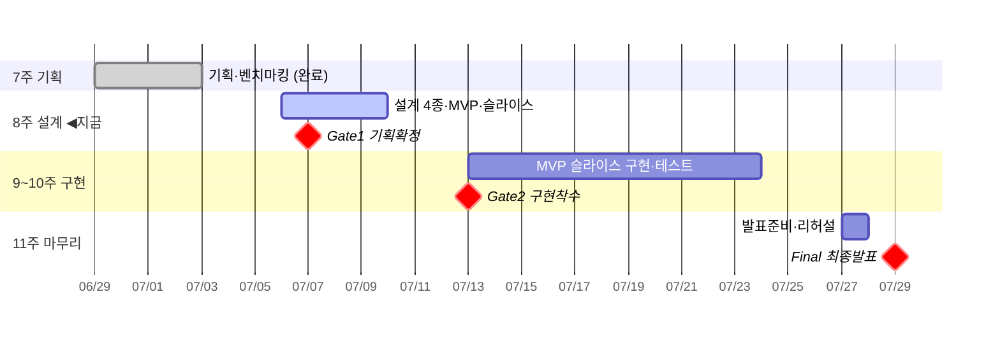

# 📅 일정 (SSOT)

!!! info "부트캠프 2차 프로젝트 · 멘토 조나래"
    **기간:** 2026-06-29(월) ~ 07-29(수) · **운영:** 주차별 마일스톤·게이트 기준
    **지금:** 8주차(설계) 시작 · 🔴 **Gate 1 = 7/7 내일**

## 한눈에 — 전체 흐름

## 주차별 상세

### 7주차 (6/29~7/3) · 기획 — ✅ 완료

| 날짜 | 활동 |
|---|---|
| 6/29 월 | 킥오프 · 주제 선정 · 벤치마킹 · 역할·간트·칸반 |
| 6/30 화 | 요구사항 도출 · 기획 구체화 |
| 7/1 수 | 요구사항 정의서·기획서 · 기능 우선순위 |
| 7/2~3 목·금 | 기획 보완·자체 점검 |

### 8주차 (7/6~7/10) · 설계 — ◀︎ 지금

| 날짜 | 구분 | 활동 |
|---|---|---|
| 7/6 월 | 특강 | 취업 특강 → 설계 준비 |
| **7/7 화** | 🔴 **Gate 1** | **기획 확정** · MVP·개발 범위 확정 |
| 7/8 수 | 팀 협업 | 기능목록·유스케이스·아키텍처·데이터모델·화면흐름 설계 |
| 7/9 목 | 멘토 | 설계 리뷰·피드백 반영 |
| 7/10 금 | 팀 협업 | **설계서 4종·MVP 정의서·슬라이스 분해표** 정리 |

### 9~10주차 (7/13~7/24) · 구현·테스트

| 날짜 | 구분 | 활동 |
|---|---|---|
| **7/13 월** | 🔴 **Gate 2** | **구현 착수** · MVP 슬라이스 구현 시작 |
| 7/14~16 화~목 | 팀 협업 | MVP 핵심 기능 슬라이스 구현 |
| 7/17 금 | 공휴일 | 제헌절 (자율) |
| 7/20 월 | 멘토 | 구현 점검 · 테스트 계획 |
| 7/21~23 화~목 | 팀 협업 | 증분 구현·테스트·고도화 |
| 7/24 금 | 멘토 | 구현·테스트 리뷰 |

### 11주차 (7/27~7/29) · 마무리

| 날짜 | 구분 | 활동 |
|---|---|---|
| 7/27 월 | 멘토 | 최종 점검 · 발표자료 초안 |
| 7/28 화 | 팀 협업 | 오류 수정 · **발표 리허설** · 산출물 정리 |
| **7/29 수** | 🏁 **Final** | **최종 발표·제출** |

!!! warning "멘토 당부"
    - 발표 **PPT는 발표 전날(7/28)까지 완성** 목표
    - 간트 **구현 단계 세분화** (에이전트별·화면 구현 등)
    - 안내 일정은 **기준**이며 팀 상황에 따라 일부 변경 가능

> 상세 제출물·완성도는 `산출물 현황` 페이지 참조.
