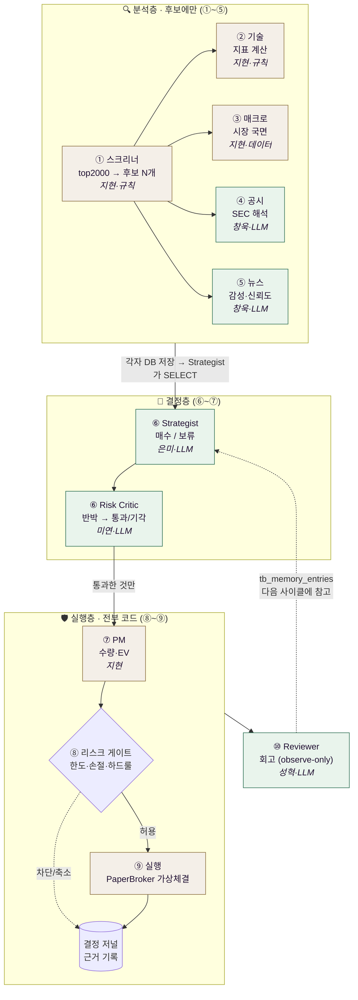
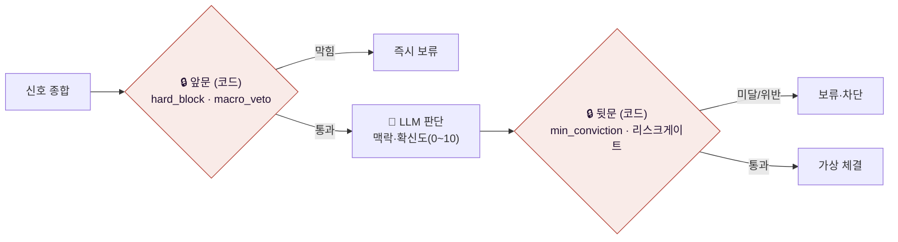
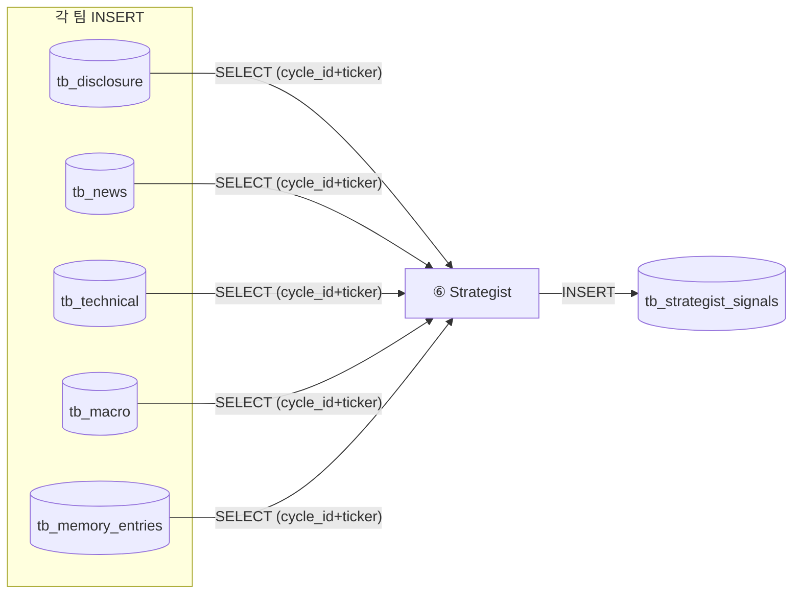

# 🔄 파이프라인 (SSOT)

> **상태: 🟢 확정** — 전체 흐름은 설계서·solutions·은미·창욱 자료에서 모두 일치(다툼 없음). 세부 값(투자유형·ML 등)만 별도 안건.
> 최초 병입 2026-07-04 · 매일 08:30 AM ET 실행 · 한 사이클 = 1개 `cycle_id`

---

## 1. 한 사이클 — 전체 흐름

> 🟩 초록 = LLM(해석·판단) · 🟫 갈색 = 코드/규칙(계산·강제). **양 끝(스크리너·게이트)은 코드, 가운데(분석·판단)만 LLM.**

---

## 2. 안전 구조 — "코드 게이트 샌드위치"

LLM은 앞문·뒷문(코드) 사이에 갇혀서 판단한다. GPT가 "매수!"라 우겨도 게이트를 못 넘으면 소용없다.

강제되는 규칙 3개(🔒): **hard_block**(상폐·거래정지 즉시보류) · **macro_veto**(시장 태풍 시 보류) · **min_conviction**(확신 미달 매수 → 보류 강등).

---

## 3. 데이터 흐름 — Pull 방식 (우편함)

각 팀은 "저장"만, 읽을 필드 선택은 Strategist가 한다. 모든 신호는 `cycle_id + ticker`로 매칭.

> 필드·타입 상세는 **`데이터 계약`** 페이지. 회고 메모리(tb_memory_entries)는 **내(성혁) 출력** → Strategist가 다음 판단에 참고.

---

## 4. 확정 원칙 요약

| 원칙 | 내용 |
|---|---|
| Macro-first / 후보 압축 | top2000 → 스크리너 후보만 → 공시·뉴스는 후보에만 (비용 방어) |
| Pull 방식 | 각 팀 저장, Strategist가 SELECT |
| 코드게이트 샌드위치 | LLM은 제안·해석만, 앞뒷문은 코드 강제 |
| NO_TRADE 정상 | 안 사는 판단도 근거와 함께 저장 |
| 전부 가상 | PaperBroker, 실거래 없음 |
| cycle_id 재현 | 한 사이클 산출물이 같은 cycle_id로 완전 재현 |

## 5. 아직 안건인 것 (흐름 아닌 세부값)
투자유형 1종 vs 2종(A1) · ML(ml_prob_up) 1차 사용 여부 · cycle_id 생성 주체(A3) → `MVP 1차 정의` · `데이터 계약` 참조
