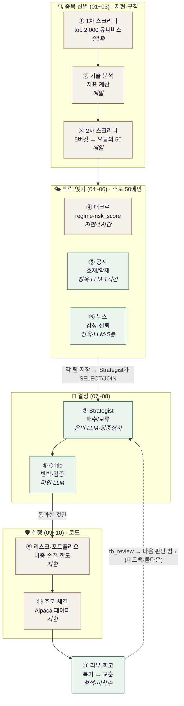
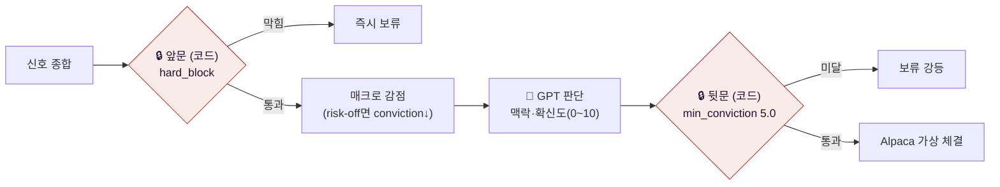
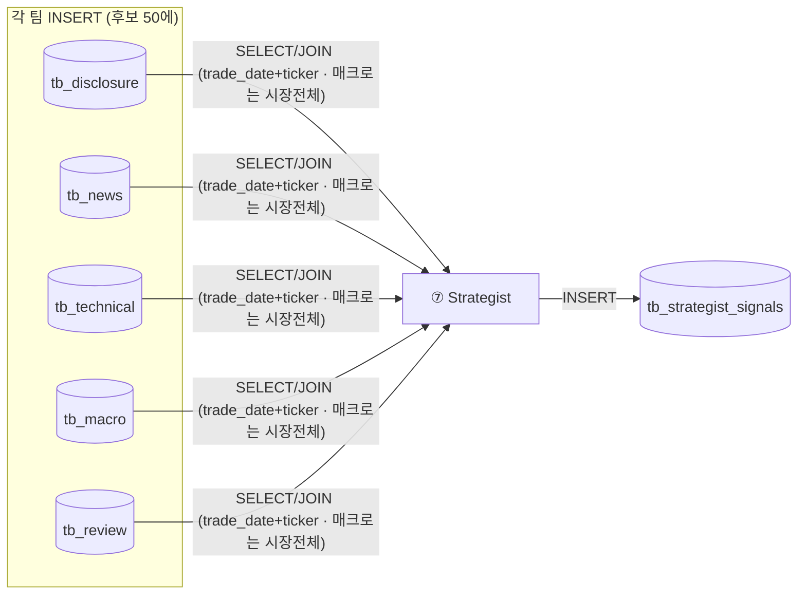

# 🔄 파이프라인 (SSOT)

!!! success "🟢 1차 확정 · 2026-07-06 (결정 #2~#7 → [결정 로그](결정로그.md))"
    기준 = 김지현 「파이프라인 흐름순 상세 명세」(파이프라인·인프라 담당) · 하루 한 사이클이 **01 → 11** 순서로 흐른다.

    - **투자유형** — 공격형 단일 (1차 MVP)
    - **실행** — 전부 가상매매 (Alpaca 페이퍼) · 시드 5인 각 1억

    ⚠️ 테이블 이름·키 등 미확정 세부는 → **[회의 안건](../질문.md)**

---

## 1. 한 사이클 — 11단계 전체 흐름

> 🟩 초록 = LLM(해석·판단) · 🟫 갈색 = 코드/규칙(계산·강제). **양 끝(스크리너·실행)은 코드, 가운데(분석·판단)만 LLM.**

### 단계 요약표

| # | 단계 | 하는 일 | 산출 테이블 | 주기 | 담당 |
|---|---|---|---|---|---|
| 01 | 1차 스크리너 | NASDAQ 시총 top 2,000 유니버스 | tb_universe | 주1회 | 지현 |
| 02 | 기술 분석 | 캔들 → 지표 계산(rs_20·rsi·macd…) | tb_technical | 매일 | 지현 |
| 03 | 2차 스크리너 | 공통필터 + 5버킷 → 오늘의 50 | tb_daily_pick | 매일 | 지현 |
| 04 | 매크로 | 지수·VIX·금리·달러 → 국면 | tb_macro | 1시간 | 지현 |
| 05 | 공시 | 8-K·10-Q 호재/악재·중요도 | tb_disclosure | 1시간 | 창욱 |
| 06 | 뉴스 | 실시간 뉴스 감성·신뢰도 | tb_news | 5분 | 창욱 |
| 07 | Strategist | 5신호+시세 → 코드게이트+GPT → 매수/보류 | tb_strategist_signals | 장중 상시 | 은미 |
| 08 | Critic | 추천에 반박·검증 | tb_critic_verdict | 매일 | 미연 |
| 09 | 리스크·포트폴리오 | 비중·손절·한도 적용 | (주문 계획) | 매일 | 지현 |
| 10 | 주문·체결 | Alpaca 페이퍼 주문·체결 기록 | tb_account·tb_order·tb_fill | 매일 | 지현 |
| 11 | 리뷰·회고 | 사후 복기 → 교훈 메모리 | tb_review | 매일 | 성혁 |

---

## 2. 안전 구조 — "코드 게이트 샌드위치" (강제규칙 **2개**)

LLM은 앞문·뒷문(코드) 사이에 갇혀 판단한다. GPT가 "매수!"라 우겨도 게이트를 못 넘으면 소용없다.

- **강제(🔒) 2개**: `hard_block`(상폐·거래정지·파산 등 즉시 보류) · `min_conviction`(공격형 5.0 미달 → 보류 강등).
- **macro_veto 폐지** (결정 #4): 매크로 risk-off는 이제 *거부권이 아니라* conviction **감점**만. 무조건 차단은 `hard_block`뿐.

---

## 3. 데이터 흐름 — Pull 방식 (우편함)

각 팀은 "저장"만, 읽을 필드 선택은 Strategist가 한다. 상류 신호는 **`trade_date`(또는 `collected_at`) + `ticker`** 로 매칭하고, Strategist 이하는 `cycle_id`로 묶는다.

> 필드·타입 상세는 **`데이터 계약`** 페이지. (상류 키 ↔ cycle_id 매핑 규칙은 회의 확정 예정)

---

## 4. 확정 원칙 요약

| 원칙 | 내용 |
|---|---|
| Macro-first / 후보 압축 | top 2,000 → 오늘의 50 → 공시·뉴스는 50에만 (비용 방어) |
| Pull 방식 | 각 팀 저장, Strategist가 SELECT/JOIN |
| 코드게이트 샌드위치 | LLM은 제안·해석만, 앞문(hard_block)·뒷문(min_conviction) 코드 강제 |
| 투자유형 | **공격형 단일** (1차 MVP) |
| 실행 | **Alpaca 페이퍼** — 지정가·손절·익절 브래킷 주문, 체결감시는 Alpaca 서버 위임 |
| NO_TRADE 정상 | 안 사는 판단도 근거와 함께 저장 |
| 전부 가상 | 실거래 없음 · 시드 5인 각 1억 |
| 저장소 | Postgres 1개(FK로 촘촘 · 시계열은 TimescaleDB hypertable 후보) |

---

## 5. 세부 정책 (1차 · 백테스트로 튜닝)

**③ 2차 스크리너 — 공통필터 5개 → 5버킷 × 각 10 + 백필 = 50**

| 공통필터 | 기준 | | 버킷 | 정렬키 |
|---|---|---|---|---|
| 주가 최소선 | 종가 ≥ $5 | | 추세 리더 | rs_20 |
| 거래대금 | 20일 평균 ≥ $5M | | 거래량 급증 | ret_5d>0 → vol_ratio |
| ATR 상한 | ≤ 종가 15% | | 신고가 돌파 | high_252_ratio≥0.95 |
| 방향 게이트 | 종가 > ma20 | | 눌림목 | pullback → rs_20 |
| 지속성 | 20일 수익률 > 0 | | 스퀴즈 돌파 | 밴드폭≤0.25 → vol_ratio |

**④ 매크로 — risk_score(0~100)** = `0.40·VIX + 0.30·지수등락 + 0.15·금리 + 0.15·달러` · regime: `≤30 risk_on / 30~70 neutral / ≥70 risk_off`

**⑦ 공격형 POLICY 문턱**: 공시 sent≥0.60·imp≥0.25 · 뉴스 sent≥0.60·grade≥0.50·confirmed≥0.40 · 필요 합의 **2/4** · min_conviction **5.0**

**⑨ 공격형 포트폴리오(aggressive.yaml)**: 한 종목 최대 **25%** · 목표 **5종목** · 손절 **−15%** · 1회 리스크 **4%** · 주식 비중 100% · risk_off면 신규 매수 축소

**⏰ 실행 타이밍**: 배치(01~03)는 KST 애프터마켓 종료~데이마켓 시작 **10분 공백(08:50~09:00)** · 04~07은 장중 상시(매크로 1h·공시 1h·뉴스 5분·전략 상시)

---

## 6. ⑪ 리뷰·회고 (성혁 담당 · 스키마 확정 #9)

판단(signal) 1건당 사후 복기 1건 — 코드(Scorer)가 결과를 채점(ret_1/3/5d·hit·mdd)하고, LLM(Reflector)이 교훈(lesson) 한 줄을 `tb_review`에 남겨 다음 사이클 Strategist(⑦)가 참고(같은 실수 반복 억제). **1차는 observe-only.** 계약 상세는 `데이터 계약` §4.
