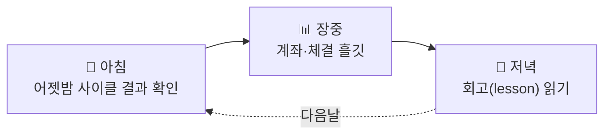

# 🖥️ 화면 (SSOT)

!!! warning "아직 확정 없음 — 아래는 AI 제안 초안"
    화면·사용자 흐름은 8주차(설계) 제출물이자 멘토 지적 항목(안건 C3). **확정된 것이 없어** AI가 파이프라인 기준으로 초안을 제안한다. 회의에서 결정되는 대로 이 페이지를 확정 내용으로 교체한다.

## 1. 출발점 — 사용자는 "조작자"가 아니라 "관찰자"

Quantinue는 자율 매매라 사용자가 누를 버튼이 거의 없다. 화면의 일은 딱 두 가지:

1. **지금 잘 돌고 있나** (모니터링)
2. **AI가 왜 그렇게 판단했나** (근거 추적 — 이 프로젝트의 차별점)

## 2. 제안 화면 — 1차는 3장이면 충분

| # | 화면 | 담는 것 | 데이터 원천 |
|---|---|---|---|
| ① | **대시보드 (홈)** | 5계좌 equity 곡선 · 보유 종목 · 오늘 사이클 진행(01→11 어디까지) · 최근 매수/보류 | `tb_account`·`tb_fill`·`tb_strategist_signals` |
| ② | **오늘의 사이클 (퍼널)** | 오늘의 50 → Strategist 매수 n → Critic 통과 m → 체결 k. 단계마다 몇 개가 왜 걸러졌나 | `tb_daily_pick`→`tb_strategist_signals`→`tb_critic_verdict`→`tb_order` |
| ③ | **판단 상세 (결정 저널)** 🎯 | 종목 하나의 전체 스토리: 신호 4종 → Strategist 근거(conviction·bull_case·key_risk) → Critic 반박 → 체결가 → T+5 회고(lesson) | signal_id 하나로 전 테이블 JOIN |

> **③이 킬러 화면** — "AI가 언제 뭘 근거로 사고, 반박당하고, 나중에 뭘 배웠나"가 한 페이지에 보이면 그게 곧 발표 데모다. 우리 스키마가 signal_id FK 릴레이라 JOIN 한 번으로 이 화면이 나온다(설계가 이미 화면을 준비해둔 셈).

**2차 후보(여유 있으면):** ④ 5계좌 비교(손절폭 다른 계좌들 성과 갈라지는 것 — 실험 서사) · ⑤ 회고 모음(lesson 목록·적중률 추이).

## 3. 구현 제안 — Streamlit

| 후보 | 판단 |
|---|---|
| **Streamlit** ✅ | 파이썬 → Postgres 바로 조회 · 팀 전원 파이썬 · 화면 3장이면 2~3일 · 발표 데모 최단 경로 |
| React 등 웹 | 예쁘지만 7/29까지 비용 과다 — 2차 |
| 텔레그램 알림 | 화면 아님·2차 로드맵에 이미 있음 |

## 4. 참고 레퍼런스

- **토스증권·로빈후드** — 계좌·보유 화면의 간결함 (①의 톤)
- **LangSmith / LLM trace 뷰** — 에이전트 판단 추적 UI (③의 원형: 입력→판단→근거 체인)
- **TradingView** — 종목 차트 위젯 (③에 임베드 가능)
- **Grafana** — 파이프라인 상태 모니터링 (①의 사이클 진행 표시)

## 5. 다음 걸음

1. 팀 회의에서 화면 3장 구성 합의 (안건 C3) → 확정되면 이 페이지를 확정 내용으로 교체
2. 담당·와이어프레임(손그림 수준이면 충분) 정하기
3. 8주차 제출물 = 이 페이지 + 와이어프레임이면 형태가 갖춰짐
