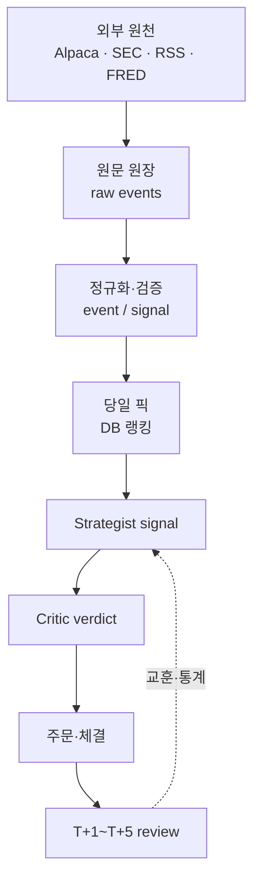

# 🔗 데이터와 판단의 계보

!!! info "최종 프로젝트의 기록 방식"
    Quantinue의 핵심 결과물은 매수 신호 하나가 어디서 왔는지 끝까지 거슬러 올라갈 수
    있다는 점이다. 화면은 원장을 읽고, 원장이 각 판단의 근거를 연결한다.

## 한 건의 계보

## 원장에 남는 질문과 답

| 질문 | 따라가는 경로 |
|---|---|
| 왜 이 종목을 봤나? | `tb_daily_pick`의 랭킹·버킷·보유 이월 |
| 무엇을 근거로 판단했나? | 기술·거시·공시·뉴스·내부자 신호 |
| AI는 무엇을 말했나? | 성향별 Strategist signal과 입력 지문 |
| 누가 반박했고 왜 통과했나? | Critic verdict·하드룰·판정 주체 |
| 왜 실제 주문이 나갔나? | 승인 결과·계좌 한도·사이징·idempotency key |
| 왜 팔렸나? | 손절·익절·기간·명제 붕괴·LLM 약세 청산 사유 |
| 결과는 어땠나? | T+1~T+5 종가·수익률·적중·lesson |

## 원문과 전달 신호를 나눈 이유

공시·뉴스는 하나의 집계값만 덮어쓰지 않는다. 개별 원문을 보존하고, 전략가가 읽는
집계 신호를 별도 계층으로 만들어 “무엇을 수집했는가”와 “무엇을 판단에 전달했는가”를
구분한다. 그래서 근거 역추적·재현·백테스트가 가능하다.

## 데이터 정본

기계적 스키마와 정책은 이 위키에 보존한 [schema.sql](final/reference/schema.sql)과
[pipeline.yaml](final/reference/pipeline.yaml)을 따른다. 설명용 ERD는
[데이터 모델·ERD](데이터모델.md), 전체 설계는
[통합 설계서](final/quantinue-integrated-design.html)에서 확인한다.
