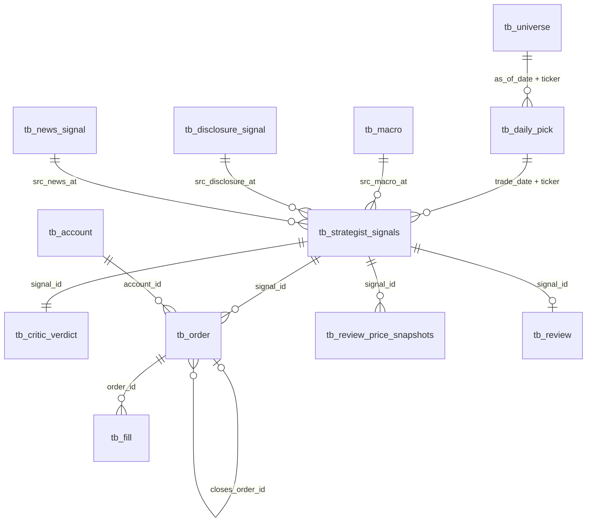
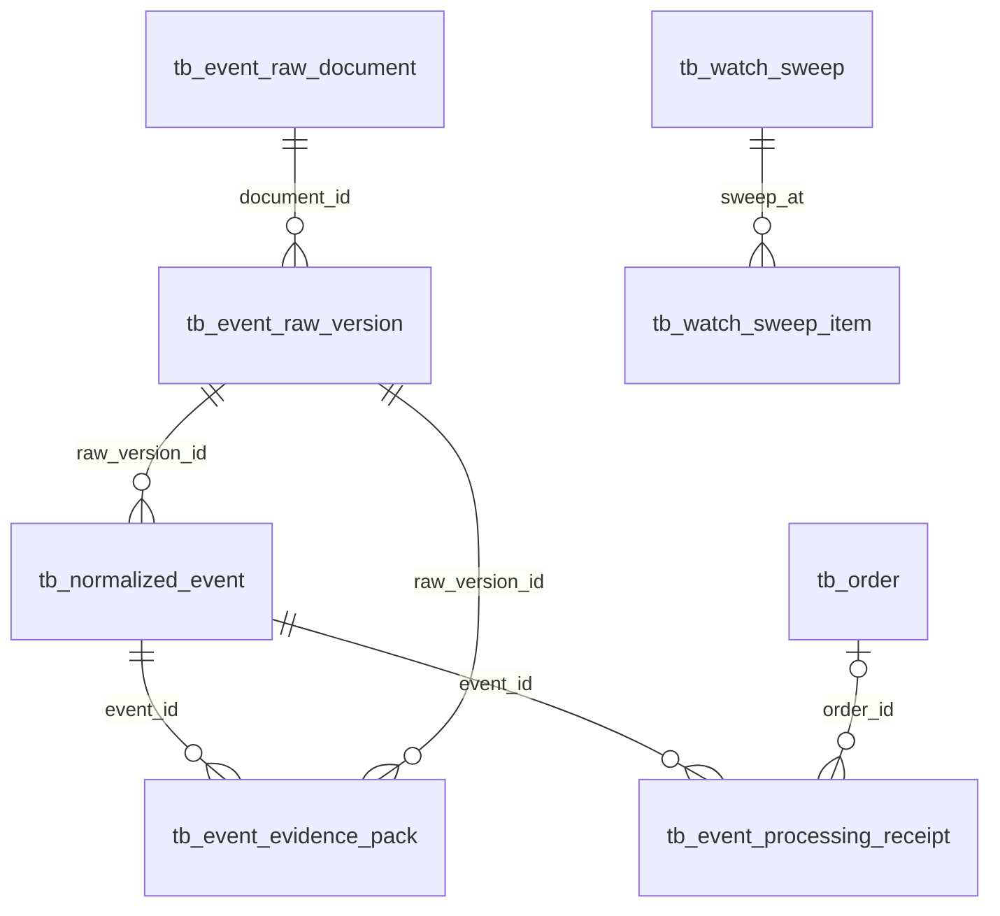

# 🗃️ 데이터 모델·ERD

!!! info "ERD를 읽는 기준"
    전체 스키마에는 핵심 테이블뿐 아니라 운영·예산·장중 사건·MVP 1차 호환 테이블도 남아
    있다. 아래 ERD는 최종 프로젝트의 핵심 계보만 보여준다. 전체 컬럼과 제약의 기계적
    정본 원문은 이 위키에 보존한 [schema.sql](final/reference/schema.sql)이다. 사람이 읽는
    전체 39개 테이블·컬럼 설명은 [데이터 사전](데이터사전.md)에서 접어서 확인한다.

## 핵심 ERD

핵심은 `tb_strategist_signals`다. 어떤 픽과 거시·공시·뉴스 신호를 보고 판단했는지
가리키며, Critic 평결·주문·체결·청산·T+1~T+5 회고가 그 뒤에 연결된다.

## 장중 사건 ERD

원문 문서와 버전을 불변으로 보존하고, 정규화된 사건이 실제 재판단·주문으로 이어졌는지는
처리 영수증으로 분리한다. 현재 이 경로는 구현됐지만 운영 원장 사건이 0건이므로 “구조가
있다”와 “실제 사례가 쌓였다”를 구분해야 한다.

## 테이블 그룹

| 그룹 | 대표 테이블 | 저장하는 것 |
|---|---|---|
| 시장 | `tb_universe`, `tb_daily_bar`, `tb_benchmark_price`, `tb_macro` | 거래 범위·가격·비교 기준·시장 국면 |
| 원문 | `tb_disclosure_raw`, `tb_news_raw`, `tb_event_raw_*` | 외부에서 받은 공시·뉴스·사건 원문과 버전 |
| 선별 | `tb_daily_pick`, `tb_disclosure_signal`, `tb_news_signal` | 오늘 볼 종목과 판단에 전달할 증거 |
| 판단 | `tb_strategist_signals`, `tb_critic_verdict` | 성향별 판단·입력 지문·Critic 승인/기각 |
| 집행 | `tb_account`, `tb_order`, `tb_fill`, `tb_order_plan` | 계좌·주문·체결과 매수하지 못한 이유 |
| 운영 | `tb_job_run`, `tb_watch_sweep*`, `tb_llm_usage` | 실행 멱등·장중 재판단·LLM 비용 |
| 회고 | `tb_review_price_snapshots`, `tb_review` | 판단 후 가격과 적중·교훈 |

## 핵심 제약

| 제약 | 보장하는 것 |
|---|---|
| `tb_job_run` PK `(job_name, slot_date)` | 같은 JOB의 하루 중복 실행 방지 |
| 판단 UNIQUE `(ticker, cycle_ts, inv_type)` | 종목·시점·성향별 판단 하나 |
| `tb_critic_verdict.signal_id` UNIQUE | 판단 하나당 Critic 평결 하나 |
| `tb_order.closes_order_id` | 어떤 매수를 닫는 청산인지 추적 |
| `tb_order_plan` planned XOR skipped | 샀거나, 못 산 이유가 있거나 둘 중 하나 |
| 사건 원문 append-only·버전 UNIQUE | 나중에 근거 원문이 바뀌거나 덮어써지는 것 방지 |
| `tb_watch_sweep_item` dispatch fencing | 불확실한 유료 재판단 호출의 중복 방지 |

## 계보의 실제 범위

- 픽 FK는 판단 342건 전부에 연결됐다.
- 프롬프트·모델·입력 해시는 기록 배선 이후 LLM 판단 전건에 남았다.
- `policy_version`은 컬럼만 있고 채우는 배선이 없어 당시 정책은 config 이력으로 확인해야 한다.
- 공시·뉴스 FK는 nullable이며 실제 적재 사례가 적다. NULL은 해당 슬롯에 전달된 채점 신호가
  없었다는 뜻이지만, 이 채널의 운영 실적이 얕다는 한계도 함께 말해야 한다.

## 다음에 볼 문서

- [전체 데이터 사전](데이터사전.md) — 39개 테이블의 모든 컬럼·타입·NULL·키·기본값·제약
- [설정·정책 기준](설정정책.md) — 임계값과 실행 주기가 데이터에 미치는 영향
- [역할·협업 계약](역할협업계약.md) — 누가 어떤 행을 생산하고 다음 역할에 넘기는지
