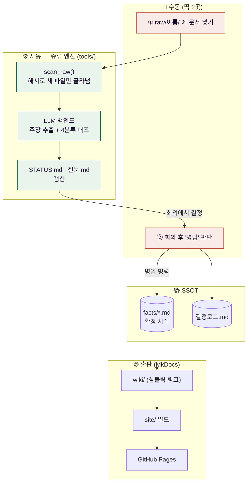
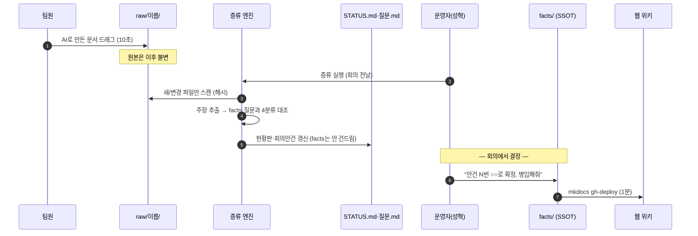
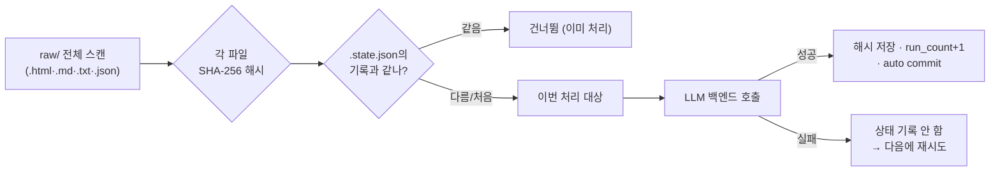
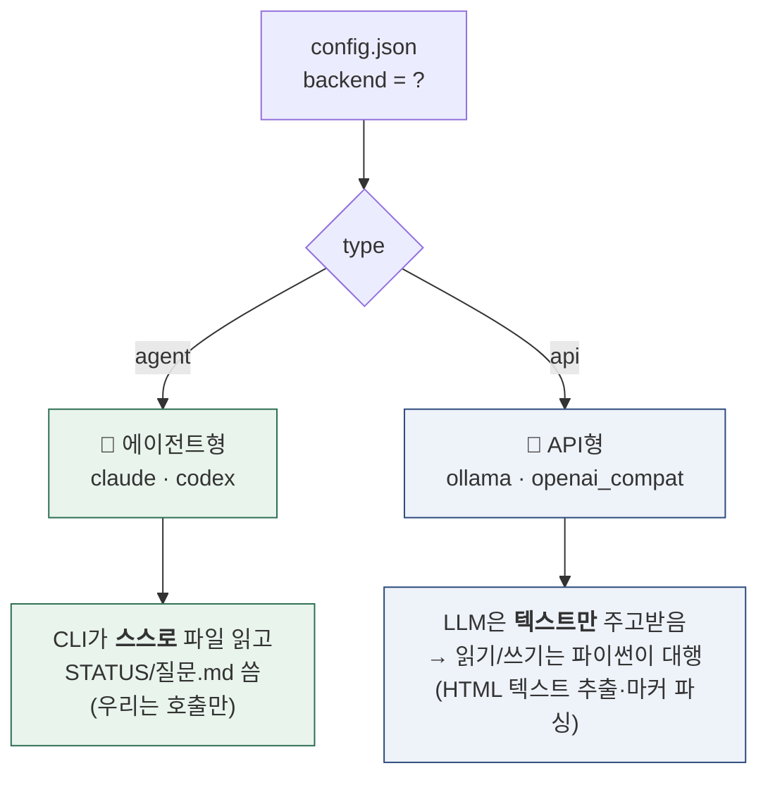
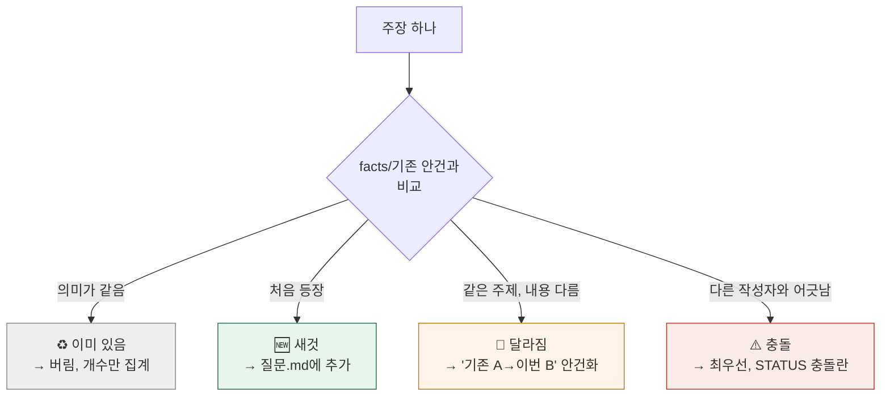
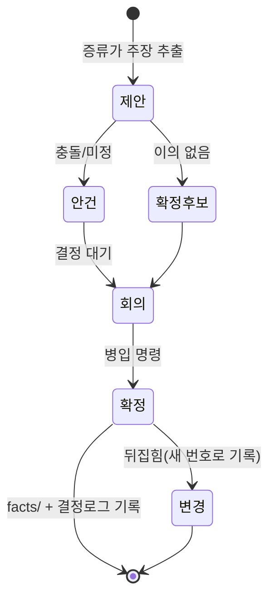
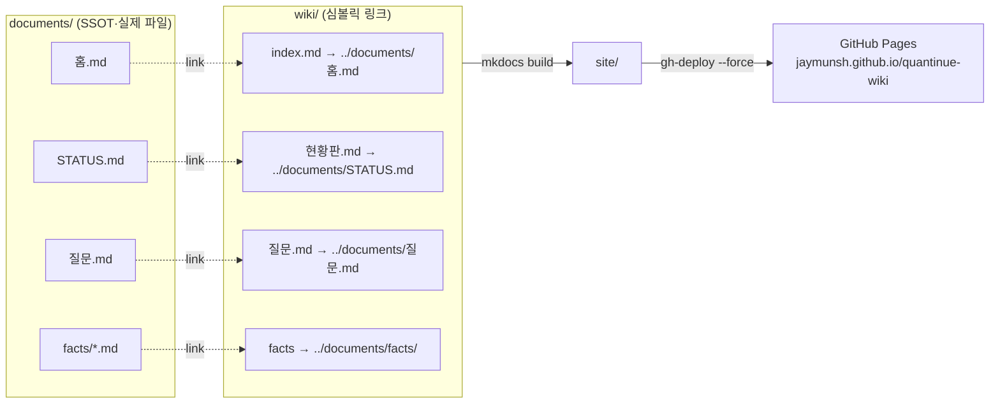

# 🛠️ DocStill 시스템 설명서 — 이 위키는 어떻게 구동되는가

!!! abstract "이 문서가 다루는 것"
    *운영 절차*(→ `사용가이드.md`)가 아니라, **이 위키 시스템(DocStill)이 내부에서 어떻게 동작하는지** — 어떤 부품이 무엇을 하고, 문서 한 장이 웹 위키가 되기까지 어떤 처리를 거치는지.

    **한 줄 정의:** 팀원이 각자 AI로 만든 HTML/MD 문서를, AI가 '주장(claim)' 단위로 증류·대조해, 확정된 것만 SSOT(`facts/`)에 쌓고 MkDocs로 웹 배포하는 파이프라인.

---

## 0. 설계 철학 — 왜 이렇게 만들었나

| 원칙 | 뜻 | 코드/구조에서의 보장 |
|---|---|---|
| **SSOT (Single Source of Truth)** | 확정된 사실은 `documents/facts/` **한 곳**에만 있다 | 위키가 읽는 건 여기뿐. 나머지는 과정 산출물 |
| **raw 불변 (immutable)** | 원본은 절대 안 고친다 → 언제든 재증류 가능 | 증류 엔진은 raw를 **읽기만** 함. 쓰기는 STATUS/질문/facts에만 |
| **수동은 딱 2곳** | ①raw에 파일 넣기 ②확정 판단(병입) | 나머지(추출·대조·배포)는 전부 자동 |
| **프롬프트 = 소스코드** | "무엇을 추출하나"는 `distill_prompt.md` 한 파일에만 | 규칙 수정 = 이 md 한 줄 추가 (파이썬 안 건드림) |
| **LLM 벤더 중립** | 어떤 LLM으로도 증류가 돈다 | 백엔드는 `config.json` 값 하나로 교체 (§4) |
| **재현성** | 같은 raw + 같은 지시서 → 같은 결과로 되짚음 | raw 불변 + 해시 기반 증분 처리 |

**핵심 통찰:** 팀원의 행동을 바꾸지 않는다. 그들은 하던 대로 AI로 문서를 만들 뿐. 그 이질적인 문서들을 **하나의 확정 사실 집합으로 수렴**시키는 게 이 시스템의 전부다.

---

## 1. 전체 구조 한눈에



> 🟥 빨강 = 사람이 하는 일(2곳뿐) · 🟩 초록 = 자동. **엔진은 raw를 읽고 STATUS/질문만 쓴다. facts는 사람이 병입 명령을 내릴 때만 바뀐다.**

---

## 2. 문서 한 장의 일생 (Lifecycle)

한 팀원의 HTML이 웹 위키의 "확정 사실"이 되기까지:



**단계별 무슨 일이 실제로 일어나나:**

1. **투입** — `raw/{공용,지현,창욱,은미,미연,성혁,멘토}/` 아래 파일 드래그. HTML·MD·TXT·JSON 지원.
2. **스캔** — 엔진이 `raw/`를 재귀 탐색해 **SHA-256 해시가 바뀐 파일만** 골라냄 (§3). 같은 파일 재투입은 자동 무시.
3. **증류** — 새 문서에서 "팀의 결정·수치·계약·일정"에 해당하는 문장을 **주장(claim)** 단위로 뽑고, 기존 `facts/`·`질문.md`와 대조해 4가지로 분류 (§5).
4. **산출** — `STATUS.md`(현황판) 전체 재작성 + `질문.md`(회의안건) 추가. **facts/는 절대 안 건드림.**
5. **결정** — 팀 회의에서 안건을 판단.
6. **병입(bottling)** — 운영자가 "N번 확정 병입해줘" 하면 그 사실만 `facts/`에 추가 + `결정로그.md`에 1줄 (§6).
7. **출판** — `mkdocs gh-deploy`로 `facts/`가 웹 위키에 반영 (§7).

---

## 3. 증류 엔진 — 증분 처리의 원리 (`tools/distill.py`)

엔진은 **"지난번 이후 달라진 것만"** 처리한다. 이를 위해 파일별 해시를 `.state.json`에 기억한다.



**핵심 함수 (distill.py):**

| 함수 | 하는 일 |
|---|---|
| `scan_raw()` | `raw/**` 재귀 · 지원 확장자만 · 숨김파일(`.`) 제외 |
| `file_hash(p)` | 파일 내용 SHA-256 앞 16자 — **내용이 바뀌면 해시가 바뀜** |
| `find_new_files(state)` | 해시가 `.state.json`과 다른(또는 처음 보는) 파일만 반환 |
| `mark_processed()` | 성공 시에만 해시 기록 · `run_count`·`last_run` 갱신 |
| `git_commit()` | `auto_git_commit=true`면 회차별 자동 커밋 |

**이게 왜 중요한가:**
- ♻️ **재투입 안전** — 같은 파일을 두 번 넣어도 해시가 같으면 무시. (멱등성 = 같은 걸 두 번 해도 결과 한 번)
- 🔁 **재증류 가능** — raw가 불변이라, `.state.json`만 지우면 전체를 처음부터 다시 증류할 수 있음.
- ✅ **실패 안전** — LLM 호출이 실패하면 상태를 기록 안 함 → 다음 실행 때 같은 파일을 다시 시도.

> **현재 상태(참고):** `.state.json` = `run_count: 2`, `last_run: 2026-07-04`. 즉 이 엔진(distill.py)으로는 2회차까지 돎. 이후 3회차(김지현 파이프라인 명세)는 대화형으로 처리됨 → `.state.json`엔 아직 미반영.

---

## 4. LLM 벤더 중립 — 백엔드 2종류 (`config.json`)

증류를 돌리는 LLM은 `config.json`의 `"backend"` 값 **하나**로 갈아끼운다. 백엔드는 딱 두 종류(type)뿐:



| type | 백엔드 | 동작 방식 | 파일 입출력 |
|---|---|---|---|
| `agent` | **claude**, codex | CLI 에이전트가 지시서를 읽고 스스로 파일 조작 | 에이전트가 직접 |
| `api_ollama` | ollama (로컬·무료) | `/api/generate` 호출, 텍스트만 | 파이썬이 대행 |
| `api_openai` | openai_compat (OpenAI·Groq·Together·vLLM·LM Studio…) | `/v1/chat/completions` 호출 | 파이썬이 대행 |

**벤더 중립의 원리 (distill.py 주석):**
> *"무엇을 추출하나(주장·4분류)"* 는 `distill_prompt.md` **한 곳**에만 있고, *"어떻게 파일을 읽고 쓰나"* 만 백엔드별로 감싼다. → 같은 프롬프트가 어떤 LLM에도 그대로 통한다.

- **agent형** — `build_agent_prompt()`가 "지시서 읽고 이 파일들만 증류하라"는 짧은 명령을 만들어 CLI에 넘김. 에이전트가 알아서 STATUS/질문을 씀.
- **api형** — `build_api_prompt()`가 지시서 + 현재 STATUS/질문/facts + 새 문서 텍스트를 **한 프롬프트에 다 담아** 보냄. HTML은 `_TextExtractor`(script·style·head 제거)로 텍스트만 뽑고 `max_chars`로 자름. 응답은 `===STATUS===` / `===QUESTIONS===` / `===REPORT===` **마커로 분리**해 파일에 기록. 마커가 깨지면 파일을 안 건드리고 원문만 `archive/briefings/`에 백업(안전).

---

## 5. 증류 로직 — 주장 추출 + 4분류 (`distill_prompt.md` = 소스코드)

이 시스템의 "지능"은 파이썬이 아니라 **`tools/distill_prompt.md`** 에 있다. 규칙을 바꾸면 이 md에 한 줄 더 쓴다.

### 5-1. 주장(claim) 추출 — "굵기"가 관건

문서에서 **"팀의 결정·수치·계약·일정에 해당하는 문장"** 만 뽑는다.

| | 예 |
|---|---|
| ✅ 좋은 굵기 | "DB는 Postgres로 한다" / "후보는 5~10개로 제한" |
| ❌ 너무 잘게 | "PER은 주가수익비율이다" (용어 설명은 주장 아님) |
| ❌ 너무 크게 | "시스템 아키텍처 전체" (문서 통째는 주장 아님) |

> 배경·교육용·비유는 건너뛴다. **결정·수치·계약·일정만** 주장이다. 모든 주장엔 **출처 필수**(못 대면 버림 = 환각 방지).

### 5-2. 4분류 대조

각 주장을 `facts/`(확정)와 `질문.md`(기존 미정)에 비교:



- **"실질 동일"** 은 표현이 아니라 **의미** 기준(숫자·방식이 같으면 동일).
- **⚠️ 충돌**은 *다른 작성자끼리* 어긋날 때만 — 최우선 처리.
- **멘토 피드백**의 지적·요구는 자동으로 🆕 안건(우선순위 높음).

### 5-3. 산출물 스타일 규칙 (모든 md 공통)

- 쉬운 말 우선 · 긴 설명보다 표·목록
- **흐름·구조·관계는 Mermaid 적극 활용** (flowchart·erDiagram·sequenceDiagram·stateDiagram·gantt) — MkDocs Material에서 자동 렌더
- 읽는 사람 = 비개발자 팀원 기준

### 5-4. 절대 금지 (안전 규칙)

- ❌ **facts/ 직접 수정 금지** — 병입은 운영자 별도 명령으로만
- ❌ **원문에 없는 내용 지어내기 금지** — 출처 없으면 버림
- ❌ 애매하면 "확정후보"가 아니라 "제안"으로 (거짓 확정이 최악)
- ❌ 질문.md 기존 안건 삭제 금지

---

## 6. 병입(Bottling) — 확정 사실을 facts에 쌓는 절차

증류는 facts를 못 건드린다. **오직 운영자의 "N번 확정 병입해줘" 명령**만이 facts를 바꾼다.



**병입 시 엔진(또는 클로드)이 하는 4가지:**
1. `facts/해당주제.md`에 추가 — 형식: `- 내용 (확정 YYYY-MM-DD, 출처: …, 결정 #k)`
2. `facts/결정로그.md`에 1줄: `| #k | 날짜 | 결정 | 이유 |`
3. `질문.md`에서 해당 안건 제거, `STATUS.md` 갱신
4. **뒤집힌 결정은 삭제하지 않고** 결정로그에 새 번호로 "변경" 기록 (이력 보존)

---

## 7. 출판 — MkDocs + GitHub Pages

facts가 웹 위키가 되는 마지막 단계. 핵심은 **심볼릭 링크**로 SSOT를 실시간 반영하는 것.



- **`docs_dir: wiki`** — MkDocs는 `wiki/`만 읽음. 그 안은 `documents/`의 실제 파일로 향하는 심볼릭 링크라, `documents/`의 STATUS/질문/facts를 고치면 **위키에 즉시 반영**. (심볼릭 = 이름표만 다른 바로가기)
- **테마** — Material · 한국어 · Noto Sans KR · Mermaid 활성화(`pymdownx.superfences`) · 상단바 `#232323`(extra.css).
- **로컬 미리보기** — `mkdocs serve` → `http://localhost:8000` (자동 리로드).
- **배포** — `mkdocs gh-deploy --force` → `gh-pages` 브랜치 빌드 후 푸시(약 1분).

---

## 8. 디렉터리 구조 & 파일 레퍼런스

폴더는 **역할별로 4갈래**로 나뉜다: 📤 사이트 노출(`documents/`) · 📥 원본(`raw/`) · ⚙️ 엔진(`tools/`) · 🗄️ 안 보는 파일(`archive/`).

```text
quantinue-wiki/
├─ documents/            📤 사이트에 노출되는 것 = SSOT + 문서 (wiki가 이걸 가리킴)
│  ├─ 홈.md                  🏠 사이트 첫 화면 — 프로젝트 소개 대시보드
│  ├─ STATUS.md              운영 현황판 — 증류가 매번 재작성 (운영 섹션)
│  ├─ 질문.md                회의 안건 — 증류가 누적
│  ├─ 산출물_현황판.md        산출물 추적
│  ├─ 사용가이드.md           운영 절차 문서
│  ├─ 시스템설명서.md         (이 문서) 시스템 동작 원리
│  ├─ 업데이트로그.md         위키 변경 이력 (증류·병입마다 1줄)
│  ├─ 회의록/                회의별 규격 요약 (결정·보류·액션)
│  ├─ 에이전트/              에이전트별 코드 동작 설명 (개요 + Reviewer…)
│  └─ facts/             ⭐ SSOT — 확정 사실(병입으로만 바뀜)
│     ├─ MVP1차.md · 파이프라인.md · 데이터계약.md
│     └─ 일정.md · 화면.md · 결정로그.md
│
├─ raw/                  📥 원본 문서 (불변 · 언제든 재증류)
│  ├─ {공용,지현,창욱,은미,미연,성혁,멘토}/
│  └─ 회의/                  회의 녹음 전사(txt) — 증류가 규격 회의록으로 변환
│
├─ CLAUDE.md             🤖 AI 세션 규칙 — 새 세션이 자동으로 읽는 운영 헌법
├─ .claude/              🤖 하네스: commands/(/증류·/병입·/점검·/배포) + settings.json(권한)
│
├─ tools/                ⚙️ 증류 엔진
│  ├─ distill.py             러너 (증분 스캔 · 백엔드 분기)
│  ├─ distill_prompt.md      증류 규칙 = "소스코드"
│  ├─ config.json            백엔드 선택·설정
│  └─ .state.json            처리 이력(해시·회차) · gitignore
│
├─ archive/              🗄️ 사이트에 안 나오는 보관물
│  ├─ briefings/             회차별 STATUS 사본 · API 원문 백업
│  └─ (구자료·공지 원본 등)    무효화됐지만 보존하는 파일들
│
├─ wiki/                 🔗 MkDocs 소스 = documents/로 향하는 심볼릭 링크 + assets/extra.css
├─ site/                 빌드 결과(배포 대상) · gitignore
├─ mkdocs.yml            사이트 설정(nav·테마·mermaid)
└─ *.command            더블클릭 실행기(증류실행·위키보기)
```

**어디를 만지고, 무엇이 자동인가:**

| 경로 | 역할 | 누가 씀 |
|---|---|---|
| `raw/{이름}/` | 원본 문서 (불변) | 사람(드래그) |
| `documents/facts/*.md` | **SSOT — 확정 사실** (파이프라인·데이터계약·MVP1차·일정·화면·결정로그) | 병입 명령만 |
| `documents/홈.md` | 사이트 첫 화면 (프로젝트 대시보드) | 수동 |
| `documents/STATUS.md` | 운영 현황판 (증류마다 전체 재작성) | 증류 엔진 |
| `CLAUDE.md` · `.claude/` | AI 하네스 — 세션 규칙 자동 로드 + 슬래시 명령·권한 | 사람 |
| `documents/질문.md` | 회의 안건 (누적, 병입 시 정리) | 증류 엔진 |
| `documents/산출물_현황판.md` · `사용가이드.md` · `시스템설명서.md` | 사이트 문서 | 수동 |
| `documents/회의록/` | 회의별 규격 요약 | 증류(회의 전사) |
| `documents/에이전트/` | 에이전트별 코드 동작 설명 | 외부 repo 참조로 생성 |
| `documents/업데이트로그.md` | 위키 변경 이력 | 증류·병입 시 1줄 |
| `tools/distill.py` | 증류 러너 (증분·백엔드 분기) | — |
| `tools/distill_prompt.md` | **증류 규칙 = 소스코드** | 규칙 수정 시 사람 |
| `tools/config.json` | 백엔드 선택·설정 | 사람 |
| `tools/.state.json` | 처리 이력(해시·회차) | 엔진 자동 |
| `archive/briefings/` | 회차별 STATUS 사본·API 원문 백업 | 엔진 자동 |
| `archive/` | 세션 메모 등 사이트에 안 보이는 파일 | 수동 |
| `wiki/` | MkDocs 소스(→documents/ 심볼릭) + `assets/extra.css` | — |
| `mkdocs.yml` | 사이트 설정(nav·테마·mermaid) | 사람 |
| `site/` | 빌드 결과(배포 대상) | 엔진 자동 |
| `*.command` | 더블클릭 실행기(증류·위키보기) | — |

!!! note "일반 문서 외 특수 입력 2종"
    - **회의 전사**(`raw/회의/*.txt`) — 일반 문서는 "제안→안건"이지만 회의는 **결정의 원천**. 증류가 규격 회의록(결정·보류·액션·맥락)을 만들고, 결정은 facts에 바로 안 쓰고 **"병입 대기"로 제시** → 운영자 승인 후 반영. (전사 오인식이 SSOT를 오염시키지 않게)
    - **에이전트 코드**(외부 `quantinue` repo) — raw에 안 넣고, 운영자가 "에이전트 X 갱신해줘" 하면 **로컬 repo를 읽기 전용 참조**해 `documents/에이전트/` 페이지 생성. 페이지에 **참조 커밋 해시**를 박아 "어느 시점 기준"인지 추적. 소스 원문이 아니라 정리된 설명만 위키에 올라감.

---

## 9. 시스템이 보장하는 것 (불변식)

| 불변식 | 어떻게 지켜지나 |
|---|---|
| **raw는 절대 안 바뀐다** | 엔진은 raw를 읽기 전용으로만 연다 |
| **facts는 병입으로만 바뀐다** | 증류 프롬프트·에이전트 명령에 "facts 수정 금지" 명시 |
| **모든 확정엔 출처·결정번호가 있다** | 병입 형식이 `(확정 날짜, 출처, 결정 #k)` 강제 |
| **뒤집힌 결정도 흔적이 남는다** | 결정로그는 삭제 없이 새 번호로 "변경" 기록 |
| **같은 입력 → 재현 가능** | raw 불변 + 해시 증분 + `.state.json` 리셋으로 전체 재증류 |
| **LLM을 바꿔도 규칙은 그대로** | 규칙은 `distill_prompt.md` 한 곳, 백엔드는 `config.json` 값 하나 |

---

## 10. 실패 모드 & 대처

| 증상 | 원인 | 대처 |
|---|---|---|
| `localhost:8000` 접속 안 됨 | `mkdocs build`만 하고 서버 안 띄움 | `mkdocs serve` (=`위키보기.command`) 실행 |
| 증류가 파일을 안 잡음 | 이미 같은 해시로 처리됨 | 내용이 바뀌었나 확인 · 전체 재증류는 `.state.json` 삭제 |
| api형에서 파일 미수정 | 응답 마커(`===STATUS===` 등) 깨짐 | `archive/briefings/`의 원문 백업 확인 후 수동 반영 |
| 증류 실패 후 재실행 | 성공 시에만 상태 기록 | 그냥 다시 실행하면 같은 파일 재시도 |
| Mermaid 안 그려짐 | 코드펜스가 ` ```mermaid ` 아님 | 펜스 언어 확인 · `superfences` 설정 확인 |

---

## 11. 용어 사전

- **주장(claim)** — 문서에서 뽑은 "결정·수치·계약·일정" 한 조각. 증류의 최소 단위.
- **증류(distill)** — raw 문서 → 주장 추출 → 대조 → STATUS/질문 갱신하는 자동 처리.
- **병입(bottling)** — 확정된 주장을 facts에 담는 수동 절차(= 술을 병에 담듯).
- **SSOT** — Single Source of Truth. 확정 사실의 유일한 출처(`facts/`).
- **멱등성** — 같은 걸 두 번 해도 결과가 한 번(재투입 안전).
- **증분 처리** — 전체가 아니라 "바뀐 것만" 처리(해시 기반).
- **벤더 중립** — 특정 LLM 회사에 묶이지 않음(백엔드 교체 가능).

---

> 📌 **요약:** DocStill은 *raw(불변) → 증류(자동, 규칙은 프롬프트) → STATUS/질문 → 병입(수동) → facts(SSOT) → MkDocs(웹)* 의 단방향 파이프라인이다. 사람은 딱 2곳(넣기·확정 판단)만 만지고, 나머지는 재현 가능하고 LLM에 독립적으로 자동화돼 있다.
