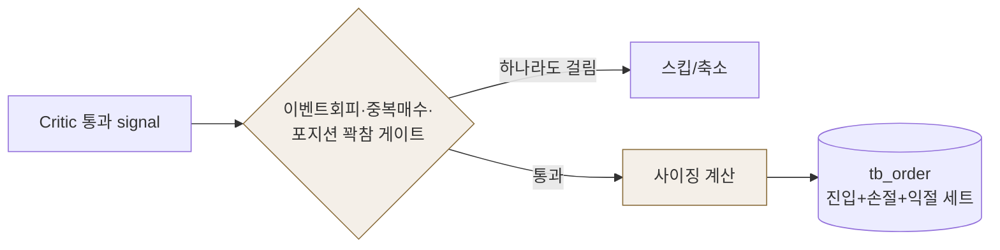

# ⚙️ Core · Infra (①~④ · ⑨⑩)

!!! warning "에이전트 아님 · 코드·규칙 계층 · 담당 김지현"
    LLM 판단 에이전트가 아니라 **계산·강제하는 코드 계층**(스크리너·기술·매크로·리스크·주문·오케스트레이션) — 파이프라인의 양 끝과 배관. 아래는 지현 마스터 ERD 기준. 갈린 용어는 [용어 사전](../facts/용어.md).

## 1. 역할 (한 사이클의 양 끝 + 배관)

| 단계 | 하는 일 | 산출 | 주기 |
|---|---|---|---|
| ① 1차 스크리너 | NASDAQ 시총 top 2,000 (last ≥ $1) | `tb_universe` | 주 1회 |
| ② 기술 분석 | 캔들 → 지표(`rs_20`·`rsi`·`macd`·`atr_pct`·`high_252_ratio`…) 규칙 계산 | `tb_technical` | 매일 |
| ③ 2차 스크리너 | 공통필터(종가≥$5·거래대금≥$5M·펌프 제거) + 5버킷 → 오늘의 50 | `tb_daily_pick` | 매일 |
| ④ 매크로 | 지수·VIX·금리·달러 → 국면(`regime`·`risk_score`) | `tb_macro` | 1시간 |
| ⑨ 리스크·포트폴리오 | 이벤트회피·비중·손절 계산 (§3) | 주문 계획 → `tb_order` | 매수 시 |
| ⑩ 주문·체결 | Alpaca 브래킷 주문·체결 기록 | `tb_account·tb_order·tb_fill` | 매수 시 |
| — 오케스트레이션 | 스케줄러·`cycle_id` 발급·실시간 시세 배치 (§4) | — | 상시 |

> 거의 모든 표가 `tb_daily_pick`(오늘의 50)에서 파생된다 — 그래서 한 DB로 촘촘히 조인된다.

## 2. ⑨ 리스크·포트폴리오 — 결정론적 규칙(LLM 아님)

Strategist·Critic이 "살까"를 정하면, ⑨는 **"얼마나·어떻게"** 를 코드로 계산한다.

- **사이징 공식** — 배정금액 = (`equity` × 거래당 리스크 4%) ÷ 손절폭 15% ≈ **계좌의 26.7%** → 상한 `max_position_pct` 25% · 현금 한도에서 컷. 손절폭이 좁으면 많이·넓으면 적게 산다(같은 4% 리스크 유지).
- **리스크오프 게이트** — `risk_score ≥ 70`이면 시장 전체가 나빠 매수 차단.
- **손절 = 09 권한** — −15% + 트레일링을 미리 계산해 브래킷으로 걸어둠(매수는 판단, 매도는 자동). 이벤트회피 = 어닝·FOMC·CPI 임박 종목 회피.

## 3. ⑩ 주문 · 체결 (Alpaca 페이퍼)

브래킷 주문(진입 + 손절 + 익절/트레일링을 **한 세트**)으로 제출 → 체결되면 손절·익절이 자동으로 걸림. 전부 가상매매.

## 4. 오케스트레이션 · 인프라

- **스케줄러** — 장중 2시간 → 1시간 → 10분 단계 축소. 정해진 시각에 후보 현재가를 1회 조회 → 사이클 실행.
- **`cycle_id`** — signal→critic→review를 묶는 키. **생성 주체 미정**(오케스트레이터?) → [A5·B10](../질문.md).
- **실시간 시세** — Alpaca에서 50종목 배치 조회 → Strategist·Critic에 스냅샷으로 전달.
- **DB** — **Postgres 1개 + TimescaleDB hypertable**(#12). `candle`은 DB 아님 = 메모리/CSV 캐시(조회 속도용).
- **5계좌** — 같은 config에서 **손절폭·비중·종목수만** 다르게(1차 페르소나 없음). 값이 같으면 5계좌 매매가 동일해진다.

## 5. 계약·결정

- 스키마: [데이터 계약](../facts/데이터계약.md) 상류 6테이블 + 계좌·주문·체결
- 정책: [파이프라인](../facts/파이프라인.md) §5 (버킷·필터·포트폴리오·타이밍)
- 확정 이력: [결정 로그](../facts/결정로그.md) #12(Postgres) · 남은 확인 [A5](../질문.md)(cycle_id)·[B4](../질문.md)(기술 값형태)
- 회의: [4차](../회의록/2026-07-06.md)(가드레일)·[6차 2부](../회의록/2026-07-09-2.md)(사이징·손절 15%)
