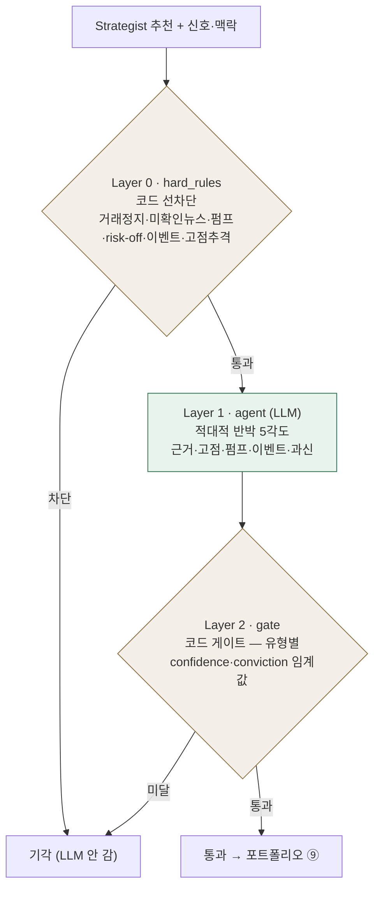

# ⚖️ Critic Agent (⑧ 반박·검증)

!!! success "✅ 구현됨 · 담당 김미연"
    Strategist의 매수 추천을 **일부러 반박**해 통과/기각을 정하는 모듈. 코드 하드룰 → LLM 반박 → 코드 게이트의 3계층.
    참조 소스: `quantinue` repo · `critic-agent-1` @ `d107834` · 구현 완료·테스트 51개 통과(gpt-4o-mini) · 패키지 `agents/critic/` (import `quantinue.agents.risk_critic`)

!!! warning "위키 baseline과 정합 필요"
    코드 README는 옛 번호(결정층 ⑥)·**균형형 활성** 기준. 현재 위키 baseline은 **⑧ · 공격형 단일**. → `config`의 `THRESHOLDS`에 공격형 임계값 추가 + `ACTIVE_PROFILES` 확장으로 정합(코드 분기 없음). 모델도 현재 OpenAI(`CRITIC_MODEL`) — 모델명 안건 참조.

## 1. 역할

- **입력:** Strategist 추천(signal) + 분석 신호(공시·뉴스·기술·매크로) + 맥락(섹터·등락·이벤트 임박 등)
- **출력:** `RiskCriticVerdict` → 통과 시 포트폴리오(⑨), 기각 시 회고(⑪)로 사유 전달
- **핵심:** "AI가 사고 싶어도 반박을 못 이기면 못 산다" — 최종 안전 판단

## 2. 동작 흐름 — 판정 3계층 (하이브리드)

> **왜 3계층?** LLM `agree`를 그대로 안 믿음 — 하드룰이 앞에서 명백한 것 선차단(비용↓·재현성), 게이트가 뒤에서 임계값으로 최종 판정. Strategist의 코드게이트 샌드위치와 같은 철학.

**1차 MVP (`critique_single_pass`)** — 하드룰 → LLM 반박 **1회** → 게이트. 되돌리는 루프 없음(거절 시 그 종목 스킵).
**2차 (`critique`)** — Critic 반박 ↔ Strategist 방어·수정 재검토, 최대 라운드(균형형 2회), 합의 불가 시 **보수적 기각**. `transcript`(라운드별 케미)는 결정 저널·발표 데모에 사용.

## 3. 코드 구조 (`agents/critic/`)

| 파일 | 역할 |
|---|---|
| `hard_rules.py` | Layer 0 — 코드 하드룰 선차단 |
| `agent.py` | Layer 1 — PydanticAI 적대적 반박 에이전트 |
| `gate.py` | Layer 2 — 코드 결정 게이트(임계값) |
| `critic.py` | 진입점 — `critique_single_pass` / `critique` 토론 루프 |
| `dedup.py` | **중복방지 4겹** — 쿨다운·변화트리거·기각캐시·메모리피드백 |
| `store.py` | 영속 추상화 — 쿨다운·기각 캐시·최근 컨텍스트 (`InMemoryStore`) |
| `config.py` | 유형별 임계값·하드룰·쿨다운 파라미터 |
| `schemas.py` | 입출력 계약 (§4) |

> **콜백 주입 설계** — Critic은 `critic_round`(반박 함수)만 주입받으면 독립 동작. 다른 팀원 모듈 완성을 안 기다림(병렬 작업). 2차 토론의 `strategist_defend`는 은미 담당이 구현.

## 4. 사용 스키마

**DB** — 입력: `tb_strategist_signals`(+ 분석 신호 테이블) · 출력: `tb_critic_verdict` ([데이터 계약](../facts/데이터계약.md))

**Pydantic 모델** (`schemas.py`)

| 모델 | 무엇 |
|---|---|
| `StrategistSignal` | 평가 대상 추천 (side·conviction 0~10) |
| `AnalystSignals` | 공시·뉴스·기술·매크로 신호 묶음 (반박 재료) |
| `CritiqueContext` | 맥락 — profile·섹터·등락%·소셜급증·이벤트임박·거래정지·cycle_id |
| `RiskCriticVerdict` | **판정** — agree · confidence(반박 설득력) · objection_category |
| `StrategistDefense` | (2차) 방어 — revised_conviction · withdrawn(방어포기→즉시기각) |

## 5. 핵심 규칙

- **중복방지 4겹** (`dedup.py`): ①쿨다운(최근 기각 N일 재제안 억제) ②변화 트리거(값 안 바뀌면 재평가 안 함) ③기각 캐시 ④메모리 피드백. 무한 반박↔재제안 루프 방지.
- **유형별 임계값** (`config.THRESHOLDS`): confidence·conviction 문턱이 profile별로 다름. 현재 `balanced`만 활성 — 비활성 유형 입력 시 `ValueError`.
- **하드룰 선차단**: 거래정지·미확인뉴스·펌프·risk-off·이벤트임박·고점추격 → LLM 전에 코드로 컷.

## 6. 계약·결정

- 스키마 계약: [데이터 계약](../facts/데이터계약.md) `tb_critic_verdict`
- 관련 논의: [회의 안건](../질문.md) B5(Critic payload) · 모델명 · 투자유형 정합
- 회의 맥락: [4차 회의록](../회의록/2026-07-06.md) (어닝/FOMC 가드레일 = Critic 뒤 이중 안전망)
