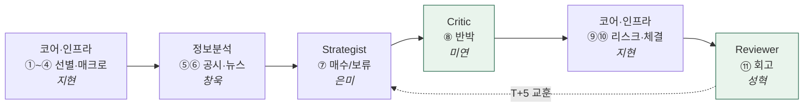

# 🤖 에이전트

!!! abstract "이 섹션이 다루는 것"
    "팀이 뭘 합의했나"(→ [파이프라인](../facts/파이프라인.md)·[데이터 계약](../facts/데이터계약.md))가 아니라, **각 에이전트가 코드로 실제 어떻게 동작하나**. 흐름과 핵심 위주 — 함수 시그니처·라인 단위는 repo가 진실, 여기는 이해용.

## 5개 에이전트 — 파이프라인 담당과 구현 상태

| 에이전트 | 담당 | 파이프라인 | 구현 상태 |
|---|---|---|---|
| [📓 Reviewer](reviewer.md) | 문성혁 | ⑪ 회고 | ✅ 구현 — Scorer·Reflector |
| Critic | 김미연 | ⑧ 반박·검증 | ✅ 구현 (문서화 예정) |
| Strategist | 이은미 | ⑦ 전략 종합 | ⚪ 설계 예정 |
| 정보분석 | 정창욱 | ⑤⑥ 공시·뉴스 | ⚪ 설계 예정 |
| 코어·인프라 | 김지현 | ①~④·⑨⑩ | ⚪ 설계 예정 |

## 한 사이클에서 어떻게 엮이나

> 🟩 = 코드 구현된 에이전트. 나머지는 계약(스키마)만 확정, 구현 대기.
