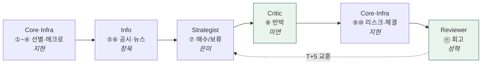

# 🧩 핵심 기능

!!! abstract "이 섹션이 다루는 것"
    "팀이 뭘 합의했나"(→ [파이프라인](../facts/파이프라인.md)·[데이터 계약](../facts/데이터계약.md))가 아니라, **각 구성요소가 코드로 실제 어떻게 동작하나**. 한 사이클은 코드 계층(Core·Infra)이 판을 깔고, 4개 LLM 에이전트가 순서대로 판단한다. 흐름·핵심 위주 — 함수 시그니처·라인 단위는 repo가 진실, 여기는 이해용.

## 구성 — 파이프라인 순서

| 구성요소 | 담당 | 파이프라인 | 종류 | 구현 상태 |
|---|---|---|---|---|
| [⚙️ Core · Infra](core.md) | 김지현 | ①~④·⑨⑩ | 코드 계층 | — 계산·강제 |
| [📰 Info Agent](info.md) | 정창욱 | ⑤⑥ 공시·뉴스 | LLM 에이전트 | ⚪ 설계 예정 |
| [🧠 Strategist Agent](strategist.md) | 이은미 | ⑦ 전략 종합 | LLM 에이전트 | ⚪ 설계 예정 |
| [⚖️ Critic Agent](critic.md) | 김미연 | ⑧ 반박·검증 | LLM 에이전트 | ✅ 구현 — 3계층 하이브리드 |
| [📓 Reviewer Agent](reviewer.md) | 문성혁 | ⑪ 회고 | LLM 에이전트 | ✅ 구현 — Scorer·Reflector |

> ⚙️ **Core · Infra는 에이전트가 아니다** — 스크리너·기술·매크로·리스크·주문·오케스트레이션의 규칙·코드 계층. LLM 판단이 아니라 계산·강제라 별도로 둔다. 나머지 4개가 LLM 판단 에이전트.

## 한 사이클에서 어떻게 엮이나

> 🟩 = 코드 구현된 에이전트. 나머지는 계약(스키마)만 확정, 구현 대기.
