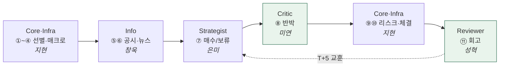

# 🧩 구성요소 참고 (1차 역할 기준)

!!! info "1차 설명과 최종 구현"
    아래 표와 각 구성요소 페이지는 1차 01→11 역할을 이해하기 위한 설명을 보존한다.
    최종 프로젝트는 **등록 JOB 14종·공격형/안전형 두 성향·PostgreSQL 28테이블·WatchRunner**로
    확장됐다. 현재 상태와 최종 역할은 [최종 프로젝트 한눈에](../facts/최종프로젝트.md),
    최종 구현 설명은 [엔지니어링 부록](../final/quantinue-engineering.html)을 따른다.

!!! abstract "이 섹션이 다루는 것"
    "팀이 뭘 합의했나"(→ [파이프라인](../facts/파이프라인.md)·[데이터 계약](../facts/데이터계약.md))가 아니라, **각 구성요소가 코드로 실제 어떻게 동작하나**. 한 사이클은 코드 계층(Core·Infra)이 판을 깔고, 4개 LLM 에이전트가 순서대로 판단한다. 흐름·핵심 위주 — 함수 시그니처·라인 단위는 repo가 진실, 여기는 이해용.

## 구성 — 파이프라인 순서

| 구성요소 | 담당 | 파이프라인 | 종류 | 구현 상태 |
|---|---|---|---|---|
| [⚙️ Core · Infra](core.md) | 김지현 | 수집·선별·청산·배분·운영 기반 | 코드 계층 | ✅ 2차 JOB 기반 구현 |
| [📰 Info Agent](info.md) | 정창욱 | SEC·뉴스·와이어 수집·정규화 | 데이터 계층 | ✅ 원문/집계 계보 구현 |
| [🧠 Strategist Agent](strategist.md) | 이은미 | 공격형·안전형 전략 판단 | LLM 에이전트 | ✅ 성향별 분석 구현 |
| [⚖️ Critic Agent](critic.md) | 김미연 | 반박·승인/기각·비용 방어 | LLM 에이전트 | ✅ 구현·테스트 |
| [📓 Reviewer Agent](reviewer.md) | 문성혁 | T+1~T+5 회고·장중 감시 | LLM/운영 계층 | ✅ 구현·운영 기록 |

> ⚙️ **Core · Infra는 에이전트가 아니다** — 스크리너·기술·매크로·리스크·주문·오케스트레이션의 규칙·코드 계층. LLM 판단이 아니라 계산·강제라 별도로 둔다. 나머지 4개가 LLM 판단 에이전트.

## 한 사이클에서 어떻게 엮이나

```mermaid
flowchart LR
  CORE["Core·Infra<br/>①~④ 선별·매크로<br/><i>지현</i>"] --> INFO["Info<br/>⑤⑥ 공시·뉴스<br/><i>창욱</i>"]
  INFO --> ST["Strategist<br/>⑦ 매수/보류<br/><i>은미</i>"]
  ST --> CR["Critic<br/>⑧ 반박<br/><i>미연</i>"]
  CR --> EXE["Core·Infra<br/>⑨⑩ 리스크·체결<br/><i>지현</i>"]
  EXE --> RV["Reviewer<br/>⑪ 회고<br/><i>성혁</i>"]
  RV -.T+5 교훈.-> ST
  classDef done fill:#e9f4ec,stroke:#2C6E52
  class RV,CR done
  click CR "critic.md"
  click RV "reviewer.md"
```

> 🟩 = 1차 페이지의 표현 기준. 최종 구현 상태는 위 표와 [최종 프로젝트 한눈에](../facts/최종프로젝트.md)가 우선한다.
