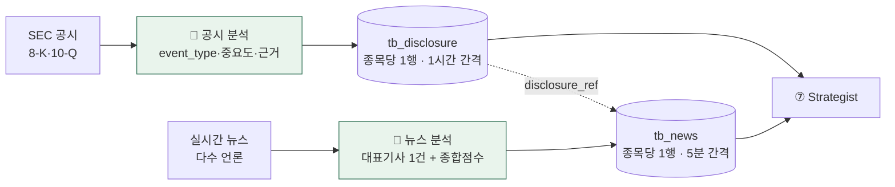

# 📰 Info Agent (⑤⑥ 공시·뉴스)

!!! note "🟡 설계·계약 기준 · 담당 정창욱"
    한 담당이 **공시·뉴스를 함께** 분석(속도차·상호보완). 공시 18필드·뉴스 25필드 확정 수준, 대표기사 선정 기준은 조율 중. 코드는 정리되면 반영. 갈린 용어는 [용어 사전](../facts/용어.md).

## 1. 역할

오늘의 50 종목의 **공시(8-K·10-Q)와 뉴스**를 LLM으로 분석해 호재/악재·중요도·신뢰도를 산출. **찌라시·루머를 거르는 신뢰도 판단**이 핵심.

- **입력:** `tb_daily_pick` 50 티커 + SEC 공시 · 실시간 뉴스
- **출력:** `tb_disclosure`(공시) · `tb_news`(뉴스) — **종목당 사이클당 1행 집계**
- **원칙:** 코드=사실 / LLM=해석 · `hard_block`(파산·상폐 등) 코드 강제 · 시간별 누적(사이클마다 append)

## 2. 동작 흐름

> **`disclosure_ref`** — 뉴스가 공시를 근거로 쓴 건지 교차확인하는 매칭키(공시번호=확정·null=미확인). 뉴스↔공시를 잇는 다리.

## 3. 공시 (`tb_disclosure` · 18필드)

- **`event_type`** — 실적·M&A·증자·경영진변경·상폐 등 **11종** 중 하나로 분류(+근거 reason).
- **`importance`** — 사건 규모로 중요도 산출(유상증자여도 규모 작으면 하향).
- **`summary`** — 원문(100p도 있음)이 아니라 **LLM 요약본** + 키워드.
- **`hard_block`** — 거래정지 등 나오는 순간 매수 차단(0/1).
- **PK** = (`ticker`, `collected_at`) 복합키. 창욱 동의로 24→**18필드 확정**(07-07, `confirmed_score` 등 6개 삭제 — 공시는 공식문서라 신뢰 항상 1.0).

## 4. 뉴스 (`tb_news` · 25필드)

- **대표기사** 🔴 — 종목당 뉴스 여러 건 중 **1건을 대표로** 선정. 선정 기준(신뢰도 vs 영향도 종합)이 **아직 미합의** — [6차 1부](../회의록/2026-07-09.md)에서 막힘. AI 구성 제안은 [추천제안](../추천제안.md) 참조.
- **`sentiment_score`** — 호·악재 강도 하나로(0=악재·0.5=중립·1=호재, 라벨 컬럼 통합 방향).
- **`source_trust` ↔ `grade_score`** — 출처 신뢰(기관 1.0 / 일반 0.6 / 찌라시 0). 두 축의 중복 여부 논쟁 중([B3](../질문.md)).
- 24명세 + `disclosure_ref` 신설 = **25필드**(07-08). 루머/팩트 4필드 삭제.

## 5. 핵심 규칙

- **종목당 1행 집계** — "공시별/기사별 여러 행" ❌ → 종목당 사이클당 1행으로 누적(5차 결정).
- **신호 없으면 행은 생성** — 그 사이클 뉴스/공시 없어도 `has_signal=0`으로 행 생성(릴레이 안 끊김).
- **코드=사실 / LLM=해석** — 분류·점수는 LLM, `hard_block` 같은 확정 사실은 코드 강제.

## 6. 계약·결정

- 스키마: [데이터 계약](../facts/데이터계약.md) `tb_disclosure`·`tb_news`·event_type 11종
- 남은 확인: [회의 안건](../질문.md) B3(필드 충돌)·대표기사 선정 기준
- 회의: [3차](../회의록/2026-07-03.md)·[5차](../회의록/2026-07-08.md)(disclosure_ref)·[6차 1부](../회의록/2026-07-09.md)(대표기사 막힘·요약본·reason 신설)
