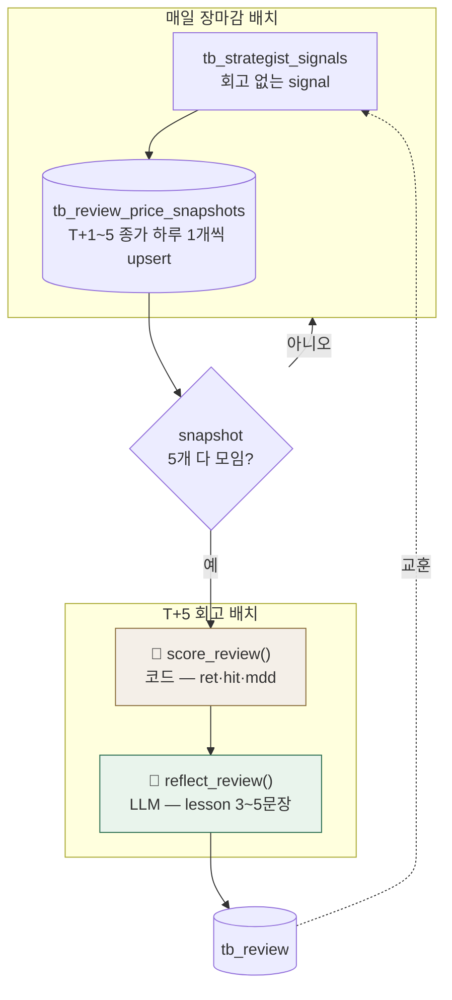

# 📓 Reviewer 에이전트 (⑪ 회고)

!!! success "✅ 구현됨 · 담당 문성혁"
    한 판단(signal)을 **T+5 이후 복기**해 결과를 채점하고 교훈을 남기는 모듈. 코드가 숫자를, LLM이 교훈을 쓴다.
    참조 소스: `quantinue` repo · `reviewer-agent` @ `abcec1a` · 패키지 `agents/reviewer/`

## 1. 역할

- **입력:** Strategist 최종 판단(signal) + 그 종목의 T+1~5 종가
- **출력:** `tb_review` 1행 (수익률·적중·교훈)
- **되먹임:** 교훈(lesson)을 다음 사이클 Strategist(⑦)가 참고 → 같은 실수 반복 억제
- **1차 observe-only** (기록만, 전략 자동 반영은 2차) · **Critic 미참조**(최종 책임은 Strategist signal)

## 2. 동작 흐름 — 2단 배치 + Scorer→Reflector

> **왜 스냅샷 테이블이 따로?** `tb_technical`은 그날 오늘의 50만 담아서, 판단한 종목이 T+1/3/5에 50 밖으로 빠지면 종가를 못 구함 → 실제 판단한 signal만 T+1~5 종가를 별도 추적. (계약: [데이터 계약](../facts/데이터계약.md))

## 3. 코드 구조 (`agents/reviewer/`)

| 파일 | 역할 |
|---|---|
| `schemas.py` | Pydantic 입출력 모델 (§4) |
| `scorer.py` | LLM 없이 숫자만 채점 — `score_review()` |
| `agent.py` | LLM Reflector — `reflect_review()` · `REFLECTOR_PROMPT` |
| `__init__.py` | 공개 API + 레거시 `review()` 호환 래퍼 |

**흐름:** `ReviewInput → score_review() → ReviewScore → ScoredReviewContext → reflect_review() → TbReviewDraft`
(TbReviewDraft = tb_review에 넣을 값을 담은 객체 · 실제 테이블 아님)

## 4. 사용 스키마

**DB 테이블** — 읽기: `tb_strategist_signals`·`tb_fill`·`tb_review_price_snapshots` · 쓰기: `tb_review` (상세는 [데이터 계약](../facts/데이터계약.md))

**Pydantic 모델** (`schemas.py`)

| 모델 | 무엇 |
|---|---|
| `StrategistSnapshot` | 평가 대상 최종 판단 (signal_id·side·conviction·근거) |
| `FillSnapshot` | 체결가 — buy의 P0 |
| `ReviewPriceSnapshot` | T+1~5 종가 1개 (day_offset·close·source) |
| `ReviewInput` | 위 셋 + `decision_close`(hold의 P0) 묶음 — day_offset 1~5 필수 |
| `ReviewScore` | 코드 채점 결과 (ret_1/3/5d·hit·max_drawdown) |
| `TbReviewDraft` | tb_review 저장값 (숫자=Scorer, lesson=Reflector) |

## 5. 핵심 규칙 (코드로 고정)

**P0 (수익률 기준가)** — `_baseline_price()`

| 판단 | P0 | 없으면 |
|---|---|---|
| `buy` | `fill.price` (체결가) | `MissingBaselinePriceError` |
| `hold` | `decision_close` (판단일 종가) | 〃 |

**hit** — `buy`: ret_5d>0 / `hold`: ret_5d≤0 ("안 사길 잘했다") → 보수적 기회손실도 기록

**입력 방어** — `score_review()`는 signal_id 불일치·day_offset 중복·1~5 누락을 `InvalidPriceSnapshotWindowError`로 차단 (가격 섞이면 lesson이 통째로 틀려지므로)

**lesson (`REFLECTOR_PROMPT` 5규칙)** — ①3~5문장 ②ret_5d 또는 max_drawdown 숫자 포함 ③다음 행동 규칙 ④일반론·감정 표현 실패 ⑤Scorer 확정 숫자만 인용(새 계산 금지). 모델은 PydanticAI `Agent[None, LessonReflection]`.

## 6. 계약·결정

- 스키마 계약: [데이터 계약](../facts/데이터계약.md) `tb_review`·`tb_review_price_snapshots`
- 확정 이력: [결정 로그](../facts/결정로그.md) #9(스키마)·#11(snapshot·Critic 미참조)
- 남은 확인: [회의 안건](../질문.md) B8(은미 소비)·B11(NO_TRADE 범위·1차 주입)
