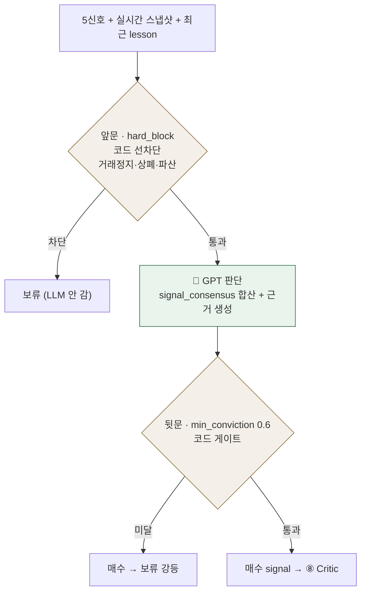

# 🧠 Strategist Agent (⑦ 전략 종합)

!!! note "🟡 설계·계약 기준 (v3.0) · 담당 이은미"
    스키마는 **v3.0으로 확정 수준**, 코드는 스켈레톤(`agents/fundmanager/`). 아래는 지현 마스터 ERD + 은미 v3.0 기준 설명 — 구현되면 코드 기준으로 갱신한다. 갈린 용어는 [용어 사전](../facts/용어.md).

## 1. 역할

5개 신호와 실시간 시세를 종합해 종목별 **매수/보류**를 근거·확신도와 함께 판단하는 결정 시작점.

- **입력:** `tb_technical`·`tb_macro`·`tb_disclosure`·`tb_news`(종목당 집계 1행) + 실시간 스냅샷 + `tb_review.lesson`(최근 교훈)
- **출력:** `tb_strategist_signals` 1행 — `side`·`conviction`·`signal_consensus`·`evidence`·`sizing_hint`
- **1차:** 매수/보류 2택 (능동 매도 `side=매도`는 2차) · 페르소나 없음(`persona_notes`=null) · 단일 패스

## 2. 동작 흐름 — 코드 게이트 샌드위치

> **왜 샌드위치?** LLM 판단을 코드가 앞뒤로 감싼다 — 앞문이 명백한 결격을 선차단(비용↓), 뒷문이 확신도 문턱으로 최종 강등. Critic(⑧)의 3계층과 같은 철학.

## 3. 판단 로직 (v3.0)

- **`signal_consensus` 0~3** — 공시·뉴스·기술이 각자 POLICY 문턱을 넘으면 +1. 합의가 높을수록 확신.
- **뉴스 게이트** — `sentiment_score ≥ 0.70` · `grade ≥ 0.55` (기존 `confirmed_score ≥ 0.50`은 창욱 삭제 확정 → `source_trust`/`grade` 기반 **재설계 필요**, [B3](../질문.md))
- **매크로** — 투표 폐지 → **감점만**(`risk_score` 3→−0.05 … 10→−0.50). 시장이 나빠도 종목을 죽이지 않고 확신을 깎는다.
- **점수 0~1 통일** — v1(0~10)→v3(0~1, 소수점 3자리). 매수율 v1 52% → v3 **24%**(오탐 반감).

## 4. 사용 스키마

**DB** — 읽기: `tb_technical`·`tb_macro`·`tb_disclosure`·`tb_news`·`tb_review` · 쓰기: `tb_strategist_signals` ([데이터 계약](../facts/데이터계약.md))

| `tb_strategist_signals` 주요 컬럼 | 뜻 |
|---|---|
| `id` (PK) · `cycle_id`(FK) · `ticker`(FK) | 판단 식별 — 하류가 이 키로 릴레이 |
| `side` | 매수 / 보류 (2택) |
| `conviction` | 확신도 0~1 · `min_conviction` 0.6 미달이면 보류 |
| `signal_consensus` | 0~3 신호 합의 개수 |
| `evidence` · `sizing_hint` | 근거(JSONB) · 비중 힌트(JSONB) |

**실시간 스냅샷**(입력) — `current_price`·`day_high/low`·`volume`·`turnover`·52주 최고/최저.

## 5. 핵심 규칙

- **주기 단계 축소** — 장중 2시간 → 1시간 → 10분 (상시가 아님).
- **손절·매도가 미포함** — 손절 권한은 ⑨(리스크·포트폴리오). Strategist 스키마에서 관련 필드 제거([B14](../질문.md)).
- **메모리 되먹임** — 같은 종목 `tb_review.lesson` 최근 5개를 참고(반복 실수 억제). 통일 방식은 [B8](../질문.md).

## 6. 계약·결정

- 스키마: [데이터 계약](../facts/데이터계약.md) `tb_strategist_signals`
- 남은 확인: [회의 안건](../질문.md) B3(필드 충돌·게이트 재설계)·B13(`decision_close`)·B8(메모리 통일)
- 회의: [5차](../회의록/2026-07-08.md)(v3.0·0~1 통일)·[6차 2부](../회의록/2026-07-09-2.md)(실시간 스냅샷·손절 15%)
