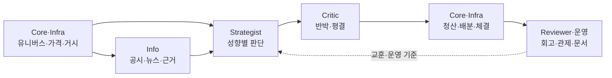

# 👥 역할·협업 계약

!!! info "5명이 같은 시스템을 만드는 기준"
    역할은 발표용 명단이 아니라 **입력·출력·완료 조건의 소유권**이다. 각 담당자는 자기 코드만
    끝내는 것이 아니라 다음 담당자가 읽을 원장 행과 실패 사유까지 남겨야 한다.

## 역할별 인수인계

아래 표는 1차에서 합의한 역할 계약이며 최종 구현에서도 소유권 경계로 유지된다.
2차(최종 프로젝트) 구현 단계에서는 이은미가 취업으로 참여를 마쳐 Strategist 영역을 문성혁이 인계받았고,
최종 구현·통합과 문서화도 문성혁이 맡아 마감했다([결정 #15](facts/결정로그.md)).

| 역할 | 소유 범위 | 입력 | 반드시 남길 출력 | 완료 증거 |
|---|---|---|---|---|
| Core·Infra | 설정, 거래일, JOB 러너, DB, 선별, 청산, 배분, 관제 | 공급자 어댑터·판단·평결 | `tb_job_run`, `tb_daily_pick`, `tb_order_plan`, `tb_order`, `tb_fill` | 재실행 무중복, 실패 원장, 계좌 한도 테스트 |
| Info | SEC·뉴스·와이어 수집, 정규화, 신뢰도 | 외부 원문·수집 커서 | `tb_*_raw`, `tb_*_signal`, 사건 원문/버전/근거 팩 | 원문 URL·해시·시각, 중복 제거, 결손 사유 |
| Strategist | 공격형·안전형 판단 | 픽, 가격, 거시, 공시, 뉴스 | `tb_strategist_signals` | BUY/HOLD/SELL, 확신, 근거, 모델·프롬프트·입력 해시 |
| Critic | 반대 논리, 게이트, 최종 평결 | 전략가 신호와 동일 근거 | `tb_critic_verdict` | 승인/기각/보류, 반박, 적용 규칙, 비용 기록 |
| Reviewer·운영 | T+1~T+5 회고, 장중 감시, 문서·발표·인수인계 | 판단·주문·체결·후속 가격 | `tb_review_price_snapshots`, `tb_review`, 운영 기록 | 수익률·낙폭·교훈, 장애 절차, 정본 링크 최신화 |

## 공통 데이터 계약

- 거래일은 뉴욕 세션 날짜, 시각은 UTC로 저장한다. 화면에서만 사용자 시간대로 변환한다.
- 티커는 대문자 정규형을 사용한다. 성향은 `aggressive`와 `conservative`만 허용한다.
- 데이터가 없으면 임의의 0이나 중립값을 채우지 않는다. NULL·`skipped_reason`·실패 상태 중
  의미에 맞는 방식으로 결손을 드러낸다.
- LLM 결과만 저장하지 않는다. 모델, 프롬프트 버전, 입력 해시, 사용 토큰, 비용을 함께 남긴다.
- 외부 부작용은 멱등 키와 소유권 토큰으로 감싼다. 타임아웃은 성공도 실패도 아니므로 원장을
  조회해 소유권과 결과를 확인한 뒤 재시도한다.
- 새 컬럼·상태값·JOB을 추가하면 [데이터 사전](데이터사전.md), [설정·정책](설정정책.md),
  운영 가이드 중 영향받는 문서를 같은 변경에서 갱신한다.

## 하루의 핸드오프

## 완료의 정의

기능 하나는 다음 조건을 모두 만족해야 완료다.

1. 정상 입력에서 기대 행과 화면이 생성된다.
2. 중복 실행해도 주문·비용·원문이 중복되지 않는다.
3. 외부 API 오류와 프로세스 중단 후 재시작 경로가 확인된다.
4. 판단에서 원문, 주문, 체결, 회고까지 식별자로 역추적된다.
5. 운영자가 로그를 읽지 않고도 현황판과 원장에서 실패 이유를 알 수 있다.
6. 설정값·스키마·운영 절차가 위키와 일치한다.

## 바로 찾기

- 전체 실행 순서: [JOB·파이프라인](파이프라인.md)
- 테이블 관계와 모든 컬럼: [데이터 모델·ERD](데이터모델.md) · [데이터 사전](데이터사전.md)
- 판단과 주문 역추적: [데이터·판단 계보](데이터계보.md)
- 기동·장애 대응: [운영 가이드](운영가이드.md)

