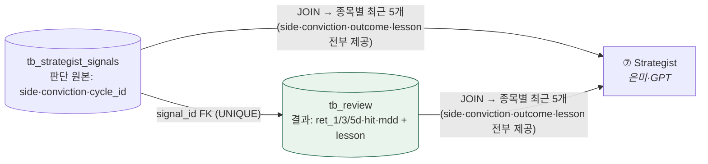

# ❓ 회의 안건 (질문)

!!! abstract "2026-07-06 · 1차 확정 후 남은 안건 (4회차 갱신)"
    위에서부터 결정하면 [결정 로그](facts/결정로그.md)로 번호를 받아 이동하고 여기서 지운다.
    🆕 이번 갱신: **B8 개정**(tb_review 단일 통일 — 은미 확인만) · **B11 신설**(리뷰어 채점·운영 세부 4건)

    ✅ **이미 확정(결정 #1~#8):** tb_ 접두사 · 투자유형 · 11단계 · macro_veto 폐지 · Alpaca · risk_score 0~100 · 타이밍 · 공통컬럼(created/updated_at)

## 🔴 최우선 — 팀 간 필드 계약 (schema keeper = 성혁 표준화)

| # | 안건 | 내용 | 당사자 |
|---|---|---|---|
| 🔴 B8 | **리뷰어 출력 = `tb_review` 단일 통일** (개정 2026-07-06) | 성혁 확정안: `tb_memory_entries`는 테이블명 미정 시절 임시 이름 → **폐기**. 은미가 쓰던 컬럼(side·conviction·outcome·lesson)은 `tb_review + tb_strategist_signals JOIN` 한 번으로 전부 제공(쿼리 초안 있음). 뷰도 불필요 — **은미 확인만 받으면 종결** | 성혁·은미 |
| B11 🆕 | **리뷰어 채점·운영 세부 확정** (성혁 제안 — 이의만 받기) | ① 기준가 P0: 매수=**체결가** / 보류=**판단일 종가** · ② 채점 확정 = **T+5** (창욱 백테스트 +1/3/5d와 동일 창) · ③ **1차 메모리 주입 허용** 여부 — MVP 정의 "observe-only(기록만)"와 은미 STEP4(주입)가 갈림, 성혁은 "참고 제공은 허용" 제안 · ④ NO_TRADE 회고 → **4차 회의: 50종목 전량 보류 포함 기록으로 결론**(병입 대기) | 성혁·은미·지현 |
| B9 | **표 접미사 `_signals` 통일** | `tb_technical`·`tb_news`(지현) ↔ `tb_technical_signals`·`tb_news_signals`(은미). tb_ 접두사는 합의(#1), 접미사만 | 지현·은미 |
| B10 | **cycle_id ↔ trade_date 키 매핑** | 상류(tb_technical·daily_pick·disclosure·news)는 trade_date/collected_at 키인데 은미 07은 ticker+cycle_id로 SELECT → 변환 규칙 | 지현·은미 |
| ~~B2~~ | **공시 18필드·뉴스 28필드 감축 = 창욱 동의(2026-07-07)** — company_name·category·verdict 등 JOIN/중복 제거 → **병입 대기** | ✅ 창욱 동의 |
| B13 🆕 | **decision_close 신설** (은미 스키마) | Reviewer가 보류 P0로 쓰는데 tb_strategist_signals에 없음(cross_source_confirmed와 같은 케이스). 은미가 추가 | 은미·성혁 |
| B14 🆕 | **실시간 스냅샷 필드 + 손절/매도 필드 제거** (은미 스키마) | 추가: current_price·day_high/low·volume·turnover·52w(판단 순간 배치 조회, snapshot JSONB 가능). 제거: 매도가·손절가(09가 정함) | 은미·지현 |
| B3 | **cross_source_confirmed 생성 책임** | 은미 필수(교차확인 +0.15) · 창욱 Bundle 없음. 원자료 있어 창욱이 신설 | 창욱·은미 |
| B4 | **기술 신호 값 형태** | trend="상승/혼조/하락" · macd=숫자 (지현 문서 채택) → 은미 파싱 정합 | 지현·은미 |
| B5 | **tb_critic_verdict 필드 확정** | 지현이 미연 인수인계 v1.2로 초안 정리: id·signal_id·cycle_id·decision(pass/reject)·agree·category(weak_evidence·late_entry·pump·event_risk·macro_riskoff·halted)·objection·confidence·decided_layer(hard_rule/llm/gate) → **미연 확정만** | 미연 |
| B6 | **PM sizing_hint 형식** | 은미 `{suggested_weight…}` ↔ 지현 포트폴리오 정책(25%·5종목·−15%) | 은미·지현 |
| B12 🆕 | **`updated_at` 컬럼 = 상태 변경 테이블에만** (성혁 표준 · #10) | `created_at`은 전 테이블 공통. **행이 나중에 수정되는 테이블에만 `updated_at` 추가** — 해당 항목: `tb_account`(체결마다 잔고 갱신) · `tb_order`(주문 상태 제출→체결/취소 전이). 그 외 append-only(덮어쓰기 ❌)는 created_at만. 실제 만드는 지현 확인 | 지현·성혁 |

## 🅰️ 인프라 잔여

| # | 안건 | 내용 |
|---|---|---|
| A2 | **SQLite → Postgres 통합 시점** | Postgres 1개 방향 확정. 창욱 SQLite 코드 → 언제·어떻게 통합할지만 |
| A5 | **cycle_id, 애초에 필요한가?** (성혁 → 지현·은미) | 기존 설계에 있다고 정답은 아님 — 근본부터 얘기해보자는 제안. **하류는 signal_id FK 체인으로 이미 다 이어지고, 상류는 자기 시간 키로 살며, 한 실행의 묶음·시각은 `tb_strategist_signals.created_at`으로 도출 가능.** 그럼 cycle_id가 실제로 해주는 일이 남나? 필요하다면 "무엇을 위해"를 먼저 정의하고 최소로 도입 (없애면 A3·B10도 함께 소멸) |
| — | **LLM 모델명 확정** | 분석가=싼 모델(mini) · Strategist=상위. 정확한 모델명 |
| — | **ml_prob_up 1차 사용?** | 02 ml_probs는 1차 빈값 {} 인데 07 POLICY에 ml_prob_up≥0.50 있음 → 1차엔 스킵(trend만)? |

## 🅲 기존 안건 (멘토·구조) — 여전히 유효

| # | 안건 | 제기 |
|---|---|---|
| C1 | **MVP 성공 기준 정의** 🔴 | 멘토 |
| C3 | 화면·사용자 흐름 산출물 | 멘토 |
| C4 | 간트 구현단계 세분화 + PPT 전날 완성 | 멘토 |

> C2(Attempt1 push 구조)는 Pull(SELECT/JOIN) 확정으로 사실상 종료.

---

### 💡 schema keeper 제안 (성혁) — B8 한 그림 (개정판)

tb_review 스키마는 **데이터계약에 반영 완료(결정 #9)**. 테이블을 늘리지 않고 **JOIN 하나로** 은미 스펙을 전부 충족 — 은미 확인만 남음:

> `tb_memory_entries`(임시 이름) 폐기 — 별도 테이블·뷰 없이 위 JOIN이 은미 v2.2 소비 스펙과 1:1 대응. 채점 공식·계산 예시는 초안 §3 참조.
