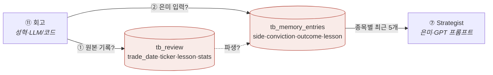

# ❓ 회의 안건 (질문)

> 증류 3회차(2026-07-05) 누적. 위에서부터 결정 → 병입 지시 시 제거.
> 🆕 3회차 = **김지현 파이프라인 owner 문서**가 A1·A4를 사실상 풀고, 하류 스키마(내 출력 테이블·상류 키·표 이름)에서 새 안건을 냈다.

## 🅰️ 최우선 — 파이프라인이 안 돌게 만드는 것

| # | 안건 | 왜 급한가 | 관련 |
|---|---|---|---|
| A1 | **투자유형: 공격형 단일 확정?** 🟢거의합의 | **은미 v2.2도 "공격형 단일"로 선회** → 설계서·은미·지현 3자 일치. solutions(균형)만 이견. 회의서 도장만 | 충돌1(완화) |
| A2 | **저장소: Postgres 1개로 · SQLite 통합 시점** 🟡 | 지현 "FK로 촘촘해 두 DB 불가 → Postgres 1개" 단호. 창욱 SQLite 코드 존치 → **언제·어떻게 Postgres로 합칠지**만 남음 | 충돌2(완화) |
| A3 | **cycle_id 생성 주체 = 오케스트레이터 확정** | 지현도 지지(팀 확인 중). ↔ 단, 상류 테이블 키 매핑 문제 동반(B10) | 충돌⑩ |
| A4 | **매크로 risk_score = 0~100 확정** 🟢거의합의 | 지현(owner)이 0~100 + 가중식(`0.40×VIX+0.30×지수+0.15×금리+0.15×달러`) + regime 구간(≤30/30~70/≥70) 확정. 병입만 | 충돌(해소임박) |

## 🅱️ 인터페이스 필드·스키마 계약 (schema keeper = 성혁이 표준화)

| # | 안건 | 내용 |
|---|---|---|
| ~~B1~~ | ✅ **확정: tb_ 접두사** (2026-07-04) → 결정로그 #1 | — |
| 🔴 **B8** | **내 출력 테이블 이름·스키마 통일** (성혁↔은미↔지현) 🆕 | 데이터계약=`tb_memory_entries`(side·conviction·outcome·lesson·created_at, 은미가 읽음) vs 지현 ERD=`tb_review`(trade_date·ticker·lesson·stats). **같은 표인가, 아니면 회고 원본(tb_review)→은미 입력(tb_memory_entries) 2단인가?** 내 파트 인터페이스 직격 |
| **B9** | **테이블명 접미사 `_signals` 통일** (지현↔은미) 🆕 | 은미 계약=`tb_technical_signals`·`tb_news_signals`… vs 지현=`tb_technical`·`tb_news`… tb_는 합의, 접미사만 갈림 → 하나로 |
| **B10** | **상류 테이블에 cycle_id 매핑** (지현↔은미) 🆕 | 지현 상류는 `trade_date+ticker`(공시·뉴스 `collected_at`) 키, cycle_id 컬럼 없음. 은미 07은 "ticker+cycle_id로 SELECT" → cycle_id↔trade_date 변환 규칙 정해야 SELECT가 붙음 |
| B2 | **category → tb_universe JOIN** (진전) | 지현: Bundle에서 category/company_name **빼고 tb_universe.sector로 JOIN**(rename이 아니라 drop). 창욱 협의 |
| B3 | **cross_source_confirmed 생성 책임** | 은미 필수(교차확인 +0.15) · 창욱 Bundle 없음. 지현 "원자료 있어 산출 가능" → 창욱이 뉴스에 신설 |
| B4 | **기술 신호 값 형태** | trend="상승/혼조/하락"(지현 문서 채택) · macd=숫자(지현 문서=NUMERIC). 은미 파싱과 정합 확인 |
| B5 | **Critic payload / tb_critic_verdict** | 지현 초안=agree·objection·confidence. 은미 payload(bull_case·key_risk·rebuttal·counter_scenarios·evidence)와 미연이 합의 |
| B6 | **PM sizing_hint 형식** | 은미 `{suggested_weight…}` ↔ 지현(PM=09 리스크·포트폴리오) 정책값(25%·5종목·−15%·리스크4%)과 정합 |
| ~~B7~~ | (B8로 대체·확장) tb_memory_entries 스키마 | → B8에서 tb_review와 함께 통일 |

## 🅳 파이프라인 facts 갱신 안건 (3회차 문서로 달라짐 — 병입 대기)

| # | 안건 | 내용 |
|---|---|---|
| P1 | **macro_veto 폐지 반영** | 은미가 매크로 거부권 없앰 → 매크로는 conviction 감점만. facts/파이프라인 강제규칙 **3개→2개**(hard_block·min_conviction)로 갱신 |
| P2 | **파이프라인 10→11단계 재병입** | 스크리너 1차/2차 분리 · PM·게이트·실행 → 09 리스크·포트폴리오 + 10 주문·체결 · 11 회고 |
| P3 | **broker = Alpaca 확정** | PaperBroker(총칭) → Alpaca 페이퍼 + 브래킷 주문(체결감시 Alpaca 위임) |
| P4 | **실행 타이밍 모델 반영** | "08:30 ET 한 사이클" → 배치(01~03) 10분 공백 + 04~07 장중 상시(매크로 1h·공시 1h·뉴스 5분·전략 상시) |
| + | **ml_prob_up 1차 처리 확정** | 02에서 ml_probs는 **1차 빈값 {}** 인데 07 POLICY에 `ml_prob_up≥0.50` 문턱이 있음 → 1차엔 이 문턱 스킵(trend만)으로 확정할지 |

## 🅲 기존 안건 (1회차) — 여전히 유효

| # | 안건 | 제기 |
|---|---|---|
| C1 | **MVP 성공 기준 정의** 🔴 | 멘토 |
| C2 | Attempt 1 구조(Evidence Center·Context Builder) 채택 여부 | solutions push ↔ 지현·은미 Pull(SELECT/JOIN) 확정으로 사실상 Pull 우세 |
| C3 | 화면·사용자 흐름 산출물 | 멘토 |
| C4 | 간트 구현단계 세분화 + PPT 전날 완성 | 멘토 |

---

### 💡 성혁(schema keeper·Reviewer) 관점 제안

내 파트가 이번에 정면으로 걸렸다(B8). 회의 전에 **내가 tb_review ↔ tb_memory_entries 관계를 한 그림으로 정리**해 가면 빠르다:

**제안**: `tb_review`(내가 남기는 회고 원본 = stats·lesson) → 그중 은미가 프롬프트에 쓸 필드만 추린 뷰/테이블이 `tb_memory_entries`. 즉 **둘 다 유지하되 tb_review가 원천, tb_memory_entries가 은미용 계약 뷰**로 정리하면 지현 ERD와 은미 소비 스펙이 둘 다 산다. 이의만 받는 방식으로 회의에서 확정.
