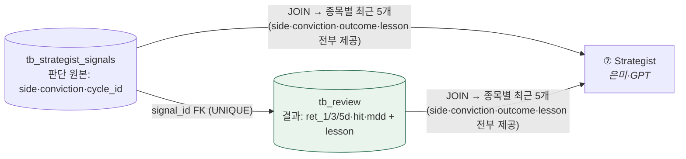

# ❓ 회의 안건 (질문)

!!! abstract "2026-07-06 · 1차 확정 후 남은 안건 (4회차 갱신)"
    위에서부터 결정하면 [결정 로그](facts/결정로그.md)로 번호를 받아 이동하고 여기서 지운다.
    🆕 이번 갱신: **B8 개정**(tb_review 단일 통일 — 은미 확인만) · **B11 신설**(리뷰어 채점·운영 세부 4건)

    ✅ **이미 확정(결정 #1~#8):** tb_ 접두사 · 투자유형 · 11단계 · macro_veto 폐지 · Alpaca · risk_score 0~100 · 타이밍 · 공통컬럼(created/updated_at)

## 🔴 최우선 — 팀 간 필드 계약 (schema keeper = 성혁 표준화)

| # | 안건 | 내용 | 당사자 |
|---|---|---|---|
| 🔴 B8 | **리뷰어 출력 = `tb_review` 단일 통일** (개정 2026-07-06) | 성혁 확정안: `tb_memory_entries`는 테이블명 미정 시절 임시 이름 → **폐기**. 은미가 쓰던 컬럼(side·conviction·outcome·lesson)은 `tb_review + tb_strategist_signals JOIN` 한 번으로 전부 제공(쿼리 초안 있음). 뷰도 불필요 — **은미 확인만 받으면 종결** | 성혁·은미 |
| B11 🆕 | **리뷰어 채점·운영 세부 확정** (성혁 제안 — 이의만 받기) | ① 기준가 P0: 매수=**체결가** / 보류=**판단일 종가** · ② 채점 확정 = **T+5** (창욱 백테스트 +1/3/5d와 동일 창) · ③ **1차 메모리 주입 허용** 여부 — MVP 정의 "observe-only(기록만)"와 은미 STEP4(주입)가 갈림, 성혁은 "참고 제공은 허용" 제안 · ④ NO_TRADE 회고 = **판단한 종목만**(50개 전부는 LLM 비용 과다) | 성혁·은미·지현 |
| B9 | **표 접미사 `_signals` 통일** | `tb_technical`·`tb_news`(지현) ↔ `tb_technical_signals`·`tb_news_signals`(은미). tb_ 접두사는 합의(#1), 접미사만 | 지현·은미 |
| B10 | **cycle_id ↔ trade_date 키 매핑** | 상류(tb_technical·daily_pick·disclosure·news)는 trade_date/collected_at 키인데 은미 07은 ticker+cycle_id로 SELECT → 변환 규칙 | 지현·은미 |
| B2 | **category → tb_universe JOIN** | 지현: Bundle에서 category/company_name 빼고 sector는 tb_universe JOIN | 지현·창욱 |
| B3 | **cross_source_confirmed 생성 책임** | 은미 필수(교차확인 +0.15) · 창욱 Bundle 없음. 원자료 있어 창욱이 신설 | 창욱·은미 |
| B4 | **기술 신호 값 형태** | trend="상승/혼조/하락" · macd=숫자 (지현 문서 채택) → 은미 파싱 정합 | 지현·은미 |
| B5 | **Critic payload / tb_critic_verdict** | agree·objection·confidence(지현 초안) ↔ 은미 payload(bull_case·key_risk·rebuttal…) | 미연·은미 |
| B6 | **PM sizing_hint 형식** | 은미 `{suggested_weight…}` ↔ 지현 포트폴리오 정책(25%·5종목·−15%) | 은미·지현 |

## 🅰️ 인프라 잔여

| # | 안건 | 내용 |
|---|---|---|
| A2 | **SQLite → Postgres 통합 시점** | Postgres 1개 방향 확정. 창욱 SQLite 코드 → 언제·어떻게 통합할지만 |
| A5 | **cycle_id 발급 규칙 + 배치 확정** (지현·오케스트레이터) | 1차는 **테이블 신설 없이** 규칙만 확정: ①발급 = 오케스트레이터가 07 실행마다 1개(타임스탬프 기반 BIGINT 제안 — 정렬·중복 방지) ②어느 테이블에 넣나 = 아래 배치표. 사이클 시각·묶음 추적은 tb_strategist_signals(NO_TRADE도 저장되므로 모든 사이클이 행을 남김)로 충분. ※ 원장(tb_cycle)·실행로그(tb_run)는 **2차 검토** — 죽은 사이클 기록·수집 실패 추적이 필요해지면 (제기: 성혁) |
| — | **LLM 모델명 확정** | 분석가=싼 모델(mini) · Strategist=상위. 정확한 모델명 |
| — | **ml_prob_up 1차 사용?** | 02 ml_probs는 1차 빈값 {} 인데 07 POLICY에 ml_prob_up≥0.50 있음 → 1차엔 스킵(trend만)? |

**A5 보조 — cycle_id 배치표 (성혁 제안):** 원칙 = *"cycle_id는 판단(07)에서 태어나고, 하류는 FK 체인으로 도달하고, 상류에는 아예 넣지 않는다."*

| 구간 | 테이블 | cycle_id | 이유 |
|---|---|---|---|
| 발원지 | **tb_strategist_signals** | ✅ **유일하게 컬럼으로 저장** | 오케스트레이터가 07 실행마다 발급 — 판단 묶음의 시작점이자 사실상의 원장(NO_TRADE도 저장되므로 모든 사이클이 여기 행을 남김) |
| 하류 (08~11) | tb_critic_verdict · tb_order · tb_fill · tb_review | ❌ 불필요 | `signal_id`(→order_id) FK 체인으로 JOIN 한 번에 도달 — 중복 저장은 어긋남 위험만 추가 |
| 상류 (01~06) | tb_universe · tb_daily_pick · tb_technical · tb_macro · tb_disclosure · tb_news | ❌ 넣지 않음 | 상류는 자기 주기(trade_date·collected_at·as_of)로 사는 데이터 — 07이 판단 시점의 **최신 행을 읽는** 구조라 사이클에 종속 안 됨. 재현성은 07이 `evidence` JSONB에 "읽은 행의 시각"을 기록하는 것으로 해결(은미 조율) |

> 이 배치가 확정되면 **B10(cycle_id↔trade_date 매핑)도 자동 해소** — 상류에 cycle_id를 넣지 않기로 하면 매핑 규칙 자체가 필요 없어지고, "07이 읽은 최신 행 + evidence 기록"이 답이 된다.

## 🅲 기존 안건 (멘토·구조) — 여전히 유효

| # | 안건 | 제기 |
|---|---|---|
| C1 | **MVP 성공 기준 정의** 🔴 | 멘토 |
| C3 | 화면·사용자 흐름 산출물 | 멘토 |
| C4 | 간트 구현단계 세분화 + PPT 전날 완성 | 멘토 |

> C2(Attempt1 push 구조)는 Pull(SELECT/JOIN) 확정으로 사실상 종료.

---

### 💡 schema keeper 제안 (성혁) — B8 한 그림 (개정판)

리뷰어 설계 초안 v2 제출됨(raw/성혁/2026-07-06). 테이블을 늘리지 않고 **JOIN 하나로** 은미 스펙을 전부 충족:

> `tb_memory_entries`(임시 이름) 폐기 — 별도 테이블·뷰 없이 위 JOIN이 은미 v2.2 소비 스펙과 1:1 대응. 채점 공식·계산 예시는 초안 §3 참조.
