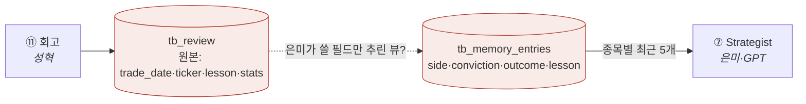

# ❓ 회의 안건 (질문)

!!! abstract "2026-07-06 · 1차 확정 후 남은 안건"
    위에서부터 결정하면 [결정 로그](facts/결정로그.md)로 번호를 받아 이동하고 여기서 지운다.

    ✅ **이미 확정(결정 #2~#7):** 투자유형 · 11단계 · macro_veto 폐지 · Alpaca · risk_score 0~100 · 타이밍

## 🔴 최우선 — 팀 간 필드 계약 (schema keeper = 성혁 표준화)

| # | 안건 | 내용 | 당사자 |
|---|---|---|---|
| 🔴 B8 | **리뷰어 출력 테이블 통일** | `tb_review`(지현 ERD: trade_date·ticker·lesson·stats) ↔ `tb_memory_entries`(은미 소비: side·conviction·outcome·lesson). **같은 표? 2단(원본→뷰)?** 성혁 제안: tb_review=원본 / tb_memory_entries=은미용 뷰 | 성혁·은미·지현 |
| B9 | **표 접미사 `_signals` 통일** | `tb_technical`·`tb_news`(지현) ↔ `tb_technical_signals`·`tb_news_signals`(은미). tb_ 접두사는 합의(#1), 접미사만 | 지현·은미 |
| B10 | **cycle_id ↔ trade_date 키 매핑** | 상류(tb_technical·daily_pick·disclosure·news)는 trade_date/collected_at 키인데 은미 07은 ticker+cycle_id로 SELECT → 변환 규칙 | 지현·은미 |
| B2 | **category → tb_universe JOIN** | 지현: Bundle에서 category/company_name 빼고 sector는 tb_universe JOIN | 지현·창욱 |
| B3 | **cross_source_confirmed 생성 책임** | 은미 필수(교차확인 +0.15) · 창욱 Bundle 없음. 원자료 있어 창욱이 신설 | 창욱·은미 |
| B4 | **기술 신호 값 형태** | trend="상승/혼조/하락" · macd=숫자 (지현 문서 채택) → 은미 파싱 정합 | 지현·은미 |
| B5 | **Critic payload / tb_critic_verdict** | agree·objection·confidence(지현 초안) ↔ 은미 payload(bull_case·key_risk·rebuttal…) | 미연·은미 |
| B6 | **PM sizing_hint 형식** | 은미 `{suggested_weight…}` ↔ 지현 포트폴리오 정책(25%·5종목·−15%) | 은미·지현 |

## 🅰️ 인프라 잔여

| # | 안건 | 내용 |
|---|---|---|
| A2 | **SQLite → Postgres 통합 시점** | Postgres 1개 방향 확정. 창욱 SQLite 코드 → 언제·어떻게 통합할지만 |
| — | **LLM 모델명 확정** | 분석가=싼 모델(mini) · Strategist=상위. 정확한 모델명 |
| — | **ml_prob_up 1차 사용?** | 02 ml_probs는 1차 빈값 {} 인데 07 POLICY에 ml_prob_up≥0.50 있음 → 1차엔 스킵(trend만)? |

## 🅲 기존 안건 (멘토·구조) — 여전히 유효

| # | 안건 | 제기 |
|---|---|---|
| C1 | **MVP 성공 기준 정의** 🔴 | 멘토 |
| C3 | 화면·사용자 흐름 산출물 | 멘토 |
| C4 | 간트 구현단계 세분화 + PPT 전날 완성 | 멘토 |

> C2(Attempt1 push 구조)는 Pull(SELECT/JOIN) 확정으로 사실상 종료.

---

### 💡 schema keeper 제안 (성혁)

리뷰어 파트는 미착수 — `tb_review`(파이프라인 기준)에서 설계를 시작한다. 회의 전에 **B8을 한 그림으로** 정리:

