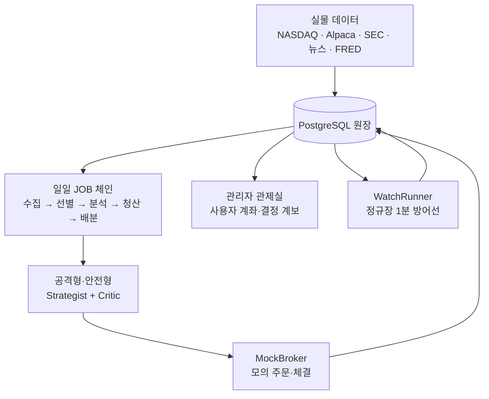

# 🧱 최종 시스템 구조

!!! success "현재 기준 · 2026-07-28"
    이 페이지는 Quantinue의 **최종 구현 시스템**을 설명한다. 1차의 11단계 설계와
    14개 테이블은 [1차 기준선](facts/MVP1차.md) 아래에 보존하고, 현재 구현·운영 판단은
    [최종 프로젝트 한눈에](facts/최종프로젝트.md)와 아래 로컬 최종 문서를 따른다.

## 전체 구조

원칙은 단순하다. **AI는 해석하고, 코드는 제한하고, 원장은 증거를 보존한다.**
손절·익절·멱등성·예산·권한은 LLM이 아니라 코드가 결정한다.

## 핵심 구조 문서

| 문서 | 답하는 질문 |
|---|---|
| [JOB·파이프라인](파이프라인.md) | 하루 동안 무엇이 어떤 순서로 실행되는가? |
| [데이터 모델·ERD](데이터모델.md) | 판단·주문·체결·회고가 어떤 키로 연결되는가? |
| [전체 데이터 사전](데이터사전.md) | 39개 테이블의 각 컬럼은 무엇을 뜻하고 누가 쓰고 읽는가? |
| [설정·정책 기준](설정정책.md) | 임계값·주기·한도를 어디서 왜 바꾸는가? |
| [AI 판단·안전장치](AI안전장치.md) | AI와 코드의 책임 경계는 어디인가? |
| [데이터·판단 계보](데이터계보.md) | 한 주문의 근거를 어떻게 역추적하는가? |
| [역할·협업 계약](역할협업계약.md) | 5명의 입력·출력·완료 조건은 무엇인가? |
| [개발 시작하기](개발시작하기.md) | 새 담당자가 앱을 띄우고 테스트와 첫 수정까지 어떻게 시작하는가? |
| [코드맵](코드맵.md) · [API·화면 계약](API계약.md) | 실제 코드 위치와 웹 인터페이스는 어디에 있는가? |

## 최종 구현 담당 영역

| 영역 | 담당 기능 |
|---|---|
| Core·Infra | JOB 러너·거래일·원장·선별·청산·배분·관제실 |
| Info | SEC 공시·뉴스·와이어 수집과 원문/집계 계보 |
| Strategist | 공격형·안전형 매수·보유·매도 판단 |
| Critic | 전략가 제안 반박·승인/기각·비용 제한 |
| Reviewer·기록·문서화·운영 | T+1~T+5 회고·결정 계보·최종 설계·발표 자료·장중 감시·인수인계 기록 |

## 구현 정본

| 알고 싶은 것 | 정본 |
|---|---|
| 현재 설계·JOB·전체 데이터 모델 | [최종 통합 설계서](final/quantinue-integrated-design.html) |
| 구현 과정·결함·코드 구조 | [엔지니어링 부록](final/quantinue-engineering.html) |
| 실제 하루의 원장 계보 | [하루의 해부](final/quantinue-day-anatomy.html) |
| 기동·관측·장애 대응 | [운영 가이드](운영가이드.md) · [검증 결과와 한계](운영검증.md) |
| JOB 등록·운영 스위치 | [JOB·파이프라인](파이프라인.md) · [pipeline.yaml 원문](final/reference/pipeline.yaml) |
| 테이블·컬럼·제약·계보 | [데이터 모델·ERD](데이터모델.md) · [전체 데이터 사전](데이터사전.md) · [schema.sql 원문](final/reference/schema.sql) |
