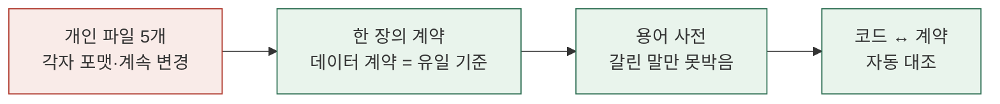
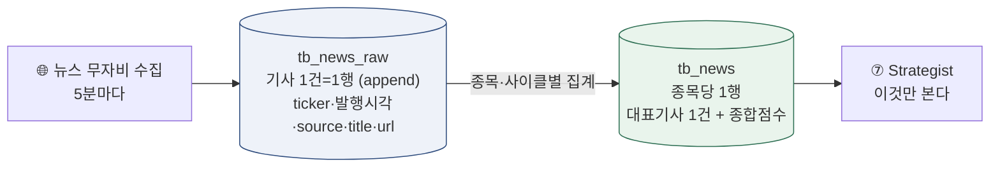

# 🤖 AI 추천 제안

!!! abstract "이 페이지는"
    위키 전체(확정 사실·회의록·안건)를 훑어 **AI가 "이렇게 하면 더 명확해진다"고 제안**하는 곳. 참고용이며 **결정은 팀**이 한다. 새 회의·확정이 쌓이면 갱신된다.

    최종 갱신: 2026-07-09 (6차 회의 반영)

---

## 🎯 지금 딱 하나만 한다면 — "대표기사"를 먼저 못박기

6차 회의가 여기서 멈췄다. **뉴스 대표기사 선정 기준**이 안 잡혀 07(전략)~08(검증)이 못 나간다. 이 하나가 릴레이 전체의 병목이다.

- 창욱이 **"대표기사 = 이 기준으로 이렇게 뽑은 1건"** 을 데이터 예시와 함께 한 장으로 고정 → 은미·미연이 그걸 보고 로직을 짠다.
- 정의가 서면 [용어 사전](facts/용어.md)의 🔴 대표기사 항목을 ✅로 옮긴다.

> 왜 이게 1순위인가: 회의에서 반복된 말이 **"컬럼이 흔들리면 모두가 흔들린다"**. 대표기사는 지금 가장 크게 흔들리는 컬럼이다.

---

## 🧩 난잡함을 없애는 3단 — "한 장의 계약"으로 수렴

지금은 **[5명 × 계속 바뀌는 파일 × 애매한 용어]** 라 구조적으로 명확해질 수 없다. 아래로 접으면 된다.

1. **[데이터 계약](facts/데이터계약.md)을 유일 기준으로** — 앞단이 바꾸면 여기부터 고치고, 뒷단은 여기만 보고 짠다. 회의에서 "제 파일요"가 아니라 **"계약 N번 컬럼"** 으로 말하기.
2. **[용어 사전](facts/용어.md)** — 대표기사·grade(봉투)·신선도처럼 **뜻이 갈린 말만** 짧게 고정. (이번에 신설)
3. **코드 ↔ 계약 자동 대조** — 각자 구현한 스키마가 계약과 어긋나면 회의 전에 표로. 사람이 대조하느라 회의를 태우는 걸 없앤다.

---

## 🔗 이음새 뚫는 순서 — 07~11 릴레이

01~06(데이터 수집)은 잡혔고, **07~11(에이전트가 DB로 주고받는 이음새)** 이 미확정이다. 뚫는 권장 순서:

| 순위 | 이음새 | 막힌 것 |
|---|---|---|
| 1 | 뉴스 → 07 | **대표기사 기준** + 게이트가 쓰는 필드([B3](질문.md)) |
| 2 | 07 → 08 | Critic이 실제로 읽는 컬럼·하드룰 임계값([B5](질문.md)) |
| 3 | → 11 | `decision_close`(보류 기준가) 신설([B13](질문.md)) · 메모리 통일([B8](질문.md)) |
| 4 | 전체 | `cycle_id` 생성 주체·키 매핑([A5·B10](질문.md)) |

> 1·2만 풀려도 "한 종목이 뉴스→전략→검증까지 실제로 흐르는" 데모가 가능해진다.

---

## 📰 뉴스 구성 방식 — AI 제안 (지금 막힌 곳 풀기)

6차 회의가 뉴스에서 멈췄다. 아래는 **AI가 제안하는 한 가지 정리안** — 확정 아니며, 회의에서 취사선택하는 재료다.

### ① 뉴스 테이블을 2층으로 (raw ↔ 집계)

회의의 "원본을 다 담나, 1행만 담나" 논쟁은 **둘 다 필요**해서 생긴 것 — 층을 나누면 해소된다.

- **원본 층 `tb_news_raw`** — 수집한 기사 전부(append-only). 창욱이 "스크래핑"이라 부른 것.
- **집계 층 `tb_news`** — 종목당 사이클당 **1행**(5차 결정과 일치). 원본에서 대표기사 1건 + 종합점수 산출. Strategist·Critic은 이 층만 소비.

### ② "대표기사"의 정의를 한 문장으로 못박기

지금 막힌 건 정의가 없어서다. 제안하는 정의:

> **대표기사 = 그 종목·그 사이클에서 매매 판단에 영향이 가장 큰 1건.** (신뢰도 하나가 아니라 **영향도 종합** 최상위)

선정 2단계: **필터**(종목 무관·찌라시 컷) → **랭크**(종합점수 최상위 1건). "신뢰만으로 뽑으면 별것 아닌 한국은행 발표가 대표가 된다"는 회의 지적이 정확히 이 랭크식으로 풀린다.

### ③ 점수 축 3개로 단순화 (source_trust ↔ grade 중복 해소)

| 축 | 뜻 | 범위 |
|---|---|---|
| `credibility` | **출처 신뢰 하나로 통합** — 기관 1.0 / 일반 0.6 / 찌라시 0 (코드·사전 기반) | 0~1 |
| `sentiment_score` | 호·악재 **강도 하나로** — 0=악재·0.5=중립·1=호재 (라벨 컬럼 제거) | 0~1 |
| `importance` | 사건 규모 (event_type + 내용) | 0~1 |

→ **종합점수 = `importance × credibility`** (찌라시면 importance를 죽인다). 회의의 `source_trust`(LLM·사후) ↔ `grade_score`(코드·사전) 중복 논쟁은, MVP에선 **`credibility` 하나**로 합치는 걸 추천(두 축 유지는 2차에서 근거 생기면).

### ④ 뉴스가 없을 때 (5분마다 전 종목이 안 옴)

- 뉴스 없으면 `has_signal=0`으로 **행은 생성**(null 아님) → 릴레이 안 끊김.
- 공시·뉴스 **둘 다 없으면** Strategist는 기술·시세로만 판단하되 **강신호 아니면 보류**(회의의 "굳이 5분마다 사고팔 필요 없다"와 일치).

> 이 구성의 이점: 창욱(1행 집계)·은미(깨끗한 점수로 게이트)·미연(대표기사 1건 검증) 요구가 **동시에** 충족된다. 상세 컬럼은 [데이터 계약](facts/데이터계약.md), 갈린 용어는 [용어 사전](facts/용어.md) 참조.

## 🎤 발표(7/29) 대비 — 이 위키 자체가 스토리

- **"이질적 개인 문서 5개 → 하나의 확정 사실로 수렴"** 이 프로젝트의 협업 서사 그대로다. [업데이트 로그](업데이트로그.md)·[결정 로그](facts/결정로그.md)가 이미 그 재료.
- 발표 1주 전(7/22쯤) 결정 흐름을 타임라인 한 장으로 뽑으면 "팀이 어떻게 합의를 관리했나"가 데모가 된다.
- 제출물 완성도는 [산출물 현황](산출물.md)에서 🔴부터.

---

## ⚙️ 협업 프로세스 팁

- **회의 = 안건 위에서부터**. 결정 안 나면 "보류"도 정상 — 억지 확정 금지.
- 각자 문서 맨 위에 **`[업데이트] 날짜 / 바꾼 것 / 결정 필요`** 한 줄만 있으면 대조가 몇 배 빨라진다.
- 개인 문서와 위키가 다르면 **위키(확정 사실)가 이긴다** — 이게 지켜져야 "한 장의 계약"이 작동한다.
