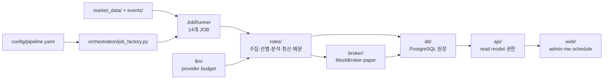

# 🗺️ 코드맵

!!! info "코드를 찾는 규칙"
    아래 경로는 최종 애플리케이션 저장소 `/Users/sunghyuk/Documents/ClaudeCode/quantinue-v2/app-v2`
    기준이다. `src/quantinue` 안에서 **계약(core) → 저장(db) → 오케스트레이션(orchestration)
    → 역할(roles) → 화면(api/web)** 순서로 따라가면 된다.

## 상위 구조

| 경로 | 책임 | 첫 진입 파일 |
|---|---|---|
| `src/quantinue/main.py` | FastAPI 조립, lifespan, 라우트 연결, worker 부착 | `create_app`, `main.py` |
| `src/quantinue/core/` | 설정, 공통 스키마, 거래일, ontology, 보안 경계 | `config.py`, `schemas.py`, `ontology.py` |
| `src/quantinue/db/` | memory/PostgreSQL 저장소, lifecycle, 조회, 사용자·주문 원장 | `store.py`, `domain.py`, `postgres_*.py` |
| `src/quantinue/orchestration/` | JOB 생성, 순서, retry, cadence, watch 배선 | `job_factory.py`, `job_runner.py`, `policy.py` |
| `src/quantinue/roles/` | 01~11 도메인 역할과 최종 analysis/exits/allocation | 각 역할의 `contracts.py`, `service.py`, `job.py` |
| `src/quantinue/market_data/` | fixture/public/Alpaca/SEC/FRED/news 공급자 | `factory.py`, adapter 파일 |
| `src/quantinue/llm/` | mock/local/OpenAI 호환 provider, prompt, budget ledger | `provider_factory.py`, `budget.py` |
| `src/quantinue/broker/` | MockBroker, Alpaca paper, 주문 reservation·bracket | `provider.py`, `mock.py`, `alpaca.py` |
| `src/quantinue/events/` | SEC/news 사건 수집·정규화·증거·재판단·영수증 | `ingestion.py`, `routing.py`, `analysis.py`, `execution.py` |
| `src/quantinue/api/` | 인증, 관제실, 계좌, pipeline read model, 리뷰 endpoint | `schemas.py`, 라우터 파일 |
| `src/quantinue/web/` | Jinja 템플릿·CSS·화면 표시 | `templates/`, `static/` |
| `config/` | pipeline·뉴스 신뢰 정책 정본 | `pipeline.yaml` |
| `db/` | PostgreSQL DDL 정본 | `schema.sql` |
| `tests/unit/` | 외부 의존성 없는 계약·정책 테스트 | 관련 기능명 `test_*.py` |
| `tests/integration/` | disposable PostgreSQL 원장·동시성 테스트 | `QUANTINUE_TEST_DATABASE_URL` 필요 |
| `tests/real_key/` | 실제 provider opt-in 테스트 | 기본 실행 제외 |
| `scripts/` | 운영 기동·Compose 계약·secret scan | `run_observation.sh` |

## 최종 일일 경로

## 주요 수정 위치

| 바꾸려는 것 | 수정 시작점 | 같이 확인할 테스트·문서 |
|---|---|---|
| JOB 순서·등록·주기 | `orchestration/job_factory.py`, `job_runner.py`, `policy.py` | `test_job_factory.py`, `test_job_runner.py`, [JOB·파이프라인](파이프라인.md) |
| 유니버스·가격 수집 | `market_data/`, `roles/role_01_*`, `roles/role_02_*` | adapter unit + `test_domain_lifecycle_postgres.py` |
| 공시·뉴스·사건 | `market_data/sec_*`, `wire_news.py`, `events/`, `roles/disclosure/` | `test_event_*`, raw ledger integration tests |
| Strategist 판단 | `roles/analysis/`, `llm/prompts.py` | `test_analysis_job.py`, `test_strategist_gates.py` |
| Critic 평결 | `roles/analysis/`, `core/` 게이트 | `test_critic_*`, [AI 안전장치](AI안전장치.md) |
| 손절·익절·시간청산 | `roles/exits/`, `broker/bracket_trigger.py` | `test_exit_*`, `test_bracket_trigger.py` |
| 배분·주문 상한 | `roles/allocation/`, `db/order_reservations.py` | `test_allocation_*`, `test_daily_order_cap.py` |
| 주문 중복·불확실 응답 | `broker/reservations.py`, `db/order_submissions` 경로 | `test_close_plan_submission.py`, integration ledger tests |
| T+1~T+5 회고 | `roles/role_11_reviewer/`, `api/reviews.py` | `test_review_processor.py`, `test_role_11_reviewer.py` |
| 관리자·사용자 화면 | `api/`, `web/templates/`, `main.py` | `test_pipeline_dashboard.py`, `test_my_account.py`, `test_web_auth.py` |
| 데이터 컬럼·제약 | `db/schema.sql`, `db/domain_records.py` | `test_schema_sql.py`, [데이터 사전](데이터사전.md) |
| 모델·예산 | `llm/provider_factory.py`, `llm/budget.py`, `config/pipeline.yaml` | `test_llm_*`, [설정·정책](설정정책.md) |

## 역할 디렉터리와 최종 JOB의 관계

최종 14개 JOB의 이름은 [JOB·파이프라인](파이프라인.md)에 있고, 코드 조립은
`orchestration/job_factory.py`가 소유한다. 역할 계약은 `roles/role_01_*`부터
`role_11_*`에 남아 있지만, 최종 일일 러너의 `screening`, `insider_scoring`,
`analysis:aggressive`, `analysis:conservative`, `exits`, `allocation`은 해당
기능 모듈이 묶여 실행된다. 역할 번호와 runtime JOB 이름을 혼동하지 않는다.

## 변경 시 지켜야 할 경계

- `core/`의 공통 타입을 바꿀 때는 memory와 PostgreSQL 구현을 모두 확인한다.
- `db/schema.sql`을 바꿀 때는 데이터 사전 생성기를 다시 실행하고 migration/초기화 영향을 기록한다.
- `orchestration/`에서 순서를 바꿀 때는 입력 원장과 다음 JOB의 FK·NULL 조건을 확인한다.
- `api/`는 조회 경로와 쓰기 경로를 분리한다. 사용자 구역은 읽기 전용이고 관리자 쓰기만
  `/admin` 아래에 둔다.
- LLM prompt 변경은 판단 결과의 재현성을 깨므로 prompt version과 관련 테스트를 같이 바꾼다.
- 브로커 adapter 변경은 기본 `mock` 경로가 변하지 않는지 먼저 확인한다.

