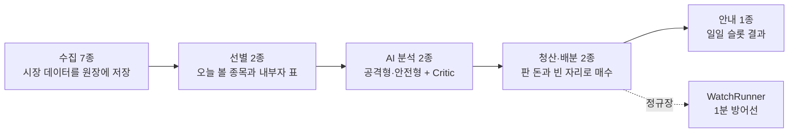

# ⚙️ JOB·파이프라인

!!! info "최종 구현 기준"
    Quantinue의 기본 실행 단위는 MVP 1차의 종목별 11단계 러너가 아니라 **뉴욕 거래일
    슬롯에 등록된 JOB 14종**이다. JOB은 서로 직접 호출하지 않고 PostgreSQL 원장을
    통해 다음 JOB에 결과를 전달한다.

## 전체 실행 흐름

등록 순서가 곧 데이터 의존성이다. 수집이 판단보다 앞서고, 오늘의 매도 판단을 반영한
청산이 신규 배분보다 먼저 실행된다.

## 등록 JOB 14종

| 단계 | 순서 | JOB | 입력 → 출력 | LLM |
|---|---:|---|---|:---:|
| 수집 | 1 | `universe` | NASDAQ 목록·보유 → `tb_universe` | — |
| 수집 | 2 | `daily_bars` | Alpaca 일봉 → `tb_daily_bar` | — |
| 수집 | 3 | `benchmark_spy` | SPY 일봉 → `tb_benchmark_price` | — |
| 수집 | 4 | `disclosures` | SEC 전 시장 공시 → `tb_disclosure_raw` | — |
| 수집 | 5 | `news` | Alpaca 뉴스 → `tb_news_raw` | — |
| 수집 | 6 | `news_wire` | GNW·PRN RSS → `tb_news_raw` | — |
| 수집 | 7 | `macro` | FRED 금리 → `tb_macro` 국면 | — |
| 선별 | 8 | `screening` | 일봉 전체 → 상위 20 + 보유 `tb_daily_pick` | — |
| 선별 | 9 | `insider_scoring` | Form 4 → 내부자 재량거래 표 | — |
| 분석 | 10 | `analysis:aggressive` | 픽·증거 → 공격형 판단 + Critic 평결 | 사용 |
| 분석 | 11 | `analysis:conservative` | 픽·증거 → 안전형 판단 + Critic 평결 | 사용 |
| 집행 | 12 | `exits` | 보유·방어선·매도 판단 → 모의 청산 | 규칙 우선 |
| 집행 | 13 | `allocation` | 승인 후보·계좌 한도 → 주문·체결·보류 사유 | — |
| 안내 | 14 | `daily_summary` | `tb_job_run`·체결 → Telegram 요약 | — |

`daily_summary`는 Telegram 설정이 있는 운영 인스턴스에서만 등록된다. 공급자 자격증명이
없는 개발 환경에서는 일부 수집 JOB도 등록되지 않을 수 있다.

## 중복 실행과 실패 처리

- 스케줄러는 60초마다 깨어나지만, `tb_job_run`의 PK `(job_name, slot_date)`를 예약한
  JOB만 본문을 실행한다.
- `universe`는 마지막 성공 후 7일, 나머지는 기본 1일 주기다.
- 실패한 JOB은 같은 슬롯에서 재시도되고 `attempts`, 상태, 소요 시간과 실패 원인이 남는다.
- JOB 하나의 실패가 이미 저장된 다른 JOB의 원장을 지우지 않는다.

## 일일 체인과 장중 감시의 차이

| 경로 | 무엇을 하는가 | 현재 상태 | 꺼져 있다면 왜인가 |
|---|---|---|---|
| 일일 JOB 체인 | 수집→선별→AI 판단→청산→배분 | 운영 관측 | — |
| 1분 방어선 | 이미 정한 손절·익절선 초과 여부 확인·모의 청산 | `watch=true` | — |
| 사건 수집 | SEC 30분·뉴스 15분·와이어 10분 증분 수집·정규화 | 구현 완료·실측 부족 | 운영 원장 사건 0건 |
| 사건 재판단 | 사건 또는 ±5% 급변 종목만 Strategist·Critic 재호출 | `rejudge=false` | 유료 호출·중복 주문·다음 거래일 영향의 Gate B 검증 전 |
| 웹소켓 시세 | 최대 30종목 실시간 구독으로 방어선 반응 단축 | `stream=false` | 1분 폴링이 이미 동작하며 재연결·재구독·fallback 검증 전 |

사건 재판단과 웹소켓은 일일 파이프라인 완주에 필요한 기능이 아니다. 전자는 **추가 판단**,
후자는 **반응 속도 개선**이며, 현재 핵심 운용은 둘을 켜지 않아도 작동한다.

## 코드 정본

| 책임 | 위치 |
|---|---|
| 전체 JOB 배선·구현 설명 | [엔지니어링 부록](final/quantinue-engineering.html) |
| 스케줄·주기·운영 스위치 | [pipeline.yaml 원문](final/reference/pipeline.yaml) |
| 실행·멱등 원장 | [통합 설계서](final/quantinue-integrated-design.html) · `tb_job_run` |
| 장중 감시·활성화 조건 | [운영 가이드](운영가이드.md) |
