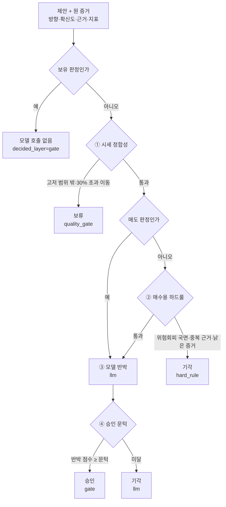

# ⚖️ Critic — 검증 4계층

!!! info "역할"
    전략가의 제안을 **같은 증거와 대조해** 승인·기각한다. 모든 제안이 모델을 거치지는
    않는다. 데이터 품질과 하드룰이 먼저 판정하고, 남은 것만 유료 호출로 반박한다.
    실측에서 Critic 검토 323건 중 271건(83.9%)이 결정론 경로에서 끝났다.

## 판정이 결정되는 순서

## 4계층이 판정하는 것

| 계층 | `decided_layer` | 판정 대상 | 결과 |
|---|---|---|---|
| ① 데이터 품질 | `quality_gate` | 현재가가 당일 고저 범위 밖, 전일 종가 대비 30% 초과 이동, 사건 시각 없음 | 보류 |
| ② 하드룰 | `hard_rule` | 위험회피 국면, 뉴스와 공시가 같은 원사건, 증거가 3일 초과로 낡음 | 기각 |
| ③ 모델 반박 | `llm` | 주장이 지표와 어긋나는가, 입력에 없는 사실을 지어냈는가 | 기각 |
| ④ 승인 게이트 | `gate` | 반박 점수가 승인 문턱 이상인가 | 승인 |

## 매수와 매도는 다른 게이트를 통과한다

②의 게이트는 전부 "살 만한 근거인가"를 묻는다. 매도에는 반대로 작동하므로 적용하지
않는다 — 위험회피 국면은 파는 것을 막을 이유가 아니라 파는 이유이고, 뉴스·공시가 없다고
이미 든 포지션을 못 팔면 근거가 조용한 종목만 영원히 남는다.

건너뛴 규칙은 `skipped_rules`에 기록된다. 남기지 않으면 화면이 "전부 검증했다"로 읽힌다.

| 판정 | 시세 정합성 | 위험회피 국면 | 중복 근거 | 증거 신선도 |
|---|:---:|:---:|:---:|:---:|
| 매수 | 적용 | 적용 | 적용 | 적용 |
| 매도 | 적용 | 건너뜀 | 건너뜀 | 건너뜀 |

시세 정합성만 매도에도 적용된다. 값을 매길 수 없으면 팔 수도 없기 때문이다.

## 성향이 게이트를 바꾸는 지점

위험회피 국면 하드룰은 성향의 `risk_off_action`을 따른다.

| 성향 | 동작 | 이유 |
|---|---|---|
| 안전형 `no_new_buys` | 신규 매수를 기각 | 국면이 나쁘면 자리를 비운다 |
| 공격형 `penalty` | 막지 않음 | 국면 악재는 이미 확신도 감점에 반영됐다. 여기서 또 막으면 같은 악재로 두 번 벌하는 셈이고, 그 감점을 감수하고 사겠다는 것이 이 성향의 정의다 |

## 승인 문턱과 과신 규칙

| 항목 | 값 | 적용 |
|---|---:|---|
| 기본 승인 문턱 | `0.70` | 반박 점수가 이 값 이상이면 승인 |
| 과신 확신도 | `0.90` | 제안 확신도가 이 값 이상이면 |
| 과신 승인 문턱 | `0.80` | 승인 문턱을 이 값으로 올린다 |

확신할수록 더 센 반박을 통과해야 한다.

## 승인에는 증명이 필요하다

계약이 `pass` 평결을 **코드 게이트의 저확신 결과일 때만** 유효하도록 강제한다.
승인은 확신의 기록이 아니라 통과의 기록이므로, 승인 시 `confidence`는 0으로 남는다.
`decided_layer`가 `gate`가 아니거나 확신도가 0.70 이상인 승인은 계약 위반으로 거부된다.

## 반박에 쓰지 않는 사유

이 시스템의 원장에는 일봉·SEC 폼 종류·뉴스 헤드라인만 있고 재무제표가 없다.
프롬프트는 다음을 **기각 사유로 삼지 말라**고 명시한다.

- "재무 근거가 없다", "밸류에이션을 모른다" — 의도적으로 갖지 않기로 한 범위다.
- 공시·뉴스가 없는 날 — 침묵은 악재가 아니다.
- 전략가가 이유에 리스크를 적은 것 — 계약상 쓰게 되어 있는 항목이라, 이를 모순으로
  읽으면 정직하게 리스크를 적은 판단만 골라서 기각된다.

진짜 모순은 이유가 **다른 행동을 명시적으로 권할 때**다.

## 비용을 아끼는 지점

보유 판정은 아무것도 집행하지 않으므로 모델을 부르지 않고 `no_action_proposal`로
기록만 남긴다. 호출 예산은 실제로 돈이 움직이는 판단에만 쓴다.

## 원장에 남는 것

`tb_critic_verdict` 한 행이 판단 하나에 붙는다(`signal_id` UNIQUE).

| 남기는 것 | 컬럼 |
|---|---|
| 판정 | `decision`, `category`, `confidence` |
| 어느 계층이 정했는가 | `decided_layer` |
| 반박 내용 | `objection` |
| 적용하지 않은 규칙 | `skipped_rules` |

## 다음에 볼 것

- 검증을 통과한 후보가 실제 주문이 되는 [⚙️ 집행·수집·예산](infra.md)
- 코드와 AI의 책임 경계는 [AI 판단과 안전장치](../AI안전장치.md)
