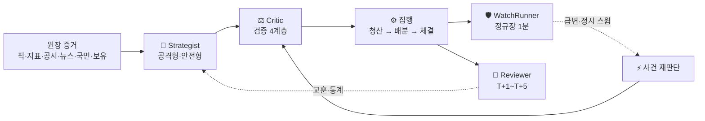

# 🧩 핵심 기능 (최종 구현)

!!! success "이 섹션이 다루는 것"
    최종 프로젝트에서 **실제로 판단하고 집행하는 구성요소**를 하나씩 설명한다.
    각 페이지는 애플리케이션 코드를 기준으로 입력·출력·게이트·원장 기록을 적는다.
    1차 01→11 역할 설명은 [구성요소 참고 (1차 역할)](../에이전트/index.md)에 따로 보존한다.

## 판단이 흐르는 순서

## 구성요소별 책임

| 구성요소 | 하는 일 | LLM | 현재 상태 |
|---|---|:---:|---|
| [🧠 Strategist](strategist.md) | 성향별로 매수·보유·매도 확신도를 낸다 | 사용 | 🟢 운영 중 |
| [⚖️ Critic](critic.md) | 제안을 증거와 대조해 승인·기각한다 | 조건부 | 🟢 운영 중 |
| [🛡️ WatchRunner](watch.md) | 정규장 1분마다 손절·익절선을 확인한다 | 0콜 | 🟢 운영 중 |
| [⚡ 사건 재판단](rejudge.md) | 급변·사건 종목만 장중에 다시 묻는다 | 사용 | 🟡 `rejudge=false` |
| [📓 Reviewer](reviewer.md) | T+1~T+5 종가로 판단을 채점한다 | 사용 | 🟢 운영 중 |
| [⚙️ 집행·수집·예산](infra.md) | 수집·선별·청산·배분·예산·알림을 코드로 강제한다 | 0콜 | 🟢 운영 중 |

## 이 구조가 지키는 원칙

- **방향은 코드가 정한다.** 모델은 0~1 확신도만 내고, 매수·보유·매도 판정은 성향별 문턱과
  비교해 코드가 결정한다. 모델은 자기가 넘어야 할 문턱값을 프롬프트에서 보지 못한다.
- **승인은 증명이 필요하다.** `pass` 평결은 코드 게이트를 통과한 결과일 때만 유효하도록
  계약이 강제한다.
- **비용이 드는 호출에는 예약이 선다.** 유료 모델 호출은 예산 원장에 먼저 자리를 잡고,
  중복 발동은 소유권 임대와 쿨다운으로 막는다.
- **못 잰 것과 나쁜 것을 구분한다.** 측정 실패는 `indicators=none`으로, 증거 없음은 NULL로
  남기고 0으로 채우지 않는다.

정본은 [통합 설계서](../final/quantinue-integrated-design.html)와
[엔지니어링 부록](../final/quantinue-engineering.html), 설정값은
[pipeline.yaml](../final/reference/pipeline.yaml)이다.
