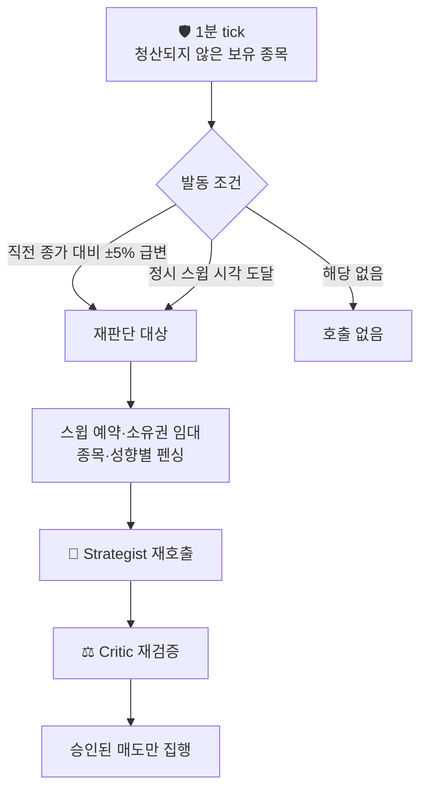
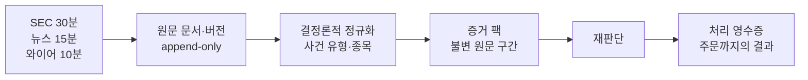

# ⚡ 사건 재판단

!!! warning "현재 상태 · `rejudge=false`"
    구현과 강제 발동 테스트는 끝났지만 운영에서는 꺼 두었다. 유료 호출·중복 주문·
    다음 거래일 영향의 검증이 남아 있기 때문이다. 이 기능은 **추가 판단**이지
    일일 파이프라인 완주에 필요한 기능이 아니다 — 꺼져 있어도 핵심 방어선은 작동한다.

## 무엇을 다시 묻는가

## 발동 조건과 제한

| 항목 | 값 | 역할 |
|---|---|---|
| `move_trigger_pct` | `0.05` | 직전 종가 대비 ±5% 이상 움직인 종목만 |
| `sweep_times_ny` | `10:00` · `12:45` · `15:15` | 급변이 없어도 이 시각엔 전 보유 종목을 훑는다 |
| `cooldown_minutes` | `30` | 같은 종목·성향을 이 시간 안에 다시 부르지 않는다 |
| `sell_budget_reserve_ratio` | `0.20` | 일일 예산의 이 비율은 위급 매도용으로 남긴다 |

## 중복 호출을 막는 장치

유료 호출이라 "한 번 더 불렀다"가 곧 비용이자 중복 주문 위험이다. 세 겹으로 막는다.

| 장치 | 원장 | 막는 것 |
|---|---|---|
| 스윕 예약 | `tb_watch_sweep` | 같은 시각의 스윕이 두 번 도는 것 |
| 항목 펜싱 | `tb_watch_sweep_item` | 같은 종목·성향에 두 번 과금되는 것 |
| 쿨다운 | `tb_rejudgement_cooldown` | 30분 안에 같은 대상을 다시 부르는 것 |

소유권 임대는 heartbeat로 갱신되며, 임대를 잃으면 진행 중이던 재판단이 중단된다.
프로세스가 죽어도 다른 러너가 같은 작업을 이어받아 이중 집행하지 않는다.

## 사건 원문이 판단까지 오는 길

가격 급변과 별개로, SEC·뉴스·와이어의 사건 문서를 증분 수집해 판단 근거로 만드는
경로가 함께 구현돼 있다.

| 단계 | 테이블 | 보장하는 것 |
|---|---|---|
| 수집 커서 | `tb_event_source_cursor` | 소스별로 어디까지 읽었는지 |
| 원문 보존 | `tb_event_raw_document` · `tb_event_raw_version` | 나중에 근거 원문이 바뀌거나 덮어써지지 않음 |
| 정규화 | `tb_normalized_event` | 결정론 규칙으로 만든 사건(모델 아님) |
| 증거 | `tb_event_evidence_pack` · `tb_event_summary_cache` | 판단이 실제로 읽은 원문 구간 |
| 처리 결과 | `tb_event_processing_receipt` | 사건이 재판단·주문으로 이어졌는지 |

원문 보존과 처리 영수증을 분리한 이유는 "구조가 있다"와 "실제 사례가 쌓였다"를
구분하기 위해서다. 현재 운영 원장의 사건은 0건이다.

## 켜기 전에 확인할 것

활성화는 [운영 가이드](../운영가이드.md)의 Gate B 절차를 따른다. 확인 대상은
비용 증가폭, 중복 주문 여부, 재판단이 다음 거래일 판단에 미치는 영향이다.

## 다음에 볼 것

- 이 경로를 태우는 [🛡️ WatchRunner](watch.md)
- 현재 운영 경계는 [운영 검증과 한계](../운영검증.md)
