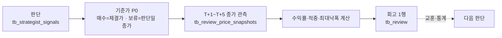

# 📓 Reviewer — T+1~T+5 회고

!!! info "역할"
    판단이 끝난 뒤 **5거래일 동안의 종가를 관측해 채점한다.** 판단 당시의 근거와
    이후의 결과를 분리해 평가하며, 결과가 좋았다고 근거를 소급해 고치지 않는다.
    이 기록이 다음 판단에 들어가는 교훈이 된다.

## 채점 경로



## 계산 규칙

| 지표 | 정의 |
|---|---|
| `ret_1d` · `ret_3d` · `ret_5d` | 기준가 대비 T+1·T+3·T+5 종가의 변화율(%) |
| `hit` | 매수 판단은 T+5 수익률 > 0, 보류 판단은 ≤ 0일 때 적중 |
| `mdd` | T+1~T+5 중 기준가 대비 가장 나쁜 변화율(0 이하) |

보류 판단의 적중 기준이 반대인 것은 **안 산 것이 옳았는지**를 묻기 때문이다.
사지 않은 종목이 떨어졌으면 그 보류는 맞은 판단이다.

## 계약이 강제하는 것

| 규칙 | 막는 것 |
|---|---|
| T+1~T+5 다섯 개가 정확히 하나씩 | 빠진 날이나 중복 관측으로 만든 수익률 |
| 매수 회고는 체결가 필수 | 체결되지 않은 계획을 보유로 세는 것 |
| 보류 회고는 체결가 금지·판단일 종가 필수 | 두 기준가가 섞이는 것 |
| 관측 시각이 판단 시각보다 앞설 수 없음 | 미래 데이터로 과거를 채점하는 것 |
| 스냅샷의 실행 식별자가 판단과 일치 | 다른 실행의 가격을 근거로 쓰는 것 |

## 멱등 처리

회고는 하루에 한 칸씩 채워지는 증분 작업이다. 같은 판단을 다시 호출해도 이미 기록된
관측일은 다시 만들지 않는다.

```http
POST /api/reviews/{signal_id}/process
X-Quantinue-Control-Token: <configured token>
```

응답의 `captured_offsets`가 이번 호출에서 실제로 채운 날을 알려준다. 다섯 칸이 모두
차면 회고 한 행이 확정된다. 거래일 계산은 뉴욕 거래소 달력을 따르므로 휴장일은 건너뛴다.

## 탈락 종목도 추적하는 이유

가격 관측 테이블은 **판단한 모든 종목**을 대상으로 한다. 매수하지 않은 종목의 종가를
따라가지 않으면 "안 사길 잘했는가"를 영원히 물을 수 없기 때문이다.

## 원장에 남는 것

| 테이블 | 남기는 것 |
|---|---|
| `tb_review_price_snapshots` | 판단별 T+1~T+5 종가와 관측 시각 |
| `tb_review` | 수익률·적중·최대낙폭과 교훈(`lesson`) |

`tb_review`는 판단 하나에 하나(`signal_id` FK UNIQUE)이며, 판단 데이터는 복사하지 않고
JOIN으로 가져온다.

## 다음에 볼 것

- 판단 원본을 만드는 [🧠 Strategist](strategist.md)
- 계보 전체는 [데이터와 판단의 계보](../데이터계보.md)
