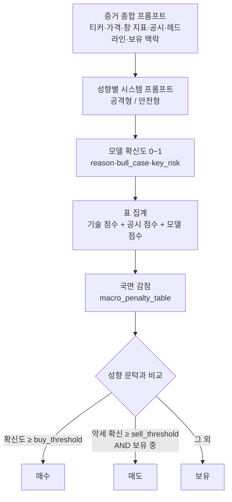

# 🧠 Strategist — 공격형·안전형

!!! info "역할"
    오늘의 픽 하나하나에 대해 **0~1 확신도와 근거 서사**를 만든다. 매수·보유·매도라는
    방향은 이 구성요소가 정하지 않는다 — 확신도를 성향별 문턱과 비교해 코드가 정한다.
    두 성향은 시스템 프롬프트와 파라미터가 각각 분리돼 있어 같은 종목에 다른 값을 낸다.

## 한 종목이 판단되는 경로

## 두 성향의 파라미터

| 항목 | 공격형 `aggressive` | 안전형 `conservative` | 의미 |
|---|---:|---:|---|
| 매수 문턱 | `0.65` | `0.75` | 확신도가 이 값을 넘어야 매수 |
| 매도 문턱 | `0.60` | `0.50` | 약세 확신이 이 값을 넘으면 매도 |
| 위험회피 국면 | `penalty` | `no_new_buys` | 감점만 할지, 신규 매수를 막을지 |
| 최대 보유 종목 | 10 | 5 | 동시 보유 상한 |
| 종목당 최대 비중 | 20% | 10% | 한 종목에 넣을 수 있는 최대 |
| 일일 손실 한도 | 4% | 2% | 당일 시작 평가액 대비 |
| 최소 현금 비율 | 10% | 30% | 항상 남겨두는 현금 |

매도 문턱이 매수보다 낮은 것은 의도다. 좋은 종목을 안 사면 기회를 놓칠 뿐이지만,
나쁜 종목을 안 팔면 손실이 계속 자란다.

## 성향별 방법론

| | 공격형 | 안전형 |
|---|---|---|
| 계열 | 추세 추종·돌파 | 리스크 우선·규율 |
| 묻는 질문 | 지금 추세가 확인됐는가 | 지금 가격에 무엇이 이미 반영돼 있는가 |
| 핵심 지표 | 상대강도·52주 고점 근접·거래량 확인·이평 정렬 | 같은 지표 + 매크로 국면 |
| 감수하는 것 | 완성되지 않은 신호를 먼저 잡는다 | 애매하면 덜 산다(안 사는 것이 아니라) |
| 양보하지 않는 것 | 확신도는 증거의 두께를 넘지 못한다 | 매도에는 같은 신중함을 적용하지 않는다 |

두 프롬프트 모두 **재무제표가 없다는 사실을 명시**한다. 실적·성장률·밸류에이션을
지어내지 말고 모른다고 적으라고 지시하며, 근거는 입력에 있는 값을 인용하도록 요구한다.

## 확신도가 만들어지는 방식

확신도는 살아남은 표의 평균에서 국면 감점을 뺀 값이다.

| 표 | 조건 | 비고 |
|---|---|---|
| 기술 점수 | 항상 참여 | 스크리닝 랭킹 점수 |
| 공시 점수 | 그 슬롯에 채점 행이 있을 때만 | 침묵은 악재가 아니므로 기권 |
| 뉴스 점수 | 출처 신뢰도가 `source_trust_min` 0.55 이상일 때만 | 현재 뉴스 소스는 문턱 미달이라 **투표하지 않는다** |
| 모델 점수 | 항상 참여 | 증거 종합 결과 |

뉴스는 투표권 없이 헤드라인으로 증거 종합에 들어가 모델 점수를 통해 영향을 준다.
문턱을 데이터 소스에 맞춰 내리는 것은 정책 오염이므로 하지 않는다.

국면 감점은 `risk_score` 구간별로 최대 0.40까지 확신도에서 뺀다.

| `risk_score` | 감점 |
|---:|---:|
| ≤ 0.50 | 0.05 |
| ≤ 0.60 | 0.10 |
| ≤ 0.70 | 0.15 |
| ≤ 0.80 | 0.20 |
| ≤ 0.90 | 0.30 |
| ≤ 1.00 | 0.40 |

## 약세 확신은 확신도의 여집합이 아니다

매도 판정에 쓰는 약세 확신은 `1 − 확신도`가 아니라 **모델 점수만으로** 다시 계산하고
국면 감점의 부호를 뒤집어 더한다. 확신도에는 스크리닝 랭킹이 섞여 있는데 픽은 정의상
그 점수 상위라 보유 종목의 랭킹이 거의 항상 높고, 그대로 두면 매도가 산술적으로
발동하지 않기 때문이다.

매도의 유일한 하드 게이트는 **실제로 보유 중인가**다. 상장폐지·거래정지로 인한 매도는
여기가 아니라 [청산 잡](infra.md)이 판정한다.

## 원장에 남는 것

`tb_strategist_signals` 한 행에 판단과 재현 정보가 함께 남는다.

| 남기는 것 | 컬럼 |
|---|---|
| 판정과 확신도 | `side`, `conviction`, `signal_consensus` |
| 근거 서사 | `summary`, `bull_case`, `key_risk` |
| 재현 메타데이터 | `model_provider`, `model_name`, `prompt_version`, `input_hash` |
| 증거 계보 | `src_macro_at`, `src_disclosure_at`, `evidence` |
| 회고 기준가 | `decision_close` |

성향은 `inv_type`으로 구분되고, `(ticker, cycle_ts, inv_type)` UNIQUE 제약이
같은 종목·시점·성향의 판단을 하나로 강제한다.

## 다음에 볼 것

- 이 판단을 검증하는 [⚖️ Critic](critic.md)
- 컬럼 전체는 [데이터 사전](../데이터사전.md)
- 문턱·감점표 원문은 [pipeline.yaml](../final/reference/pipeline.yaml)
