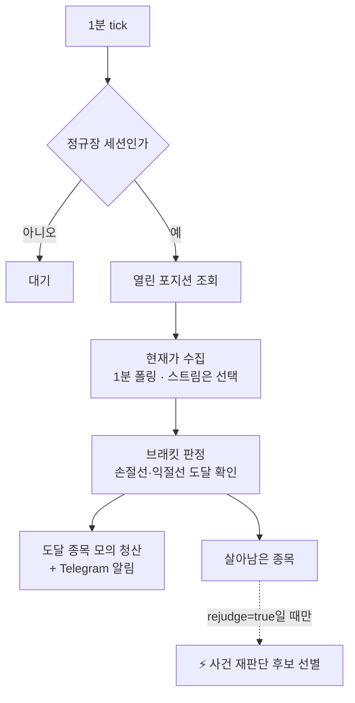

# 🛡️ WatchRunner — 1분 방어선

!!! success "현재 상태 · `watch=true` 운영 중"
    정규장 동안 1분마다 보유 종목의 가격을 확인하고, 매수 시점에 저장한 손절·익절선에
    닿으면 모의 청산한다. **이 경로는 LLM을 한 번도 부르지 않는다.** 손절은 모델의
    판단이 아니라 진입할 때 이미 정해 둔 규칙이기 때문이다.

## 한 tick이 하는 일

청산된 종목은 재판단 후보에서 빠진다. 이미 손을 떠난 포지션을 다시 묻지 않는다.

## 설정값

| 항목 | 값 | 의미 |
|---|---|---|
| `watch.enabled` | `true` | 방어선 가동 |
| `watch.interval_minutes` | `1` | tick 주기 |
| `watch.session` | `regular` | 정규장에만 동작 |
| `watch.stream.enabled` | `false` | 웹소켓 구독 대신 1분 폴링 사용 |
| `watch.stream.symbol_limit` | `30` | 스트림 사용 시 동시 구독 상한 |

## 포지션이 청산되는 세 가지 경로

방어선이 보는 것은 ①번뿐이고, 나머지 둘은 일일 [청산 잡](infra.md)이 판정한다.

| 경로 | 사유 | 판정 기준 |
|---|---|---|
| ① 브래킷 | `stop` · `take_profit` | 손절선·익절선에 가격이 닿음 |
| ② 논지 붕괴 | `thesis_break` · `thesis_soft` | 상장폐지·거래정지 같은 하드 이벤트(`thesis_break`), 모델 판단(`thesis_soft`) |
| ③ 시간 | `time` | `exits.time_exit_bdays` 10영업일이 지나도록 논지가 실현되지 않음 |

`thesis_break`와 `thesis_soft`를 나눈 이유는 같은 "논지 붕괴"라도 SEC 폼이 판정한 것과
모델이 판단한 것은 신뢰도가 다르고, 회고가 채점할 때 둘을 섞으면 "우리 판단이 옳았나"를
물을 수 없기 때문이다.

## 청산 규칙이 순수 함수인 이유

브래킷·논지·시간 판정은 DB도 브로커도 모르는 순수 함수다. "왜 팔았는가"를 픽스처로
전부 재현할 수 있어야 하고, 잡은 그 판정을 집행하기만 하면 된다.

## 웹소켓 스트림은 왜 꺼져 있는가

스트림은 반응 속도를 높이는 **선택 기능**이지 방어선의 전제가 아니다. 현재 손절·익절
확인은 1분 폴링이 담당하며 이미 동작한다. 재연결·재구독·폴링 fallback의 운영 검증이
끝나기 전까지 `stream=false`로 둔다.

## 원장에 남는 것

| 테이블 | 남기는 것 |
|---|---|
| `tb_watch_sweep` | 정시 스윕의 예약·소유권·완료 상태 |
| `tb_watch_sweep_item` | 스윕의 종목·성향별 유료 호출 펜싱 |
| `tb_order` | `closes_order_id`로 어떤 매수를 닫는 청산인지 |
| `tb_fill` | 모의 체결 사실 |

## 다음에 볼 것

- 이 tick 위에서 조건부로 도는 [⚡ 사건 재판단](rejudge.md)
- 기동·확인 절차는 [운영 가이드](../운영가이드.md)
