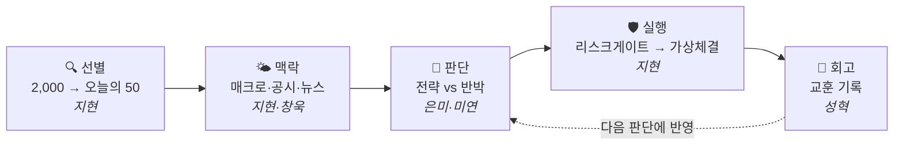

# 🌊 Quantinue

!!! abstract "무엇을 만드나"
    **미국주식 자율 AI 자동매매 시스템** — 매일 후보 종목을 고르고, AI가 분석·판단·반박을 거쳐 가상 체결과 회고까지, 사람 개입 없이 한 사이클이 돈다.

    팀 **여름이었다**(5인) · 부트캠프 2차 프로젝트(6/29~7/29) · **전부 가상매매(Alpaca 페이퍼), 실제 돈 0**

## 어떻게 돌아가나

AI는 판단만 하고, **사고파는 관문은 전부 코드가 강제**한다(코드 게이트 샌드위치). 안 사는 판단(NO_TRADE)도 근거와 함께 남는다.

→ 상세 흐름·정책: **[파이프라인](facts/파이프라인.md)** · 테이블·필드: **[데이터 계약](facts/데이터계약.md)**

## 지금 어디까지 왔나

!!! note "📍 8주차 · 설계 (7/6~7/10) — 🔴 Gate 1 기획확정 = 7/7"
    이번 주 제출물: **설계 4종 + MVP 정의서 + 슬라이스 분해표** → [일정](facts/일정.md) · [산출물 현황](산출물.md)

- ✅ **확정된 것** — 공격형 단일 · 파이프라인 11단계 · Alpaca 등 7건 → [결정 로그](facts/결정로그.md)
- ❓ **정해야 할 것** — 리뷰어 테이블 통일 · DB 통합 시점 등 → [회의 안건](질문.md)

## 누가 무엇을

| 팀원 | 파이프라인 담당 | 단계 |
|---|---|---|
| 김지현 (팀장) | 스크리너·기술·매크로·리스크·주문 + 인프라 | 01~04 · 09~10 |
| 정창욱 | 공시·뉴스 분석 | 05~06 |
| 이은미 | Strategist (전략 종합) | 07 |
| 김미연 | Critic (반박·검증) | 08 |
| 문성혁 | Reviewer (회고) + 문서·계약 관리 | 11 |

---

!!! tip "문서 규칙은 딱 하나"
    새 자료(HTML·md)는 그대로 성혁에게 전달(또는 raw 폴더에) — 정리·대조는 자동으로 된다. **확정 기준은 언제나 이 위키의 '프로젝트' 페이지들.**
