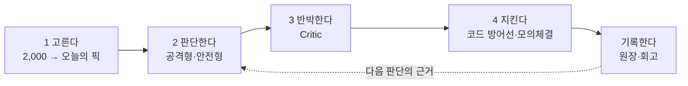

# 🌊 Quantinue

!!! success "최종 프로젝트 · 구현·검증·발표 자료 완료"
    Quantinue는 실물 시장 데이터와 AI 판단으로 굴러가는 **모의 자동매매 시스템**이다.
    실제 돈은 움직이지 않지만, 시세·공시·뉴스·거시 데이터와 판단 근거는 원장에 남긴다.

## 30초 안에 이해하기

```mermaid
flowchart LR
  A["1 고른다<br/>2,000 → 오늘의 픽"] --> B["2 판단한다<br/>공격형·안전형"]
  B --> C["3 반박한다<br/>Critic"]
  C --> D["4 지킨다<br/>코드 방어선·모의체결"]
  D --> E["기록한다<br/>원장·회고"]
  E -.다음 판단의 근거.-> B
```

사람이 종목을 골라주거나 주문을 승인하는 구조가 아니다. AI는 해석하고, 코드는 위험과
비용을 제한하며, PostgreSQL 원장이 **왜 샀고 왜 사지 않았는지**를 보존한다.

## MVP 1차 대비 변화

| | MVP-1 | 최종 프로젝트 |
|---|---|---|
| 기본 단위 | 01→11 선형 파이프라인 | 뉴욕 거래일 슬롯 + JOB 14종 |
| 판단 | 공격형 단일 흐름 | 공격형·안전형 두 성향 |
| 장중 대응 | 하루 1회 판단 | 1분 방어선 + 사건 수집·선택적 재판단 |
| 저장 | 1차 14개 테이블 기준선 | PostgreSQL 28테이블 원장 |
| 체결 | Alpaca 페이퍼 기준선 | MockBroker 로컬 모의 체결 |
| 상태 | 동결된 기준선 | 구현·테스트 완료, 운영 관측 중 |

MVP-1의 전체 설계는 [MVP 1차 아카이브](facts/MVP1차.md)에서 확인하고, 최종 결과는
[최종 시스템 구조](최종시스템.md)부터 읽는다.

## 검증된 결과

| 항목 | 수치 |
|---|---:|
| 테스트 | 994건 green |
| 판단 | 342건 |
| Critic 검토 | 323건 |
| 주문 = 체결 | 62건 |
| 유료 LLM | 312콜 · `$0.53` |

이 숫자는 수익률이 아니라 실행 계보·중복 방지·비용 통제가 실제로 기록됐다는 증거다.
자세한 범위와 한계는 [운영 검증과 한계](운영검증.md)에서 본다.

## 현재 운영 상태

| 기능 | 상태 |
|---|---|
| 일일 JOB 체인 | 🟢 운영 중 |
| 1분 손절·익절 방어선 | 🟢 운영 중 · LLM 0콜 |
| 사건 기반 LLM 재판단 | 🟡 구현 완료 · `rejudge=false` |
| 웹소켓 시세 | 🟡 구현 완료 · `stream=false` |
| 브로커 | 모의 전용 · 실제 주문 없음 |

## 읽는 순서

처음 보는 사람은 [실제 하루](실제하루.md) → [최종 프로젝트 한눈에](facts/최종프로젝트.md) →
[최종 시스템 구조](최종시스템.md) 순서가 가장 빠르다.

개발자는 [AI 판단과 안전장치](AI안전장치.md) → [데이터와 판단의 계보](데이터계보.md),
운영자는 [운영 검증과 한계](운영검증.md) → [최종 프로젝트 운영 가이드](운영가이드.md)를 본다.

## 상태 표기 기준

- `✅ 구현·검증 완료`
- `🟢 현재 운영 중`
- `🟡 구현 완료·의도적 비활성`
- `🧊 MVP-1 동결 기록`
