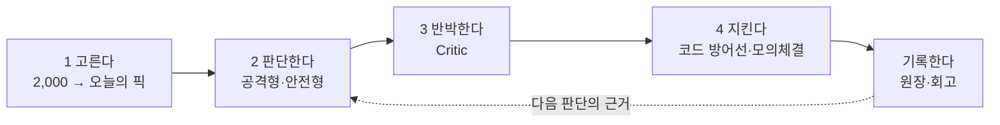

# 🌊 Quantinue

!!! success "최종 프로젝트 · 구현·검증·발표 자료 완료"
    Quantinue는 실물 시장 데이터와 AI 판단으로 굴러가는 **모의 자동매매 시스템**이다.
    실제 돈은 움직이지 않지만, 시세·공시·뉴스·거시 데이터와 판단 근거는 원장에 남긴다.

## 30초 안에 이해하기

```mermaid
flowchart LR
  A["1 고른다<br/>2,000 → 오늘의 픽"] --> B["2 판단한다<br/>공격형·안전형"]
  B --> C["3 반박한다<br/>Critic"]
  C --> D["4 지킨다<br/>코드 방어선·모의체결"]
  D --> E["기록한다<br/>원장·회고"]
  E -.다음 판단의 근거.-> B
```

사람이 종목을 골라주거나 주문을 승인하는 구조가 아니다. AI는 해석하고, 코드는 위험과
비용을 제한하며, PostgreSQL 원장이 **왜 샀고 왜 사지 않았는지**를 보존한다.

## 하루가 좁혀지는 폭

```mermaid
flowchart LR
  U["유니버스<br/><b>2,000</b>종목"] --> S["지표 계산<br/><b>500</b>"]
  S --> P["오늘의 픽<br/><b>50</b>"]
  P --> L["AI 심층 분석<br/><b>20</b> + 보유 전량"]
  L --> J["성향별 판단<br/>공격형·안전형"]
  J --> C["Critic 검증"]
  C --> O["계좌당 신규 주문<br/>하루 <b>5건</b> 이내"]
```

각 단계의 숫자는 임의값이 아니라 [설정 정본](final/reference/pipeline.yaml)에 선언된 한도다.
좁히는 이유도 단계마다 다르다 — 지표 계산은 시간 때문에, 픽은 비용 때문에, 주문은 위험 때문에 줄인다.

## 검증된 결과

| 항목 | 수치 |
|---|---:|
| 테스트 | 994건 green |
| 판단 | 342건 |
| Critic 검토 | 323건 |
| 주문 = 체결 | 62건 |
| 유료 LLM | 312콜 · `$0.53` |

이 숫자는 수익률이 아니라 실행 계보·중복 방지·비용 통제가 실제로 기록됐다는 증거다.
자세한 범위와 한계는 [운영 검증과 한계](운영검증.md)에서 본다.

## 현재 운영 상태

| 기능 | 상태 |
|---|---|
| 일일 JOB 체인 | 🟢 운영 중 |
| 1분 손절·익절 방어선 | 🟢 운영 중 · LLM 0콜 |
| 사건 기반 LLM 재판단 | 🟡 구현 완료 · `rejudge=false` |
| 웹소켓 시세 | 🟡 구현 완료 · `stream=false` |
| 브로커 | 모의 전용 · 실제 주문 없음 |

## MVP 1차 대비 변화

| | MVP-1 | 최종 프로젝트 |
|---|---|---|
| 기본 단위 | 01→11 선형 파이프라인 | 뉴욕 거래일 슬롯 + JOB 14종 |
| 판단 | 공격형 단일 흐름 | 공격형·안전형 두 성향 |
| 장중 대응 | 하루 1회 판단 | 1분 방어선 + 사건 수집·선택적 재판단 |
| 저장 | 1차 14개 테이블 기준선 | PostgreSQL 39테이블 원장 |
| 체결 | Alpaca 페이퍼 기준선 | MockBroker 로컬 모의 체결 |
| 상태 | 동결된 기준선 | 구현·테스트 완료, 운영 관측 중 |

MVP-1의 전체 설계는 [MVP 1차 아카이브](facts/MVP1차.md)에서 확인하고, 최종 결과는
[최종 시스템 구조](최종시스템.md)부터 읽는다.

## 이 위키를 보는 법

상단 탭 여섯 개가 성격별로 나뉜다. 지금 보는 문서가 어느 탭에 있는지가 곧 **그 내용의 기준 시점**이다.

| 탭 | 여기 있는 것 | 대표 페이지 |
|---|---|---|
| 📘 **프로젝트** | 무엇을 만들었고 무엇이 검증됐나 | [한눈에 보기](facts/최종프로젝트.md) · [실제 하루](실제하루.md) |
| ⚙️ **시스템** | 어떻게 굴러가나 — 구조·판단·데이터 | [아키텍처](최종시스템.md) · [핵심 기능](핵심기능/index.md) |
| 🛠️ **개발·운영** | 코드를 고치거나 실제로 켜는 방법 | [개발 시작하기](개발시작하기.md) · [운영 가이드](운영가이드.md) |
| 📜 **기록** | 왜 그렇게 정했나 — 결정과 회의의 이력 | [결정 로그](facts/결정로그.md) · [회의록](회의록/index.md) |
| 🧊 **아카이브** | MVP 1차 동결 기록과 위키 운영 문서 | [MVP 1차 정의](facts/MVP1차.md) |

!!! tip "아카이브 탭의 내용은 현재 기준이 아니다"
    🧊 탭 안의 수치·문턱·컬럼은 1차 설계 당시 값이다. 현재 값과 다를 수 있으므로
    최종 기준은 항상 ⚙️ 시스템 탭과 [결정 로그](facts/결정로그.md)를 따른다.

## 목적별 최단 경로

| 이런 사람이라면 | 이 순서로 |
|---|---|
| 처음 본다 | [실제 하루](실제하루.md) → [한눈에 보기](facts/최종프로젝트.md) → [아키텍처](최종시스템.md) |
| AI가 뭘 하는지 알고 싶다 | [AI 판단과 안전장치](AI안전장치.md) → [핵심 기능](핵심기능/index.md) |
| 코드를 이어받는다 | [개발 시작하기](개발시작하기.md) → [코드맵](코드맵.md) → [API 계약](API계약.md) |
| 운영을 이어받는다 | [운영 검증과 한계](운영검증.md) → [운영 가이드](운영가이드.md) → [운영 현황](현황판.md) |
| 판단 하나를 역추적한다 | [데이터와 판단의 계보](데이터계보.md) → [데이터 사전](데이터사전.md) |
| 왜 이렇게 정했는지 궁금하다 | [결정 로그](facts/결정로그.md) → [논의 기록](질문.md) |

## 상태 표기 기준

- `✅ 구현·검증 완료`
- `🟢 현재 운영 중`
- `🟡 구현 완료·의도적 비활성`
- `⚪ 선택 기능·운영 검증 전`
- `🧊 MVP-1 동결 기록`
