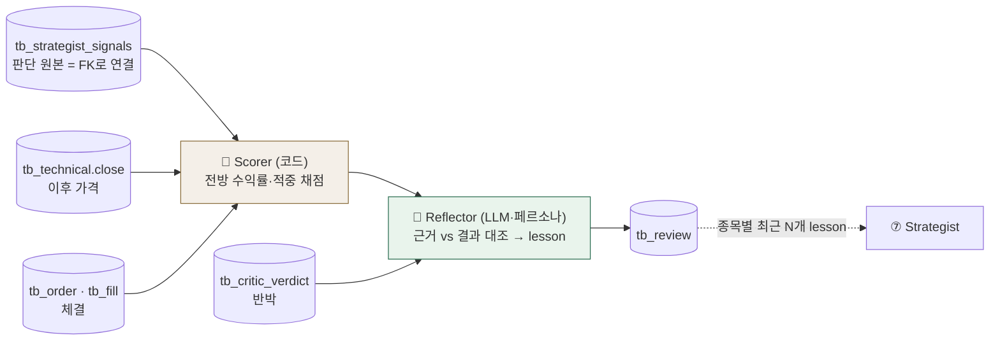

[업데이트] 2026-07-06 / ⑪ 리뷰·회고(tb_review) 설계 초안 v2 — signal_id FK 중심 슬림 스키마 + lesson 페르소나 설계 / 결정 필요: 은미 소비 스펙을 tb_review로 통일 확인 · NO_TRADE 회고 범위 · 채점 확정 시점

# ⑪ 리뷰·회고 (tb_review) 설계 초안 v2 — 문성혁

> 원칙: **코드가 사실(숫자)을 채점하고, LLM은 해석(교훈)만 쓴다.**
> v2 변경: ① 판단 데이터를 복사하지 않고 `tb_strategist_signals.id` **외래키**로 연결 ② `tb_memory_entries`는 폐기(테이블명 미정 시절의 임시 이름 — 이제 tb_review로 통일 제안) ③ lesson 페르소나·형식 설계 추가.

---

## 1. 역할

매 사이클의 판단(산 것 + 안 산 것)을 사후 채점하고, **교훈 한 줄(lesson)** 을 남겨 다음 사이클 Strategist가 같은 실수를 반복하지 않게 한다. Quantinue의 "학습"이 일어나는 곳(회고 메모리 피드백).

- 기각 쿨다운(N일 재제안 억제)은 ⑪ 소관 아님 — ⑦이 tb_critic_verdict 이력을 직접 조회.
- **1차 = observe-only**: 기록은 전부, 전략 반영 수준은 §6-④에서 확인.

## 2. 아키텍처 — Scorer(코드) → Reflector(LLM)



- **Scorer(코드)**: 판단 시점 이후 가격으로 결과 지표만 계산. 재현·감사 가능.
- **Reflector(LLM)**: Scorer의 숫자 + FK로 당긴 당시 근거(bull_case·key_risk)·Critic 반론을 대조해 lesson 생성. **숫자를 만들지 않는다.**

## 3. 스키마 — 판단은 FK로, 결과와 교훈만 저장

판단 데이터(side·conviction·근거·cycle_id·ticker)는 전부 `tb_strategist_signals`에 이미 있다 → **복사하지 않고 FK로 연결**. tb_review에는 ⑪이 새로 만드는 값만 담는다.

### 3-1. 컬럼 상세

먼저 **기준가(P0)** 정의 — 모든 수익률의 분모:

| 판단 | 기준가 P0 | 이유 |
|---|---|---|
| 매수(체결됨) | **체결가** (`tb_fill.price`) | 실제로 들어간 가격이 진짜 출발점 |
| 보류(NO_TRADE) | **판단일 종가** (`tb_technical.close`) | 체결이 없으니 "그날 샀다면"의 가상 출발점 |

| 컬럼 | 타입 | 키 | 무엇인가 | 어떻게 계산하나 |
|---|---|---|---|---|
| id | BIGSERIAL | 🔑 | 회고 고유번호 | 자동 증가 |
| signal_id | BIGINT | 🔗 **UNIQUE** | 어느 판단에 대한 회고인가 — `tb_strategist_signals.id` | Scorer가 "5영업일 지난 signal 중 아직 회고 없는 것"을 SELECT해서 지정. UNIQUE라 판단 1건 = 회고 1건 보장 |
| ret_1d | NUMERIC | | 판단 **1영업일 후** 수익률(%) | `(T+1 종가 − P0) ÷ P0 × 100` |
| ret_3d | NUMERIC | | 판단 **3영업일 후** 수익률(%) | `(T+3 종가 − P0) ÷ P0 × 100` |
| ret_5d | NUMERIC | | 판단 **5영업일 후** 수익률(%) — **대표 결과값** | `(T+5 종가 − P0) ÷ P0 × 100`. 창욱 백테스트와 같은 창이라 시스템 전체가 같은 잣대 |
| hit | BOOL | | 방향을 맞혔나 | 매수: `ret_5d > 0` → true · 보류: `ret_5d ≤ 0` → true ("안 사길 잘했다") |
| max_drawdown | NUMERIC | | 5일 보유 중 **최악의 순간**(%) | `(T+1~T+5 중 최저 종가 − P0) ÷ P0 × 100`. ret_5d가 +여도 중간에 −12%를 찍었다면 손절(−15%)에 닿을 뻔한 위험한 판단이었다는 뜻 |
| **lesson** | TEXT | | 교훈 한 줄 | **Reflector(LLM)** 가 §5 형식으로 생성 — 유일하게 코드가 아닌 컬럼 |
| created_at · updated_at | TIMESTAMPTZ | | 공통 필수 컬럼 | 자동 (데이터계약 결정 #8) |

### 3-2. 계산을 한 번 따라가 보기 (매수 예시)

**상황:** 7/6(월) cycle 123에서 Strategist가 NVDA 매수(conviction 8.5) → 게이트 통과 → **$100.00에 체결**(= P0). Critic은 "인수 프리미엄 과다" 반론을 냈지만 동의(agree=true).

이후 5영업일 종가:

| 날짜 | | 종가 | P0 대비 |
|---|---|---|---|
| 7/7 화 | T+1 | 101.20 | **+1.2%** → `ret_1d` |
| 7/8 수 | T+2 | 99.50 | −0.5% |
| 7/9 목 | T+3 | 98.00 | **−2.0%** → `ret_3d` · 5일 중 최저 → `max_drawdown = −2.0%` |
| 7/10 금 | T+4 | 102.00 | +2.0% |
| 7/13 월 | T+5 | 103.10 | **+3.1%** → `ret_5d` |

**7/14 아침 배치에서 Scorer가 계산** (T+5가 지났으므로 확정):

```
ret_1d = (101.20 − 100) / 100 × 100 = +1.2
ret_3d = ( 98.00 − 100) / 100 × 100 = −2.0
ret_5d = (103.10 − 100) / 100 × 100 = +3.1
hit    = 매수 & ret_5d > 0            → true
mdd    = ( 98.00 − 100) / 100 × 100 = −2.0   (최저점 T+3)
```

**Reflector가 받는 재료** (FK JOIN으로): bull_case "①인수 ②실적", Critic 반론 "프리미엄 과다", 위 숫자들.
**생성된 lesson:** `"Critic의 프리미엄 과다 우려에도 T+3 −2%가 바닥(손절 −15% 여유 충분) → +3.1% 적중. 교차확인된 M&A는 초반 눌림을 버틸 것."`

**최종 tb_review 행:**

| id | signal_id | ret_1d | ret_3d | ret_5d | hit | max_drawdown | lesson |
|---|---|---|---|---|---|---|---|
| 41 | 987 | +1.2 | −2.0 | +3.1 | true | −2.0 | "Critic의 프리미엄 과다 우려에도 …" |

### 3-3. 보류(NO_TRADE) 예시 — 틀린 보류에서 교훈 뽑기

**상황:** 같은 날 MRNA 보류(conviction 4.2 — min_conviction 5.0 미달로 강등). P0 = 판단일 종가 $92.10. T+5 종가 $97.60.

```
ret_5d = (97.60 − 92.10) / 92.10 × 100 = +6.0
hit    = 보류 & ret_5d > 0 → false   ("안 샀는데 올랐다" = 기회 놓침)
```

**lesson:** `"FDA 승인 확정 뉴스(confirmed 1.0)에 conviction 4.2로 보류 → +6.0% 놓침. 확정 규제 이벤트는 conviction 가점 검토."`

> 이렇게 **보류도 채점**해야 "겁이 많아 기회를 놓치는 패턴"과 "신중해서 살아남는 패턴"을 구분할 수 있다. (NO_TRADE 정상 원칙의 회고 버전)

### 3-4. FK 설계의 이점

- ticker·cycle_id·trade_date·당시 국면까지 **JOIN 한 번**으로 전부 닿음 — 중복 저장 0, 어긋남 0
- `signal_id UNIQUE` = 멱등성 (재실행해도 회고 1건)
- 상류 키 매핑 문제(cycle_id↔trade_date)가 ⑪에는 아예 없음 — signal 행이 이미 그 답을 들고 있음
- NO_TRADE(보류)도 signal 행이 있으므로 동일하게 회고 가능

## 4. 실행 시점

| 단계 | 시점 |
|---|---|
| Scorer | 매일 배치(KST 08:50~09:00 공백)에서 **5영업일 지난 signal을 확정 채점** |
| Reflector | 채점 직후 같은 배치 — 숫자 확정 후에만 해석 |

- **기본은 insert-once** (T+5 확정 채점 1회, `signal_id UNIQUE`로 재채점 스킵) → 평소 `updated_at = created_at`.
- 예외: Reflector(LLM) 실패 시 숫자 행은 `lesson NULL`로 먼저 INSERT → 다음 배치에서 UPDATE로 채움. lesson 재생성·2차 청산 채점도 UPDATE 케이스 (공통 컬럼 updated_at이 이때 쓰임).

## 5. lesson 설계 — 페르소나와 형식 (⑪의 핵심 작업)

### 페르소나: "차가운 복기 코치"

- 결과를 탓하지 않고 **판단 과정**을 복기한다 (결과론 금지 — 좋은 판단이 나쁜 결과일 수 있음)
- 당시 근거(bull_case)·Critic 반론(objection)·결과 숫자를 **삼각 대조**하는 시점
- 감정·수사 없음. 다음 판단에 그대로 꽂히는 실무 문장

### lesson 형식 계약 (프롬프트 규칙)

1. **한 줄, 120자 이내**
2. **숫자 근거 필수** — ret/conviction/신호값 중 최소 1개 인용
3. **[패턴] → [다음 행동]** 구조 — "무슨 상황에서 무슨 판단이 어떻게 됐으니, 다음엔 이렇게"
4. 일반론("시장은 어렵다")은 실패로 간주, 재생성
5. Critic이 맞았으면 명시 — "Critic의 프리미엄 과다 지적이 적중(-5.1%)" (⑦이 반론을 더 무겁게 보게)

예:
- `"confirmed 0.0 루머에 conviction 7 매수 → -5.1%. 교차확인 없으면 conviction 상한 5."`
- `"risk_off 진입 직후 보류 판단 적중(지수 -3%). 국면 전환 직후엔 보류가 유효."`

### Strategist 주입 형식 (은미와 합의할 것)

- 종목별 최근 **5개** lesson (은미 v2.2 스펙 유지) — `SELECT r.lesson, s.side, r.ret_5d FROM tb_review r JOIN tb_strategist_signals s ON s.id=r.signal_id WHERE s.ticker=? ORDER BY r.created_at DESC LIMIT 5`
- 은미의 구 `tb_memory_entries` 컬럼(side·conviction·outcome·lesson)은 위 JOIN으로 전부 제공됨 → **별도 테이블·뷰 불필요, tb_review로 통일 제안**

## 6. 결정 필요 (회의 안건화)

| # | 결정 | 내 제안 |
|---|---|---|
| ① | **은미 소비 스펙을 tb_review(+JOIN)로 통일** — tb_memory_entries는 테이블명 미정 시절의 임시 이름이므로 폐기 | 통일. 은미 쪽 필요 컬럼은 §5의 JOIN으로 전부 제공됨 — 은미 확인만 |
| ② | **NO_TRADE 회고 범위** | Strategist가 판단한 종목만 (오늘의 50 전부는 LLM 비용 과다, 판단 없으면 교훈도 없음) |
| ③ | **채점 확정 시점** | T+5 — 창욱 백테스트 창과 통일 |
| ④ | **1차 메모리 주입 여부** | 주입까지 허용 — 은미 STEP4에 이미 있고 "참고 제공"은 observe-only 취지와 충돌 안 함 |

## 7. 1차 구현 범위

| 🟢 1차 IN | 🔵 2차 OUT |
|---|---|
| Scorer: ret_1/3/5d·hit·mdd (코드) | 청산 시점 실현손익 회고 |
| Reflector: 복기 코치 페르소나 lesson (§5) | 페르소나 다변화(투자 거장 관점) |
| tb_review 기록 + 종목별 최근 5개 주입 쿼리 | 주간 집계(승률·버킷별 성과) 자동 리포트 |
| NO_TRADE 채점(판단 종목만) | lesson이 POLICY 문턱을 자동 조정 |
