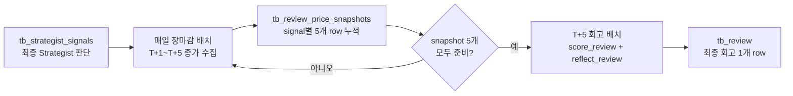
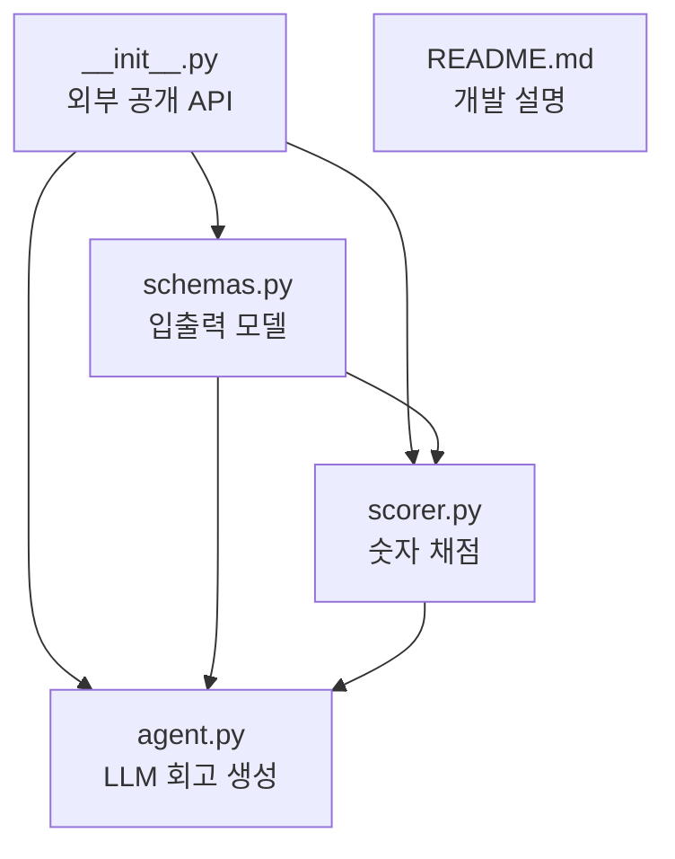
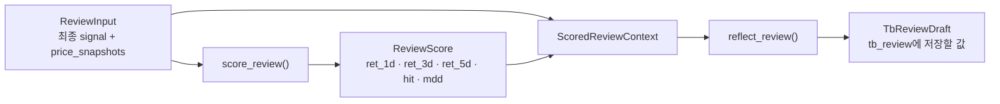
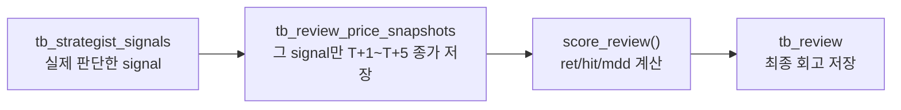
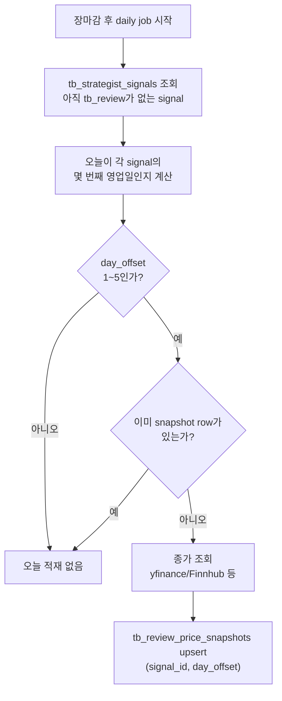
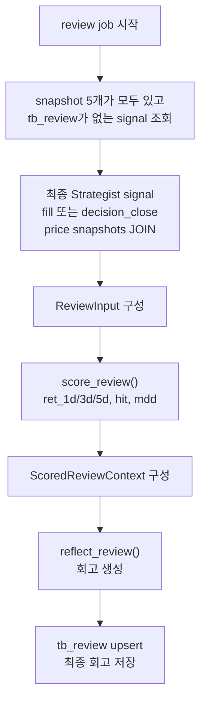

# Reviewer Agent 개발 설명

Reviewer는 Strategist가 남긴 최종 판단을 T+5 이후에 복기하는 모듈이다. 숫자는 코드가 계산하고, LLM은 이미 계산된 숫자를 바탕으로 다음 Strategist 판단에 재사용할 상세 lesson을 만든다.

이 문서는 현재 `agents/reviewer` 폴더에 실제로 있는 파일과 함수 중심으로 설명한다. DB 스케줄러, 가격 API 호출, upsert 코드는 아직 이 폴더에 없다.

DB 관점에서 먼저 보면 핵심은 두 단계다.



`tb_review_price_snapshots`는 매일 조금씩 쌓이는 중간 테이블이고, `tb_review`는 T+5까지 관측이 끝난 뒤 한 번 생성되는 최종 결과 테이블이다.

---

## 1. 현재 파일 구조



| 파일 | 현재 역할 |
|---|---|
| `schemas.py` | Reviewer가 사용하는 Pydantic 모델 정의 |
| `scorer.py` | T+1/T+3/T+5 수익률, hit, max_drawdown 계산 |
| `agent.py` | Scorer 결과를 LLM 회고로 바꾸고 `TbReviewDraft` 생성 |
| `__init__.py` | import 표면 정리, 기존 `review()` 호환 함수 유지 |

---

## 2. 현재 코드 기준 실행 흐름



현재 reviewer-agent가 실제로 처리하는 핵심 흐름은 위와 같다.

1. 상위 배치가 `ReviewInput`을 만들어 넘긴다.
2. `score_review()`가 숫자를 계산한다.
3. `ScoredReviewContext`로 원본 입력과 숫자 결과를 묶는다.
4. `reflect_review()`가 LLM 회고를 만든다.
5. `TbReviewDraft`를 반환한다.

`TbReviewDraft`는 실제 DB 테이블이 아니다. `tb_review`에 저장할 값을 담은 Python 객체다.

---

## 3. `schemas.py`

`schemas.py`는 reviewer-agent의 데이터 계약을 정의한다.

### `StrategistSnapshot`

Strategist 최종 판단의 요약본이다. Reviewer는 기본적으로 이 데이터를 중심으로 회고한다.

주요 필드:

- `signal_id`: `tb_strategist_signals.id`
- `ticker`: 종목 코드
- `side`: `buy` 또는 `hold`
- `conviction`: Strategist 확신도
- `summary`, `bull_case`, `key_risk`, `risk_rebuttal`: 판단 근거 요약

### `FillSnapshot`

매수 판단의 실제 체결가다. `buy` 판단은 이 값을 P0로 사용한다.

### `ReviewPriceSnapshot`

`tb_review_price_snapshots` 한 행에 대응하는 가격 스냅샷이다.

```text
signal_id
day_offset   # 1, 2, 3, 4, 5
price_date
close        # 해당 day_offset 날짜의 실제 종가
source
```

`close`는 구매가나 판단일 종가를 기준으로 변환한 값이 아니다. 각 `price_date`의 실제 종가이며, 수익률 계산 기준값 P0는 `buy`일 때 `tb_fill.price`, `hold`일 때 `decision_close`를 따로 사용한다.

이 모델을 둔 이유는 Reviewer가 전체 가격 테이블을 소유하지 않기 때문이다. 상위 스케줄러가 Strategist가 실제 판단한 signal에 대해서만 T+1~T+5 실제 종가를 모아 넘겨준다.

### `ReviewInput`

Scorer와 Reflector를 실행하기 위한 전체 입력이다.

```text
signal
fill
decision_close
price_snapshots
```

`price_snapshots`는 반드시 day_offset 1~5가 모두 있어야 한다.

### `ReviewScore`

코드가 계산한 숫자 결과다.

```text
ret_1d
ret_3d
ret_5d
hit
max_drawdown
```

### `TbReviewDraft`

`tb_review`에 저장할 값을 담은 Python 객체다. 실제 `tb_review_draft` 테이블은 없다. 숫자 컬럼은 Scorer가 채우고, `lesson`은 Reflector가 채운다.

---

## 4. `scorer.py`

`scorer.py`는 LLM 없이 숫자만 계산한다.

핵심 함수:

```python
score_review(review_input: ReviewInput) -> ReviewScore
```

계산하는 값:

- `ret_1d`: T+1 종가 기준 수익률
- `ret_3d`: T+3 종가 기준 수익률
- `ret_5d`: T+5 종가 기준 수익률
- `hit`: 판단 방향이 맞았는지
- `max_drawdown`: T+1~T+5 중 최저 종가 기준 손실폭

`score_review()`는 먼저 `price_snapshots`를 `day_offset` 기준으로 정리한다. 이때 다음 오류를 막는다.

- 다른 `signal_id`의 가격 스냅샷이 섞인 경우
- 같은 `day_offset`이 중복된 경우
- day_offset 1~5 중 하나가 빠진 경우

이 방어가 중요한 이유는 가격 스냅샷이 잘못 섞이면 lesson이 완전히 틀려지기 때문이다.

---

## 5. P0

P0는 수익률 계산의 기준 가격이다. P는 price, 0은 시작 시점이라고 보면 된다.

예:

```text
P0 = 100
T+5 close = 103
ret_5d = (103 - 100) / 100 * 100 = 3%
```

판단별 P0:

| 판단 | P0 | 이유 |
|---|---|---|
| `buy` | `fill.price` | 실제 매수 성과는 체결가에서 시작하기 때문 |
| `hold` | `decision_close` | 체결이 없으므로 판단일 종가를 가상 시작점으로 쓰기 때문 |

---

## 6. hit

`hit`은 판단 방향이 맞았는지를 뜻한다.

```text
buy:
  ret_5d > 0  -> hit = True
  ret_5d <= 0 -> hit = False

hold:
  ret_5d <= 0 -> hit = True
  ret_5d > 0  -> hit = False
```

보류했는데 T+5에 올랐다면 기회를 놓친 것이므로 `hit=False`다. 이 덕분에 Reviewer는 "너무 보수적으로 판단해서 상승을 놓치는 패턴"도 기록할 수 있다.

---

## 7. `agent.py`

`agent.py`는 LLM Reflector를 담당한다.

주요 함수:

```python
build_reflector_agent()
build_reflection_prompt()
reflect_review()
```

### `build_reflection_prompt()`

LLM에게 넘길 회고 프롬프트를 만든다. 프롬프트에는 다음이 들어간다.

- 최종 Strategist 판단 원본
- T+1~T+5 가격 스냅샷
- Scorer가 계산한 수익률과 hit, max_drawdown

### `reflect_review()`

`ScoredReviewContext`를 받아 LLM lesson을 만들고 `TbReviewDraft`를 반환한다.

중요한 점은 LLM이 숫자를 계산하지 않는다는 것이다. LLM은 `ReviewScore`에 이미 들어 있는 숫자를 보고 상세 lesson만 쓴다.

---

## 8. `tb_review_price_snapshots`를 추가한 이유

기존 설계에서 `tb_review`만 있으면 될 것처럼 보일 수 있지만, `tb_review`는 최종 회고 결과 테이블이다. T+1~T+5 종가 원천을 저장하는 테이블이 아니다.

`tb_technical.close`를 사용할 수도 있어 보이지만, 현재 위키 기준 `tb_technical`은 매일 최종 후보 50개 지표를 저장하는 테이블이다. Strategist가 판단한 종목이 T+1, T+3, T+5에도 계속 그 50개 안에 남는다는 보장이 없다.

그래서 Reviewer에는 별도 가격 스냅샷 테이블이 필요하다.



권장 스키마:

```text
tb_review_price_snapshots
- signal_id BIGINT
- day_offset INT
- price_date DATE
- close NUMERIC
- source TEXT
- created_at TIMESTAMPTZ
- PRIMARY KEY (signal_id, day_offset)
```

전체 유니버스 가격을 다 저장할 필요는 없다. Strategist가 실제 판단한 signal만 5영업일 동안 추적하면 된다.

---

## 9. DB 기준 워크플로우

현재 reviewer-agent 폴더에는 스케줄러와 DB upsert 코드가 없다. 상위 배치가 DB 관점에서 두 가지 일을 해야 한다.

### 9.1 매일 도는 `tb_review_price_snapshots` 적재 워크플로우

이 워크플로우는 매일 장마감 이후 실행된다. 목적은 아직 회고가 끝나지 않은 signal의 T+1~T+5 종가를 하루에 하나씩 채워 넣는 것이다.



권장 동작:

- `tb_review`가 이미 있는 signal은 더 이상 추적하지 않는다.
- 오늘이 T+1~T+5 범위가 아닌 signal은 건너뛴다.
- `(signal_id, day_offset)`를 primary key로 두고 upsert한다.
- 같은 날 배치를 여러 번 돌려도 같은 row만 갱신되도록 idempotent하게 만든다.
- 이 단계에서는 `score_review()`나 LLM을 호출하지 않는다.

예시:

```text
판단일 T:     tb_strategist_signals에 최종 signal 생성
T+1 장마감:  tb_review_price_snapshots에 day_offset=1 row upsert
T+2 장마감:  tb_review_price_snapshots에 day_offset=2 row upsert
T+3 장마감:  tb_review_price_snapshots에 day_offset=3 row upsert
T+4 장마감:  tb_review_price_snapshots에 day_offset=4 row upsert
T+5 장마감:  tb_review_price_snapshots에 day_offset=5 row upsert
```

T+5 row까지 들어오면 해당 signal은 회고 가능한 상태가 된다.

### 9.2 T+5에 도는 `tb_review` 생성 워크플로우

이 워크플로우는 `tb_review_price_snapshots`에 day_offset 1~5가 모두 모인 signal만 처리한다. 매일 실행해도 되지만, 실제로 `tb_review`가 생성되는 대상은 T+5 관측이 끝난 signal뿐이다.



`tb_review` 생성 조건:

- `tb_review`에 아직 같은 `signal_id`가 없다.
- `tb_review_price_snapshots`에 같은 `signal_id`로 day_offset 1, 2, 3, 4, 5가 모두 있다.
- `buy` 판단이면 P0로 쓸 `fill.price`가 있다.
- `hold` 판단이면 P0로 쓸 `decision_close`가 있다.

저장되는 값:

```text
tb_review
- signal_id
- ret_1d
- ret_3d
- ret_5d
- hit
- max_drawdown
- lesson
```

reviewer-agent 책임:

- `ReviewInput` 검증
- 숫자 채점
- 상세 lesson 생성
- `TbReviewDraft` 반환

상위 배치 책임:

- 회고 대기 중인 signal 조회
- 영업일 offset 계산
- 가격 API로 종가 조회
- `tb_review_price_snapshots` upsert
- 회고 가능한 signal을 `ReviewInput`으로 조립
- `TbReviewDraft`를 `tb_review`에 upsert

### 9.3 DB별 예시 데이터

아래 예시는 하나의 `buy` signal이 실제로 어떻게 누적되고 회고되는지 보여주기 위한 샘플이다. 컬럼명과 값은 reviewer 흐름 이해용이며, 전체 DB DDL을 확정하는 문서는 아니다.

#### 1. `tb_strategist_signals`

Strategist가 최종 판단을 남긴 테이블이다. Reviewer는 이 최종 signal을 평가 대상으로 본다.

| id | ticker | side | conviction | decision_date | decision_close | summary | key_risk | risk_rebuttal |
|---:|---|---|---:|---|---:|---|---|---|
| 987 | NVDA | buy | 8.5 | 2026-07-06 | 100.00 | 실적 개선과 수급 강도가 동시에 확인됨 | 단기 과열 부담 | 매출 성장률이 밸류에이션 부담 일부 상쇄 |

Reviewer 관점:

- `id=987`이 이후 모든 테이블의 `signal_id`가 된다.
- `side=buy`이므로 성과 기준 P0는 `decision_close`가 아니라 실제 체결가인 `tb_fill.price`다.
- `summary`, `key_risk`, `risk_rebuttal`은 Reflector가 lesson을 만들 때 참고하는 판단 맥락이다.

#### 2. `tb_fill`

실제 매수가 체결된 경우의 기준가 테이블이다. `buy` 판단의 P0는 이 가격을 사용한다.

| signal_id | ticker | filled_at | price | quantity |
|---:|---|---|---:|---:|
| 987 | NVDA | 2026-07-06 22:35:00+09 | 100.00 | 10 |

Reviewer 관점:

- `buy` 판단이면 `fill.price=100.00`이 P0가 된다.
- `hold` 판단은 체결이 없으므로 `tb_fill` row가 없어도 된다.
- `hold` 판단의 P0는 `tb_strategist_signals.decision_close`를 사용한다.

#### 3. `tb_review_price_snapshots`

매일 장마감 후 하나씩 쌓이는 중간 테이블이다. 전체 종목 가격 저장소가 아니라, Strategist가 실제 판단한 signal만 추적한다.

| signal_id | day_offset | price_date | close | source | created_at |
|---:|---:|---|---:|---|---|
| 987 | 1 | 2026-07-07 | 101.20 | yfinance | 2026-07-08 06:10:00+09 |
| 987 | 2 | 2026-07-08 | 99.50 | yfinance | 2026-07-09 06:10:00+09 |
| 987 | 3 | 2026-07-09 | 98.00 | yfinance | 2026-07-10 06:10:00+09 |
| 987 | 4 | 2026-07-10 | 102.00 | yfinance | 2026-07-11 06:10:00+09 |
| 987 | 5 | 2026-07-13 | 103.10 | yfinance | 2026-07-14 06:10:00+09 |

Reviewer 관점:

- `(signal_id, day_offset)`가 유일해야 한다.
- `day_offset=1~5`가 모두 있어야 `tb_review` 생성 대상으로 본다.
- 위 예시에서는 T+3에 `98.00`까지 밀렸다가 T+5에 `103.10`으로 회복했다.
- Scorer는 이 5개 close를 사용해 `ret_1d`, `ret_3d`, `ret_5d`, `max_drawdown`을 계산한다.

계산 예:

```text
P0 = 100.00
ret_1d = (101.20 - 100.00) / 100.00 * 100 = 1.20
ret_3d = (98.00 - 100.00) / 100.00 * 100 = -2.00
ret_5d = (103.10 - 100.00) / 100.00 * 100 = 3.10
max_drawdown = (98.00 - 100.00) / 100.00 * 100 = -2.00
hit = buy 판단이고 ret_5d > 0 이므로 True
```

#### 4. `tb_review`

T+5까지 관측이 끝난 뒤 최종 회고 결과가 저장되는 테이블이다. 한 signal에 대해 하나의 최종 row만 남긴다.

| signal_id | ret_1d | ret_3d | ret_5d | hit | max_drawdown | lesson |
|---:|---:|---:|---:|---|---:|---|
| 987 | 1.20 | -2.00 | 3.10 | true | -2.00 | 하단 `lesson` 예시 참조 |

`lesson` 예시:

```text
NVDA buy 판단은 T+1 1.2%, T+3 -2.0%, T+5 3.1%로 최종 적중했다.
중간에 -2.0%까지 밀렸지만 key_risk였던 단기 과열 부담은 실제 훼손으로 이어지지 않았고,
실적 개선과 수급 강도라는 bull_case가 T+5까지 더 중요한 설명력을 가졌다.
다음 Strategist 판단에서는 실적/수급 근거가 유지되는 buy signal을 T+3 수준의 단기 조정만으로 철회하지 않는다.
```

Reviewer 관점:

- `ret_*`, `hit`, `max_drawdown`은 코드 Scorer가 계산한다.
- `lesson`만 Reflector LLM이 작성한다.
- LLM은 숫자를 새로 계산하지 않고, Scorer가 넘긴 숫자를 해석한다.
- 이후 Strategist는 이 상세 lesson을 다음 판단의 참고 메모리로 사용할 수 있다.

---

## 10. 사용 예시

```python
from datetime import date
from decimal import Decimal

from agents.reviewer import (
    FillSnapshot,
    ReviewInput,
    ReviewPriceSnapshot,
    ScoredReviewContext,
    StrategistSnapshot,
    reflect_review,
    score_review,
)

review_input = ReviewInput(
    signal=StrategistSnapshot(
        signal_id=987,
        ticker="NVDA",
        side="buy",
        conviction=Decimal("8.5"),
        summary="실적 개선과 수급 강도가 동시에 확인됨",
        bull_case="실적 개선과 수급 강도가 동시에 확인됨",
        key_risk="단기 과열 부담",
        risk_rebuttal="매출 성장률이 밸류에이션 부담 일부 상쇄",
    ),
    fill=FillSnapshot(price=Decimal("100")),
    price_snapshots=(
        ReviewPriceSnapshot(signal_id=987, day_offset=1, price_date=date(2026, 7, 7), close=Decimal("101.2"), source="yfinance"),
        ReviewPriceSnapshot(signal_id=987, day_offset=2, price_date=date(2026, 7, 8), close=Decimal("99.5"), source="yfinance"),
        ReviewPriceSnapshot(signal_id=987, day_offset=3, price_date=date(2026, 7, 9), close=Decimal("98.0"), source="yfinance"),
        ReviewPriceSnapshot(signal_id=987, day_offset=4, price_date=date(2026, 7, 10), close=Decimal("102.0"), source="yfinance"),
        ReviewPriceSnapshot(signal_id=987, day_offset=5, price_date=date(2026, 7, 13), close=Decimal("103.1"), source="yfinance"),
    ),
)

score = score_review(review_input)
draft = reflect_review(ScoredReviewContext(review_input=review_input, score=score))
```

위 예시의 Scorer 결과:

```text
ret_1d = +1.20
ret_3d = -2.00
ret_5d = +3.10
hit = True
max_drawdown = -2.00
```

---

## 11. Reflector lesson 정책

Reflector는 "차가운 복기 코치"다.

규칙:

- `lesson`은 3~5문장
- 숫자 근거 최소 1개 포함
- 판단 근거, T+1/T+3/T+5 흐름, 다음 행동 규칙 포함
- 일반론 금지
- 숫자 새로 계산 금지

좋은 `lesson`:

```text
NVDA buy 판단은 T+1 1.2%, T+3 -2.0%, T+5 3.1%로 최종 적중했다.
중간에 -2.0%까지 밀렸지만 key_risk였던 단기 과열 부담은 실제 훼손으로 이어지지 않았다.
실적 개선과 수급 강도가 유지되는 buy signal은 T+3 수준의 단기 조정만으로 철회하지 않는다.
```

나쁜 회고:

```text
시장은 어렵기 때문에 신중해야 한다.
```

---

## 12. 후속 고려사항: Critic 평가

현재 개발 범위에서 Reviewer는 Critic을 참고하지 않는다.

프로젝트 흐름이 `Strategist 초안 -> Critic 반박 -> Strategist 최종 결론`이라면, 최종 의사결정 책임은 Strategist signal에 있다. Reviewer가 중간 Critic을 다시 참고하면 같은 정보를 이중 반영하거나, 최종 판단을 평가하는 기준이 흐려질 수 있다.

다만 후속 단계에서 Critic 자체의 품질을 평가하고 싶다면 별도 평가 축으로 남길 수 있다.

예:

```text
Critic이 지적한 리스크가 실제로 발생했는가?
Strategist가 기각한 Critic 의견이 사후 결과상 맞았는가?
Critic 의견이 반복적으로 맞는 구간에서는 Critic 가중치를 높일 것인가?
Critic이 너무 보수적이라 좋은 buy signal을 약화시키는가?
```

이 경우에도 현재 `tb_review` 기본 회고에 섞기보다는 `critic_review`, `debate_review`, `agent_weight_review` 같은 별도 분석 테이블이나 리포트로 분리하는 편이 낫다.

---

## 13. 검증 메모

- Python 3.9 기준 `compileall` 통과
- Python 3.11 기준 `compileall` 통과
- 임시 가상환경에서 `pydantic`, `pydantic-ai` 설치 후 import 확인
- buy 예시에서 `ret_1d=1.20`, `ret_3d=-2.00`, `ret_5d=3.10`, `hit=True`, `max_drawdown=-2.00` 확인
- `ReviewInput`에 Critic 없이 prompt를 만들고, prompt 안에 `Critic`이 들어가지 않는 것 확인
- `reflect_review()`가 단일 상세 `lesson`을 담은 `TbReviewDraft`를 반환하는 것 확인
- Reflector prompt에서 `close`가 P0 대비 수익률이 아니라 각 날짜의 실제 종가임을 명시하는 것 확인
- `tb_review_price_snapshots`의 `signal_id` 불일치, `day_offset` 중복, offset 누락은 Scorer에서 에러 처리
